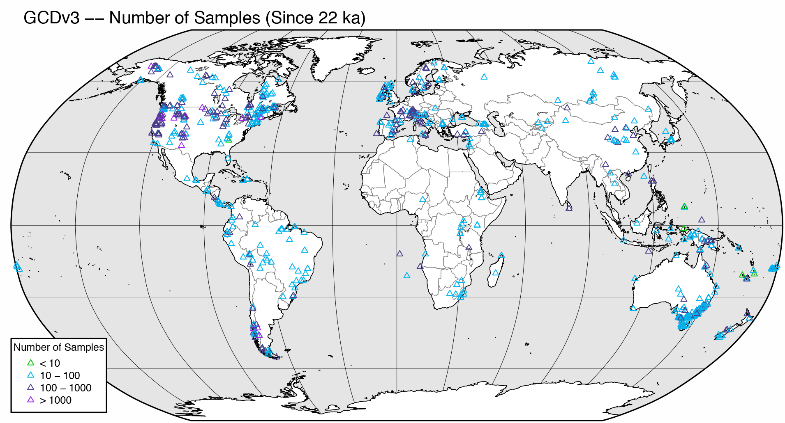
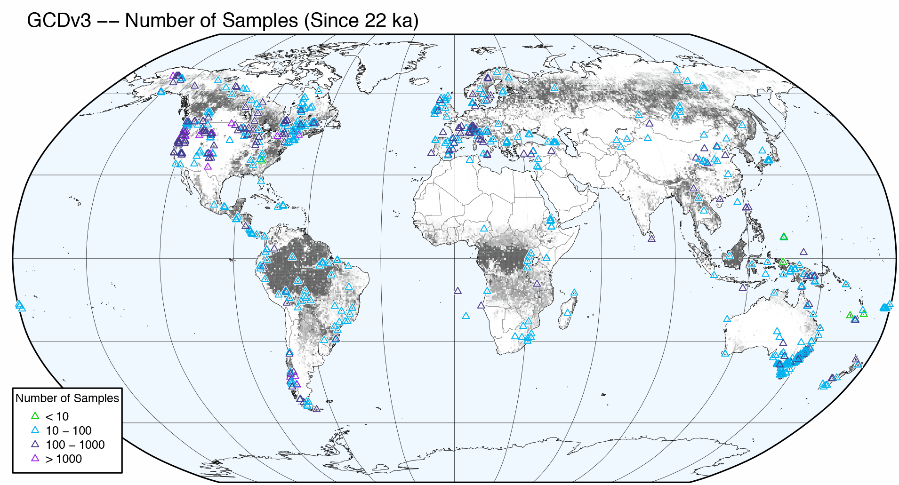

```{r set-options, echo=FALSE}
options(width = 105)
knitr::opts_chunk$set(dev='png', dpi=300, cache=TRUE)
pdf.options(useDingbats = TRUE)
klippy::klippy(position = c('top', 'right'))
```

# Introduction #

R has the ability through the `maps` package and the base graphics to generate maps, but such "out-of-the-box" maps, like other base graphics-generated illustrations, these may not be suitable for immediate publication.  Other options exit, for example, using packages like `ggmaps,` `mapview,` or `mapmate.` However, the ability of the `sp` and `rgdal` packages to handle the diverse kinds of spatial data, including shapefiles, provides a facility for creating publishable maps.  The examples here use a set of shapefiles downloaded from the *Natural Earth* web page [[http://www.naturalearthdata.com]](http://www.naturalearthdata.com).  

This first example recreates Figure 1 from  Marlon, J.R., et al., 2016,  Reconstructions of biomass burning from sediment-charcoal records to improve data–model comparisons. *Biogeosciences* 13:3225-3244. [[http://www.biogeosciences.net/13/3225/2016/]](http://www.biogeosciences.net/13/3225/2016/).  There are two general steps in the production of this map, the first involves 1) projecting the *Natural Earth* shapefiles into the Robinson projection (which are reusable for other applications), and the second the projection of the data and assembly into the finished map.

# Set up outlines and polygons for global (Robinson projection) maps #

## Read Natural Earth shapefiles ##

The first step is to read a set of shapefiles downloaded from the Natural Earth web page [[http://www.naturalearthdata.com]](http://www.naturalearthdata.com), and project these into the Robinson projection.  Two CRAN packages, `rnaturalearth` and `rnaturalearthdata` can be used to manage and download the data within R, but the *Natural Earth* web pages are worth looking at.

Begin by loading the appropriate packages:

```{r load packages, message=FALSE}
library(sp)
library(rgdal)
library(rgeos)
library(raster)
library(rasterVis)
library(classInt)
library(RColorBrewer)
```

Now read the shape files, including those for global coastlines, adminstrative units (borders), large lakes, and a graticule.  Set the filenames:

```{r read NE shapefiles}
# Natural Earth shape files -- global (Robinson) projections
# get shapefiles from http://www.naturalearthdata.com
shape_path <- "/Users/bartlein/Projects/ESSD/data/RMaps/source/"
coast_shapefile <- paste(shape_path, "ne_50m_coastline/ne_50m_coastline.shp", sep="")
ocean_shapefile <- paste(shape_path, "ne_50m_ocean/ne_50m_ocean.shp", sep="")
admin0_shapefile <- paste(shape_path, "ne_50m_admin_0_countries/ne_50m_admin_0_countries.shp", sep="")
admin1_shapefile <- paste(shape_path, "ne_50m_admin_1_states_provinces_lakes/ne_50m_admin_1_states_provinces_lakes.shp", sep="")
lakes_shapefile <- paste(shape_path, "ne_50m_lakes/ne_50m_lakes.shp", sep="")
bb_shapefile <- paste(shape_path, "ne_50m_graticules_all/ne_50m_wgs84_bounding_box.shp", sep="")
grat30_shapefile <- paste(shape_path, "ne_50m_graticules_all/ne_50m_graticules_30.shp", sep="")
```

Before reading each file, determine what kind it is (e.g. lines vs. polygons), then read and plot it.  Using the `ogrInfo()` and `readOGR` functions from `rgdal` eliminates the necessity of selecting the appropriate function in `maptools`.  In the 'plot()' functions below, use the `col` argument for lines, `bor` for polygon border colors.

```{r read coast, fig.height=4}
# find out kind of shapefile (lines vs. polygons)
layer <- ogrListLayers(coast_shapefile)
ogrInfo(coast_shapefile, layer=layer)

# read the shape file
coast_lines <- readOGR(coast_shapefile, layer=layer)
summary(coast_lines)  
plot(coast_lines, col="purple")
```

Get the Proj4 string for later use>

```{r get proj4string}
unproj_proj4string <- proj4string(coast_lines)
unproj_proj4string
```

Read the ocean polygons.

```{r read ocean, fig.height=4}
# find out kind of shapefile (lines vs. polygons)
layer <- ogrListLayers(ocean_shapefile)
ogrInfo(ocean_shapefile, layer=layer)

# read the shape file
ocean_poly <- readOGR(ocean_shapefile, layer=layer)
summary(ocean_poly)  
plot(ocean_poly, col="lightblue")
```

Read the other shape files the same way.  (Note that the summary output is suppressed here.)

```{r read other shapefiles, results="hide", message=FALSE}
layer <- ogrListLayers(admin0_shapefile)
ogrInfo(admin0_shapefile, layer=layer)
admin0_poly <- readOGR(admin0_shapefile, layer=layer)
summary(admin0_poly)  

layer <- ogrListLayers(admin1_shapefile)
ogrInfo(admin1_shapefile, layer=layer)
admin1_poly <- readOGR(admin1_shapefile, layer=layer)
summary(admin1_poly)  

layer <- ogrListLayers(lakes_shapefile)
ogrInfo(lakes_shapefile, layer=layer)
lakes_poly <- readOGR(lakes_shapefile, layer=layer)
summary(lakes_poly)  

lrglakes_poly <- lakes_poly[as.numeric(lakes_poly$scalerank) <= 2 ,]

layer <- ogrListLayers(grat30_shapefile)
ogrInfo(grat30_shapefile, layer=layer)
grat30_lines <- readOGR(grat30_shapefile, layer=layer)
summary(grat30_lines)  

layer <- ogrListLayers(bb_shapefile)
ogrInfo(bb_shapefile, layer=layer)
bb_poly <- readOGR(bb_shapefile, layer=layer)
summary(bb_poly) 
bb_lines <- as(bb_poly, "SpatialLines")
```

Plot everything (except ocean).

```{r plot input shapefiles, fig.height=4}
# plot everything
plot(coast_lines, col="black")
plot(admin0_poly, bor="gray", add=TRUE)
plot(admin1_poly, bor="pink", add=TRUE)
plot(lakes_poly, bor="lightblue", add=TRUE)
plot(lrglakes_poly, bor="blue", add=TRUE)
plot(grat30_lines, col="lightblue", add=TRUE)
plot(bb_lines, col="black", add=TRUE)
plot(coast_lines, col="purple", add=TRUE)
```

## Project the shapefiles ##

Next, transform (project) the individual shapefiles into the Robinson projection using `spTransform`.  Set the `proj4` string for the projectdion using the `CRS()` function.

```{r set CRS}
# set Robinson CRS
unproj_crs <- CRS("+proj=longlat +datum=WGS84 +ellps=WGS84 +towgs84=0,0,0")
unproj_crs
robin_crs <- CRS("+proj=robin +lon_0=0w")
robin_crs
```

Now do the projections.

```{r projections}
# do projections
bb_poly_proj <- spTransform(bb_poly, robin_crs)
coast_lines_proj <- spTransform(coast_lines, robin_crs)
admin0_poly_proj <- spTransform(admin0_poly, robin_crs)
admin1_poly_proj <- spTransform(admin1_poly, robin_crs)
lakes_poly_proj <- spTransform(lakes_poly, robin_crs)
grat30_lines_proj <- spTransform(grat30_lines, robin_crs)
lrglakes_poly_proj <- spTransform(lrglakes_poly, robin_crs)
```

Plot the projected shapefiles.

```{r plot projected, fig.height=4}
# plot projected files
plot(bb_poly_proj, col="gray95")
plot(admin0_poly_proj, col="white", bor="pink", add=TRUE)
plot(admin1_poly_proj, col="white", bor="pink", add=TRUE)
plot(lakes_poly_proj, bor="lightblue", add=TRUE)
plot(lrglakes_poly_proj, bor="purple", add=TRUE)
plot(coast_lines_proj, col="black", add=TRUE)
plot(grat30_lines_proj, col="lightblue", add=TRUE)
plot(bb_poly_proj, bor="black", add=TRUE)
```

Because the map we're creating will use the borders and lakes only as outlines (as opposed to polygons that might be filled with a specific color), those polygons can be converted to `SpatialLines` objects.

```{r convert to SpatialLines}
# convert polygons to spatial lines
admin0_lines_proj <- as(admin0_poly_proj, "SpatialLines")
admin1_lines_proj <- as(admin1_poly_proj, "SpatialLines")
lakes_lines_proj <- as(lakes_poly_proj, "SpatialLines")
lrglakes_lines_proj <- as(lrglakes_poly_proj, "SpatialLines")
bb_lines_proj <- as(bb_poly_proj, "SpatialLines")
```

Plot the `SpatialLines` objects

```{r plot spatial lines, fig.height=4}
# test the SpatialLines shapefiles
plot(bb_poly_proj, col="gray95")
plot(coast_lines_proj, col="green", add=TRUE)
plot(admin0_lines_proj, col="lightblue", add=TRUE)
plot(admin1_lines_proj, col="lightblue", add=TRUE)
plot(lakes_lines_proj, col="blue", add=TRUE)
plot(lrglakes_lines_proj, col="purple", add=TRUE)
plot(grat30_lines_proj, col="gray", add=TRUE)
plot(coast_lines_proj, col="black", add=TRUE)
plot(bb_lines_proj, col="black", add=TRUE)
```

## Write out the projected shapefiles ##

Next, write out the projected shapefiles, first setting the output path.

```{r write coast shapes, warning=FALSE}
# write out the various shapefiles 
outpath <- "/Users/bartlein/Projects/ESSD/data/RMaps/derived/glrob_50m/"
outshape <- coast_lines_proj
outfile <- "glRob_50m_coast_lines"
outshapefile <- paste(outpath,outfile,sep="")
spdf <- data.frame(as.numeric(row.names(outshape)))
row.names(spdf) <- row.names(outshape)
outshape <- SpatialLinesDataFrame(outshape, spdf)
writeOGR(outshape, outshapefile, outfile, driver="ESRI Shapefile", overwrite_layer=TRUE)
```
It's always good practice to test whether the shapefile has ideed been written out correctly.  Read it back in and plot it.

```{r test shape, fig.height=4}
test <- readOGR(outshapefile)
plot(test, col="black")
```

Write out the other shapefiles.

```{r write other shapefiles, warning=FALSE}
outshape <- bb_poly_proj
outfile <- "glRob_50m_bb_poly"
outshapefile <- paste(outpath,outfile,sep="")
spdf <- data.frame(as.numeric(row.names(outshape)))
row.names(spdf) <- row.names(outshape)
outshape <- SpatialPolygonsDataFrame(outshape, spdf)
writeOGR(outshape, outshapefile, outfile, driver="ESRI Shapefile", overwrite_layer=TRUE)

outshape <- bb_lines_proj
outfile <- "glRob_50m_bb_lines"
outshapefile <- paste(outpath,outfile,sep="")
spdf <- data.frame(as.numeric(row.names(outshape)))
row.names(spdf) <- row.names(outshape)
outshape <- SpatialLinesDataFrame(outshape, spdf)
writeOGR(outshape, outshapefile, outfile, driver="ESRI Shapefile", overwrite_layer=TRUE)

outshape <- admin0_poly_proj
outfile <- "glRob_50m_admin0_poly"
outshapefile <- paste(outpath,outfile,sep="")
spdf <- data.frame(as.numeric(row.names(outshape)))
row.names(spdf) <- row.names(outshape)
outshape <- SpatialPolygonsDataFrame(outshape, spdf)
writeOGR(outshape, outshapefile, outfile, driver="ESRI Shapefile", overwrite_layer=TRUE)

outshape <- admin0_lines_proj
outfile <- "glRob_50m_admin0_lines"
outshapefile <- paste(outpath,outfile,sep="")
spdf <- data.frame(as.numeric(row.names(outshape)))
row.names(spdf) <- row.names(outshape)
outshape <- SpatialLinesDataFrame(outshape, spdf)
writeOGR(outshape, outshapefile, outfile, driver="ESRI Shapefile", overwrite_layer=TRUE)

outshape <- admin1_poly_proj
outfile <- "glRob_50m_admin1_poly"
outshapefile <- paste(outpath,outfile,sep="")
spdf <- data.frame(as.numeric(row.names(outshape)))
row.names(spdf) <- row.names(outshape)
outshape <- SpatialPolygonsDataFrame(outshape, spdf)
writeOGR(outshape, outshapefile, outfile, driver="ESRI Shapefile", overwrite_layer=TRUE)

outshape <- admin1_lines_proj
outfile <- "glRob_50m_admin1_lines"
outshapefile <- paste(outpath,outfile,sep="")
spdf <- data.frame(as.numeric(row.names(outshape)))
row.names(spdf) <- row.names(outshape)
outshape <- SpatialLinesDataFrame(outshape, spdf)
writeOGR(outshape, outshapefile, outfile, driver="ESRI Shapefile", overwrite_layer=TRUE)

outshape <- lakes_poly_proj
outfile <- "glRob_50m_lakes_poly"
outshapefile <- paste(outpath,outfile,sep="")
spdf <- data.frame(as.numeric(row.names(outshape)))
row.names(spdf) <- row.names(outshape)
outshape <- SpatialPolygonsDataFrame(outshape, spdf)
writeOGR(outshape, outshapefile, outfile, driver="ESRI Shapefile", overwrite_layer=TRUE)

outshape <- lakes_lines_proj
outfile <- "glRob_50m_lakes_lines"
outshapefile <- paste(outpath,outfile,sep="")
spdf <- data.frame(as.numeric(row.names(outshape)))
row.names(spdf) <- row.names(outshape)
outshape <- SpatialLinesDataFrame(outshape, spdf)
writeOGR(outshape, outshapefile, outfile, driver="ESRI Shapefile", overwrite_layer=TRUE)

outshape <- lrglakes_poly_proj
outfile <- "glRob_50m_lrglakes_poly"
outshapefile <- paste(outpath,outfile,sep="")
spdf <- data.frame(as.numeric(row.names(outshape)))
row.names(spdf) <- row.names(outshape)
outshape <- SpatialPolygonsDataFrame(outshape, spdf)
writeOGR(outshape, outshapefile, outfile, driver="ESRI Shapefile", overwrite_layer=TRUE)

outshape <- lrglakes_lines_proj
outfile <- "glRob_50m_lrglakes_lines"
outshapefile <- paste(outpath,outfile,sep="")
spdf <- data.frame(as.numeric(row.names(outshape)))
row.names(spdf) <- row.names(outshape)
outshape <- SpatialLinesDataFrame(outshape, spdf)
writeOGR(outshape, outshapefile, outfile, driver="ESRI Shapefile", overwrite_layer=TRUE)

outshape <- grat30_lines_proj
outfile <- "glRob_50m_grat30_lines"
outshapefile <- paste(outpath,outfile,sep="")
spdf <- data.frame(as.numeric(row.names(outshape)))
row.names(spdf) <- row.names(outshape)
outshape <- SpatialLinesDataFrame(outshape, spdf)
writeOGR(outshape, outshapefile, outfile, driver="ESRI Shapefile", overwrite_layer=TRUE)
```

## Clip out a polygon for the Caspian ## 

Another setup step, and again one that creates some resuable files, is to make a polygon shape file for the Caspian Sea, which can be plotted and filled with color.  

The first step is to creat a "bounding box" that surrouds the Caspian.

```{r Caspian bounding box}
caspian_bb <- as(extent(45, 56, 35, 50), "SpatialPolygons")
proj4string(caspian_bb) <- unproj_proj4string
summary(caspian_bb)
```

```{r Caspian outline}
# get the points that define the ouline of the Caspian
caspian_poly <- gIntersection(ocean_poly, caspian_bb)
proj4string(caspian_poly) <- unproj_proj4string
summary(caspian_poly)
plot(coast_lines, col="purple")
plot(caspian_poly, col="red", add=TRUE)
```

Project and plot the Caspian polygon:

```{r project polygon}
caspian_poly_proj <- spTransform(caspian_poly, robin_crs)
plot(bb_poly_proj, bor="black")
plot(coast_lines_proj, col="black", add=TRUE)
plot(caspian_poly_proj, col="red", add=TRUE)
```

Write out the Caspian polygon.

```{r write Caspian poly}
outshape <- caspian_poly_proj
outfile <- "glRob_50m_caspian_poly"
outshapefile <- paste(outpath,outfile,sep="")
spdf <- data.frame(as.numeric(row.names(outshape)))
row.names(spdf) <- row.names(outshape)
outshape <- SpatialPolygonsDataFrame(outshape, spdf)
writeOGR(outshape, outshapefile, outfile, driver="ESRI Shapefile", overwrite_layer=TRUE)
```

[[Back to top]](Rmaps.html)

# Set up tree-cover data #

One version of Fig. 1 in Marlon et al. (2016) includes a gray-shade "layer" of the "UMD" tree-cover data (Defries et al., 2000, A new global 1-km dataset of percentage tree cover derived from remote sensing, *Global Change Biology* 6:247-254)  [[http://glcf.umd.edu/data/treecover/data.shtml]](http://glcf.umd.edu/data/treecover/data.shtml), used to provide a background context for the location of the GCDv3 sites.  The data were converted to a netCDF file, and this is read, and in turn coverted to spatial points and spatial polygon dataframes.

## Read the tree-cover data ##

```{r read treeMac, eval=TRUE, echo=TRUE}
# read a single-variable netCDF dataset using raster()
tree_path <- "/Users/bartlein/Projects/ESSD/data/nc_files/"
tree_name <- "treecov.nc"
tree_file <- paste(tree_path, tree_name, sep="")
tree <- raster(tree_file) # open treecov.nc
tree
```

```{r plot treecover}
# levelplot
mapTheme <- rasterTheme(region=brewer.pal(8,"Greens"))
plt <- levelplot(tree, margin=F, par.settings=mapTheme)
plt + layer(sp.lines(coast_lines, col="black", lwd=0.5))
```

Create a SpatialPoints data frame, and plot it:

```{r treecover spatialpoints}
# create spatial points data frame
tree_pts <- as(tree, "SpatialPointsDataFrame")
summary(tree_pts)
```
```{r plot treecover spatialpoins}
plotclr <- brewer.pal(9,"Greens")
cutpts <- c(10,20,30,40,50,60,70,80,90)
color_class <- findInterval(tree_pts$treecov, cutpts)+1
plot(tree_pts$x, tree_pts$y, col=plotclr[color_class], pch=16, cex=0.25)
plot(coast_lines, add=TRUE)
```

Convert the points to polygons.

```{r treecover polygons}
# spatial polygons (takes a while, especially to plot)
tree_poly <- as(tree, "SpatialPolygonsDataFrame")
summary(tree_poly)
```

Plot the treecover polygons.

```{r plot treecover polygons}
# plot the polygons
#pdf(file="treecov_poly.pdf")
plotclr <- brewer.pal(9,"Greens")
cutpts <- c(10,20,30,40,50,60,70,80,90)
color_class <- findInterval(tree_poly$treecov, cutpts)+1
clr <- plotclr[color_class]
plot(bb_lines, col="black")
plot(tree_poly, col=clr, bor=clr, lwd=0.1, add=TRUE)
plot(coast_lines, lwd=0.25, add=TRUE)
#dev.off()
```

Write out the shapefiles.

```{r write tree shapefiles}
# write tree_ptws
outpath <- "/Users/bartlein/Projects/ESSD/data/RMaps/derived/treecov/"
outshape <- tree_pts
outfile <- "treecov_pts"
outshapefile <- paste(outpath,outfile,sep="")
writeOGR(outshape, outshapefile, outfile, driver="ESRI Shapefile", overwrite_layer=TRUE)
# write <- tree_poly
outshape <- tree_poly
outfile <- "treecov_poly"
outshapefile <- paste(outpath,outfile,sep="")
writeOGR(outshape, outshapefile, outfile, driver="ESRI Shapefile", overwrite_layer=TRUE)
```
## Project the treecover points and polygons ##
 
Project and plot the shapefiles

```{r project treecov points}
tree_pts_proj <- spTransform(tree_pts, robin_crs)
summary(tree_pts_proj)
```
```{r plot treecover projected spatialpoints}
plotclr <- brewer.pal(9,"Greens")
cutpts <- c(10,20,30,40,50,60,70,80,90)
color_class <- findInterval(tree_pts_proj$treecov, cutpts)+1
plot(bb_lines_proj, col="black", axes=FALSE, xlab = "", ylab = "")
points(tree_pts_proj$x, tree_pts_proj$y, col=plotclr[color_class], pch=16, cex=0.25)
plot(coast_lines_proj, add=TRUE)
```

```{r project treecov polygons}
tree_poly_proj <- spTransform(tree_poly, robin_crs)
summary(tree_poly_proj)
```
```{r plot treecover projected polygons}
plotclr <- brewer.pal(9,"Greens")
cutpts <- c(10,20,30,40,50,60,70,80,90)
color_class <- findInterval(tree_poly_proj$treecov, cutpts)+1
clr <- plotclr[color_class]
plot(bb_lines_proj, col="black", axes=FALSE, xlab = "", ylab = "")
plot(tree_poly_proj, col=clr, bor=clr, lwd=0.1, add=TRUE)
plot(coast_lines_proj, lwd=0.25, add=TRUE)
```

Write out the projected shapefiles.

```{r write projected tree shapefiles}
# write tree_pts_proj
outshape <- tree_pts_proj
outfile <- "treecov_pts_proj"
outshapefile <- paste(outpath,outfile,sep="")
writeOGR(outshape, outshapefile, outfile, driver="ESRI Shapefile", overwrite_layer=TRUE)
# write <- tree_poly_proj
outshape <- tree_poly_proj
outfile <- "treecov_poly_proj"
outshapefile <- paste(outpath,outfile,sep="")
writeOGR(outshape, outshapefile, outfile, driver="ESRI Shapefile", overwrite_layer=TRUE)
```

[[Back to top]](Rmaps.html)

# Map the GCDv3 charcoal records #

Figure 1 of Marlon et al. (2016) shows the distribution of charcoal records, and additionally shows by means of symbol color the number of samples in each record.  Two versions of the figure will be produced:  1) as published, and 2) with the tree-cover data as a gray-shaded background.

## Read the projected shape files ##

First read the projected (Robinson) shape files produced above.

```{r map packages}
library(sp)
library(classInt)
```
```{r read_map_shapefiles, results="hide", message=FALSE}
# read the projected Robinson shapefiles
shapepath <- "/Users/bartlein/Projects/ESSD/data/RMaps/derived/glRob_50m/"
coast_lines_proj <- readOGR(paste(shapepath, "glRob_50m_coast_lines", sep=""))
admin0_lines_proj <- readOGR(paste(shapepath, "glRob_50m_admin0_lines", sep=""))
admin0_poly_proj <- readOGR(paste(shapepath, "glRob_50m_admin0_poly", sep=""))
bb_lines_proj <- readOGR(paste(shapepath, "glRob_50m_bb_lines", sep=""))
bb_poly_proj <- readOGR(paste(shapepath, "glRob_50m_bb_poly", sep=""))
grat30_lines_proj <- readOGR(paste(shapepath, "glRob_50m_grat30_lines", sep=""))
lrglakes_poly_proj <- readOGR(paste(shapepath, "glRob_50m_lrglakes_poly", sep=""))
caspian_poly_proj <- readOGR(paste(shapepath, "glRob_50m_caspian_poly", sep=""))
```

Read the projected tree-cover polygons (this can be slow--lots of polygons!)

```{r read projected treecover shapefile}
# tree-cover shape file
treecover_path <- "/Users/bartlein/Projects/ESSD/data/RMaps/derived/treecov/"
tree_poly_proj <- readOGR(paste(treecover_path, "treecov_poly_proj.shp", sep=""))  
```

Set cutpoints and gray-scale color numbers for plotting the tree-cover data.  These were calculated to follow a "Munsell sequence" of equally perceived class intervals.

```{r set treecover colors}
# colors for tree cover
tree_clr_upper <- c(   1,    15,    20,    25,    30,    35,    40,    45,    50,    55,    60,    65,    70,    75,   999)
tree_clr_gray <- c(1.000, 0.979, 0.954, 0.926, 0.894, 0.859, 0.820, 0.778, 0.733, 0.684, 0.632, 0.576, 0.517, 0.455, 0.389)
colnum <- findInterval(tree_poly_proj$treecov, tree_clr_upper)+1
clr <- gray(tree_clr_gray[colnum], alpha=NULL)
```
## Read the GCDv3 data ###

Read the GCDv3 charcoal site-location data.  

```{r read GCDv3 data}
# read the data
csvpath <- "/Users/bartlein/Projects/ESSD/data/csv_files/"
csvname <- "GCDv3_MapData_Fig1.csv"
gcdv3 <- read.csv(paste(csvpath, csvname, sep=""))
gcdv3_pts <- data.frame(cbind(gcdv3$Long,gcdv3$Lat,gcdv3$samples22k))
names(gcdv3_pts) <- c("lon","lat","samples22k")
head(gcdv3_pts)
coordinates(gcdv3_pts) <- ~lon+lat
proj4string(gcdv3_pts) <- CRS("+proj=longlat +datum=WGS84 +ellps=WGS84 +towgs84=0,0,0")
summary(gcdv3_pts)
```

Set symbol size and colors for the charcoal points.

```{r set symbol size}
# symbol size and colors
nsamp_cutpts <- c(10,100,1000,10000)
nsamp_colors <- c("green3","deepskyblue2","slateblue4","purple")
nsamp_cex <- c(0.5,0.5,0.5,0.5)
nsamp_num <- findInterval(gcdv3_pts$samples22k, nsamp_cutpts)+1
```

Project the charcoal point data.

```{r project charcoal points}
# project the data
robin.crs <- CRS("+proj=robin +lon_0=0w")
gcdv3_pts.proj <- spTransform(gcdv3_pts, robin.crs)
```

## Plot the maps ##

First, plot the sites with no background.  The code below creates a .pdf file in the working directory.  

```{r plot charcoal points, echo=TRUE, eval=FALSE}
# version with no background
pdffile <- "gcdv3_nsamp.pdf"
pdf(paste(pdffile,sep=""), paper="letter", width=8, height=8)

  plot(bb_poly_proj, col="gray90", bor="black", lwd=0.1)
  plot(grat30_lines_proj, col="black", lwd=0.3, add=TRUE)
  plot(admin0_poly_proj, col="white", bor="gray50", lwd=0.4, add=TRUE)
  plot(lrglakes_poly_proj, col="gray90", bor="black", lwd=0.2, add=TRUE)
  plot(caspian_poly_proj, col="gray90", bor="black", lwd=0.2, add=TRUE)
  plot(coast_lines_proj, col="black", lwd=0.5, add=TRUE)
  plot(bb_lines_proj, col="black", lwd=1.0, add=TRUE)
  
  plot(gcdv3_pts.proj, pch=2, col=nsamp_colors[nsamp_num], cex=nsamp_cex[nsamp_num], lwd=0.6, add=TRUE)
  
  text(-17000000, 9100000, pos=4, cex=0.8, "GCDv3 -- Number of Samples (Since 22 ka)")
  legend(-17000000, -5000000, legend=c("< 10","10 - 100","100 - 1000","> 1000"), bg="white",
    title="Number of Samples", pch=2, pt.lwd=0.6, col=nsamp_colors, cex=0.5)

dev.off()
```

The resulting plot will look like this:  


```{r plot charcoal and treecov, echo=TRUE, eval=FALSE}
# version with treecover background
pdffile <- "gcdv3_nsamp_treecov.pdf"
pdf(pdffile, paper="letter", width=8, height=8)

  plot(bb_poly_proj, col="aliceblue", bor="black", lwd=0.1)
  plot(grat30_lines_proj, col="black", lwd=0.2, add=TRUE)
  plot(tree_poly_proj, col=clr, bor=clr, lwd=0.01, ljoin="bevel", add=TRUE)
  plot(admin0_lines_proj, col="gray50", lwd=0.2, add=TRUE)
  plot(lrglakes_poly_proj, col="aliceblue", bor="black", lwd=0.2, add=TRUE)
  plot(caspian_poly_proj, col="aliceblue", bor="black", lwd=0.2, add=TRUE)
  plot(coast_lines_proj, col="black", lwd=0.2, add=TRUE)
  plot(bb_lines_proj, col="black", lwd=1.0, add=TRUE)
  
  # print the symbols in white to knockout underlying tree cover
  plot(gcdv3_pts.proj, pch=2, col="white", cex=nsamp_cex[nsamp_num], lwd=1.5, add=TRUE) 
  plot(gcdv3_pts.proj, pch=2, col=nsamp_colors[nsamp_num], cex=nsamp_cex[nsamp_num], lwd=0.6, add=TRUE) 

  text(-17000000, 9100000, pos=4, cex=0.8, "GCDv3 -- Number of Samples (Since 22 ka)")
  legend(-17000000, -5000000, legend=c("< 10","10 - 100","100 - 1000","> 1000"), bg="white",
    title="Number of Samples", pch=2, pt.lwd=0.6, col=nsamp_colors, cex=0.5)
dev.off()
```

The resulting plot will look like this:


[[Back to top]](Rmaps.html)

# A second example #

This second example illustrates the creating of a base map for North America that conforms to the projection used for the `na10km_v2` data.  As before, *Natural Earth* shapefiles are read and projected, this time using a Lambert Azimuthal Equal-Area projection, and trimmed to the appropriate region.

## Read the Natural Earth shapefiles ##

Load the appropriate packages.

```{r load packages2, results="hide"}
library(maptools)
library(sp)
library(rgdal)
library(raster)
library(rgeos)
library(lattice)
```

Set the shapefile names, including those for global coastlines, adminstrative units (borders).  Set the filenames:

```{r read NE shapefiles2}
# Natural Earth shape files -- global (Robinson) projections
# get shapefiles from http://www.naturalearthdata.com
shape_path <- "/Users/bartlein/Projects/ESSD/data/RMaps/source/"
coast_shapefile <- paste(shape_path, "ne_10m_coastline/ne_10m_coastline.shp", sep="")
admin0_shapefile <- paste(shape_path, "ne_10m_admin_0_countries/ne_10m_admin_0_countries.shp", sep="")
admin1_shapefile <- paste(shape_path, "ne_10m_admin_1_states_provinces_lakes/ne_10m_admin_1_states_provinces_lakes.shp", sep="")
lakes_shapefile <- paste(shape_path, "ne_10m_lakes/ne_10m_lakes.shp", sep="")
```

Read and plot the shapefiles (note:  summary output is suppressed)

```{r read shapefiles, results="hide"}
layer <- ogrListLayers(coast_shapefile)
ogrInfo(coast_shapefile, layer=layer)
coast_lines <- readOGR(coast_shapefile, layer=layer)
summary(coast_lines)  
plot(coast_lines)

layer <- ogrListLayers(admin0_shapefile)
ogrInfo(admin0_shapefile, layer=layer)
admin0_poly <- readOGR(admin0_shapefile, layer=layer)
summary(admin0_poly)  
plot(admin0_poly, bor="gray", add=TRUE)

layer <- ogrListLayers(admin1_shapefile)
ogrInfo(admin1_shapefile, layer=layer)
admin1_poly <- readOGR(admin1_shapefile, layer=layer)
summary(admin1_poly)  
plot(admin1_poly, bor="lightgreen", add=TRUE)

layer <- ogrListLayers(lakes_shapefile)
ogrInfo(lakes_shapefile, layer=layer)
lakes_poly <- readOGR(lakes_shapefile, layer=layer)
summary(lakes_poly)  
plot(lakes_poly, bor="lightblue", add=TRUE)

lrglakes_poly <- lakes_poly[as.numeric(lakes_poly$scalerank) <= 2 ,]
plot(lrglakes_poly, bor="purple", add=TRUE)
```
Take a look at the `admin1_poly` dataframe, to figure out the codes for Candadian and U.S. provincial and state borders.

```{r list data admin_poly}
head(admin0_poly)
```

The approprate code to extract the U.S. and Canada data is `admin1_poly$sr_sov_a3 == "CAN"` and `admin1_poly$sr_sov_a3 == "US1"`.  Extract the borders, and plot the resulting shapefiles.

```{r extract US and Candada}
can_poly <- admin1_poly[admin1_poly$sov_a3 == "CAN" ,]
us_poly <- admin1_poly[admin1_poly$sov_a3 == "US1",]
plot(coast_lines)
plot(can_poly, bor="red", add=TRUE)
plot(us_poly, bor="blue", add=TRUE)
```

Convert the U.S. and Canada polygons to `SpatialLines`:

```{r convert polygons to spatial lines}
can_lines <- as(can_poly, "SpatialLines")
us_lines <- as(us_poly, "SpatialLines")
```

## Project the shape files ##

Set the `proj4string` value and the coordinate reference system for the na10km_v2 grid:

```{r set proj4string}
na_proj4string <- "+proj=laea +lon_0=-100 +lat_0=50 +x_0=0 +y_0=0 +ellps=WGS84 +datum=WGS84 +units=m +no_defs"
na_crs = CRS(na_proj4string)
```

Project the various shapefiles (and plot the coastlines as an example):

```{r project shapefiles}
coast_lines_proj <-spTransform(coast_lines, na_crs)
admin0_poly_proj <-spTransform(admin0_poly, na_crs)
admin1_poly_proj <-spTransform(admin1_poly, na_crs)
lakes_poly_proj <-spTransform(lakes_poly, na_crs)
lrglakes_poly_proj <-spTransform(lrglakes_poly, na_crs)
can_poly_proj <-spTransform(can_poly, na_crs)
us_poly_proj <-spTransform(us_poly, na_crs)
can_lines_proj <-spTransform(can_lines, na_crs)
us_lines_proj <-spTransform(us_lines, na_crs)

plot(coast_lines_proj)
plot(admin0_poly_proj, bor="gray", add=TRUE)
plot(coast_lines_proj, add=TRUE)
```

Define a bounding box for trimming the polygon and line shape files to the area covered by the na10km_v2 grid. The extent of the area is known from the definition of the grid, but could also be determined by reading an na10km_v2 netCDF file.  The projected `admin` shape files are quite complicated, and create "topology exception errors".  These can be fixed using an approach discussed on StackExchange [[link]](http://gis.stackexchange.com/questions/163445/r-solution-for-topologyexception-input-geom-1-is-invalid-self-intersection-er)

```{r set bounding box and trim}
na10km_bb <- as(extent(-5770000,5000000,-4510000,4480000), "SpatialPolygons")
proj4string(na10km_bb) <- na_proj4string

na10km_coast_lines_proj <- gIntersection(coast_lines_proj, na10km_bb)
na10km_lakes_poly_proj <- gIntersection(lakes_poly_proj, na10km_bb)
na10km_lrglakes_poly_proj <- gIntersection(lrglakes_poly_proj, na10km_bb)
na10km_can_poly_proj <- gIntersection(can_poly_proj, na10km_bb)
na10km_us_poly_proj <- gIntersection(us_poly_proj, na10km_bb)
na10km_can_lines_proj <- gIntersection(can_lines_proj, na10km_bb)
na10km_us_lines_proj <- gIntersection(us_lines_proj, na10km_bb)
```

Now do the `admin` shape files:

```{r trim admin shapefiles}
na10km_bb <- gBuffer(na10km_bb, byid=TRUE, width=0)
admin0_poly_proj <- gSimplify(admin0_poly_proj, tol = 0.00001)
na10km_admin0_poly_proj <- gBuffer(admin0_poly_proj, byid=TRUE, width=0)
na10km_admin0_poly_proj <- gIntersection(admin0_poly_proj, byid=TRUE, na10km_bb)
admin1_poly_proj <- gSimplify(admin1_poly_proj, tol = 0.00001)
na10km_admin1_poly_proj <- gBuffer(admin1_poly_proj, byid=TRUE, width=0)
na10km_admin1_poly_proj <- gIntersection(admin1_poly_proj, byid=TRUE, na10km_bb)
```

Plot the projected shapefiles.

```{r plot projected shapefiles}
plot(na10km_coast_lines_proj)
plot(na10km_admin0_poly_proj, bor="gray", add=TRUE)
plot(na10km_can_lines_proj, col="pink", add=TRUE)
plot(na10km_us_lines_proj, col="lightblue", add=TRUE)
plot(na10km_lrglakes_poly_proj, bor="blue", add=TRUE)
plot(na10km_bb, bor="purple", add=TRUE)
```

## Write out the projected and trimmed shape files ##

Next, write out the projected shapefiles, first setting the output path.

```{r write coast shapes2, warning=FALSE}
# write out the various shapefiles 
outpath <- "/Users/bartlein/Projects/ESSD/data/RMaps/derived/na10km_10m/"
outshape <- na10km_coast_lines_proj
outfile <- "na10km_10m_coast_lines"
outshapefile <- paste(outpath,outfile,sep="")
spdf <- data.frame(as.numeric(row.names(outshape)))
row.names(spdf) <- row.names(outshape)
outshape <- SpatialLinesDataFrame(outshape, spdf)
writeOGR(outshape, outshapefile, outfile, driver="ESRI Shapefile", overwrite_layer=TRUE)
```
It's always good practice to test whether the shapefile has ideed been written out correctly.  Read it back in and plot it.

```{r test shape2, fig.height=4}
test <- readOGR(outshapefile)
plot(test, col="black")
```

Write out the other shape files (output is suppressed):

```{r write other shapefiles2, results="hide", warning=FALSE}
# write out the various shapefiles 
outshape <- na10km_bb
outfile <- "na10km_10m_bb"
outshapefile <- paste(outpath,outfile,sep="")
spdf <- data.frame(as.numeric(row.names(outshape)))
row.names(spdf) <- row.names(outshape)
outshape <- SpatialPolygonsDataFrame(outshape, spdf)
writeOGR(outshape, outshapefile, outfile, driver="ESRI Shapefile", overwrite_layer=TRUE)

outshape <- na10km_lakes_poly_proj
outfile <- "na10km_10m_lakes_poly"
outshapefile <- paste(outpath,outfile,sep="")
spdf <- data.frame(as.numeric(row.names(outshape)))
row.names(spdf) <- row.names(outshape)
outshape <- SpatialPolygonsDataFrame(outshape, spdf)
writeOGR(outshape, outshapefile, outfile, driver="ESRI Shapefile", overwrite_layer=TRUE)

outshape <- na10km_lrglakes_poly_proj
outfile <- "na10km_10m_lrglakes_poly"
outshapefile <- paste(outpath,outfile,sep="")
spdf <- data.frame(as.numeric(row.names(outshape)))
row.names(spdf) <- row.names(outshape)
outshape <- SpatialPolygonsDataFrame(outshape, spdf)
writeOGR(outshape, outshapefile, outfile, driver="ESRI Shapefile", overwrite_layer=TRUE)

outshape <- na10km_can_poly_proj
outfile <- "na10km_10m_can_poly"
outshapefile <- paste(outpath,outfile,sep="")
spdf <- data.frame(as.numeric(row.names(outshape)))
row.names(spdf) <- row.names(outshape)
outshape <- SpatialPolygonsDataFrame(outshape, spdf)
writeOGR(outshape, outshapefile, outfile, driver="ESRI Shapefile", overwrite_layer=TRUE)

outshape <- na10km_us_poly_proj
outfile <- "na10km_10m_us_poly"
outshapefile <- paste(outpath,outfile,sep="")
spdf <- data.frame(as.numeric(row.names(outshape)))
row.names(spdf) <- row.names(outshape)
outshape <- SpatialPolygonsDataFrame(outshape, spdf)
writeOGR(outshape, outshapefile, outfile, driver="ESRI Shapefile", overwrite_layer=TRUE)

outshape <- na10km_can_lines_proj
outfile <- "na10km_10m_can_lines"
outshapefile <- paste(outpath,outfile,sep="")
spdf <- data.frame(as.numeric(row.names(outshape)))
row.names(spdf) <- row.names(outshape)
outshape <- SpatialLinesDataFrame(outshape, spdf)
writeOGR(outshape, outshapefile, outfile, driver="ESRI Shapefile", overwrite_layer=TRUE)

outshape <- na10km_us_lines_proj
outfile <- "na10km_10m_us_lines"
outshapefile <- paste(outpath,outfile,sep="")
spdf <- data.frame(as.numeric(row.names(outshape)))
row.names(spdf) <- row.names(outshape)
outshape <- SpatialLinesDataFrame(outshape, spdf)
writeOGR(outshape, outshapefile, outfile, driver="ESRI Shapefile", overwrite_layer=TRUE)

outshape <- na10km_admin0_poly_proj
outfile <- "na10km_10m_admin0_poly"
outshapefile <- paste(outpath,outfile,sep="")
spdf <- data.frame(as.numeric(row.names(outshape)))
row.names(spdf) <- row.names(outshape)
outshape <- SpatialPolygonsDataFrame(outshape, spdf)
writeOGR(outshape, outshapefile, outfile, driver="ESRI Shapefile", overwrite_layer=TRUE)

outshape <- na10km_admin1_poly_proj
outfile <- "na10km_10m_admin1_poly"
outshapefile <- paste(outpath,outfile,sep="")
spdf <- data.frame(as.numeric(row.names(outshape)))
row.names(spdf) <- row.names(outshape)
outshape <- SpatialPolygonsDataFrame(outshape, spdf)
writeOGR(outshape, outshapefile, outfile, driver="ESRI Shapefile", overwrite_layer=TRUE)
```

[[Back to top]](Rmaps.html)

# Map of North American shaded relief #

## Read the read the projected and trimmed shapefiles ##

Load the appropriate packages.

```{r load packages again, results="hide"}
library(sp)
```

Read the shapefiles:

```{r read projected shapefiles, results="hide", warning=FALSE}
shapepath <- "/Users/bartlein/Projects/ESSD/data/RMaps/derived/na10km_10m/"
na10km_bb <- readOGR(paste(shapepath, "na10km_10m_bb.shp", sep=""))
na10km_coast_lines_proj <- readOGR(paste(shapepath, "na10km_10m_coast_lines.shp", sep=""))
na10km_admin0_poly_proj <- readOGR(paste(shapepath, "na10km_10m_admin0_poly.shp", sep=""))
na10km_lakes_poly_proj <- readOGR(paste(shapepath, "na10km_10m_lakes_poly.shp", sep=""))
na10km_lrglakes_poly_proj <- readOGR(paste(shapepath, "na10km_10m_lrglakes_poly.shp", sep=""))
na10km_can_lines_proj <- readOGR(paste(shapepath, "na10km_10m_can_lines.shp", sep=""))
na10km_us_lines_proj <- readOGR(paste(shapepath, "na10km_10m_us_lines.shp", sep=""))
```

Plot the projected and trimmed shapefiles: 

```{r plot projected and trimmed shapefiles}
plot(na10km_admin0_poly_proj, bor="gray")
plot(na10km_can_lines_proj, col="gray", add=TRUE)
plot(na10km_us_lines_proj, col="gray", add=TRUE)
plot(na10km_lrglakes_poly_proj, col="lightblue", add=TRUE)
plot(na10km_coast_lines_proj, col="black", add=TRUE)
plot(na10km_bb, bor="black", add=TRUE)
```

## Read a shaded relief file ##

Read a pre-computed shaded relief file.  This could also be crearted by reading the na10km_v2 grid-point elevations and using the `hillshade` function from the `raster` package.  Note that in this file, the coordinates are in km, and so they must be multiplied by 1000.

```{r read shade and shade colors}
datapath <- "/Users/bartlein/Projects/ESSD/data/csv_files/"
datafile <- "na10km_shade.csv"
shade <- read.csv(paste(datapath,datafile,sep=""))
shade$x <- shade$x*1000
shade$y <- shade$y*1000
head(shade)
```

Convert the dataframe to a SpatialPixelsData Frame

```{r convert dataframe to spatial pixels}
coordinates(shade) <- c("x","y")
points2grid(shade)
shade_pixels <- as(shade, "SpatialPixelsDataFrame")
summary(shade_pixels)
```

Read some predetermined (gray-scale) colors for the shading.

```{r read shade color file}
colorfile <- "shade40_clr.csv"
shade_rgb <- read.csv(paste(datapath, colorfile, sep=""))
shade_clr <- rgb(shade_rgb)
```

Set the (gray-scale) color numbers for each pixel:

```{r set color numbers}
shade_int <- as.integer(((shade$shade+1)/2)*40)+1
shade_colnum <- shade_clr[shade_int]
```

## Make the map ##

Plot the shaded-relief colors and the various shape files.  The location of the text string was determined by plotting an initial version ofthe map, and using the `locate()` function.  The `cex=0.09` argument in the `points()` function was detrmined by trial and error.

```{r shaded relief map, echo=TRUE, eval=FALSE, messages=FALSE}
pdf(file = "na_shade01b.pdf")
plot(na10km_bb, col="gray95")
points(shade_pixels, pch=15, cex=0.09, col=shade_colnum)
plot(na10km_admin0_poly_proj, lwd=0.2, bor="gray50", add=TRUE)
plot(na10km_can_lines_proj, lwd=0.2, col="gray50", add=TRUE)
plot(na10km_us_lines_proj, lwd=0.2, col="gray50", add=TRUE)
plot(na10km_lrglakes_poly_proj, lwd=0.2, bor="black", col="gray90", add=TRUE)
plot(na10km_coast_lines_proj, lwd=0.3, add=TRUE)
text(-5770000, 4620000, pos=c(4), offset=0.0, cex=1.0, "NA10km_v2 -- 10m Natural Earth Outlines")
plot(na10km_bb, add=TRUE)
dev.off()
```
The resulting plot will look like this:


[[Back to top]](Rmaps.html)
