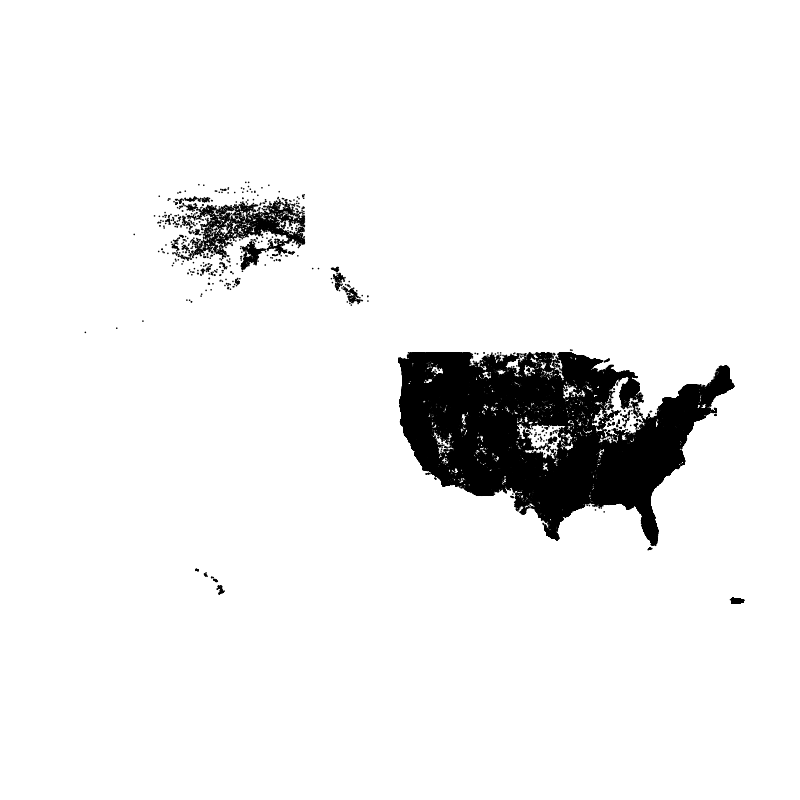
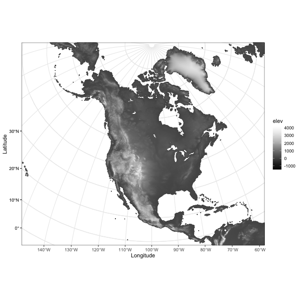
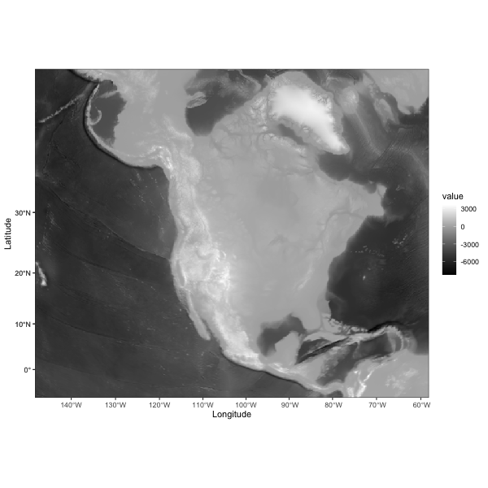

```{r geospatial-1, echo=FALSE}
options(width = 105)
knitr::opts_chunk$set(dev='png', dpi=300, cache=FALSE, out.width = "80%", out.height = "80%", verbose=TRUE)
pdf.options(useDingbats = TRUE)
klippy::klippy(position = c('top', 'right'))
```
<p><span style="color: #00cc00;">NOTE:  This page has been revised for Winter 2024, but may undergo further edits.</span></p>

# Introduction #

The `sf` package (and `sp` before it), with its direct links to the `GDAL`, `GEOS`, and `PROJ` libraries give **R** a powerful geospatial analysis capability, and at this point in the development of packages and methods for handling spatial, practically anything that can be accomplished in commercial or open-source GIS software can be done in **R**.  Because **R** is script-oriented, this has the added benefit of reproducibility, inasmuch as scripts can be saved and reused, while analysis done in menu-focused GUIs are not.

The examples here cover some of the typical things one might want to do in a GIS package.  

# Extract data from a raster #

This example demonstrates how to extract data from a raster for a set of target points contained in a .csv file.  In this case, the raster is the Ramankutty and Foley potential natural vegetation data set ([https://www.nelson.wisc.edu/sage/data-and-models/global-land-use/index.php](Shttps://www.nelson.wisc.edu/sage/data-and-models/global-land-use/index.php)), and the target points are the Global Charcoal Database (GCDv3) site locations ([http://www.gpwg.paleofire.org](http://www.gpwg.paleofire.org)), with the task being to "look up" the vegetation at each site. The first example uses a function, `extract()` in the `{terra}` package.

Load some packages:

```{r geospatial-2, results="hide", message=FALSE}
# load packages
library(maps)
library(sf)
library(terra)
library(tidyterra)
library(classInt)
library(ggplot2)
library(RColorBrewer)
```

Get some outlines:

```{r geospatial-3}
# world_sf
world_sf <- st_as_sf(maps::map("world", plot = FALSE, fill = TRUE))
world_otl_sf <- st_geometry(world_sf)
plot(world_otl_sf)

# conus_sf
conus_sf <- st_as_sf(map("state", plot = FALSE, fill = TRUE))
conus_otl_sf <- st_geometry(conus_sf)
plot(conus_otl_sf)
```


## Read the data sets -- source and target ##

Use the `{terra}` package to read the vegetation data, which are stored in a netCDF file.

```{r geospatial-4 }
# read potential natural vegetation data sage_veg30.nc as a terra SpatRaster
# modify the following path to reflect local files
vegtype_path <- "/Users/bartlein/Projects/RESS/data/nc_files/"
vegtype_name <- "sage_veg30.nc"
vegtype_file <- paste(vegtype_path, vegtype_name, sep="")
vegtype <- rast(vegtype_file)
vegtype 
```

Quick plot.

```{r geospatial-5 }
# quick plot
plot(vegtype, col = rev(brewer.pal(9,"Greens")))
```

Note that the data are vegetation type, not tree-cover density, but the green scale works well.

Read the charcoal data locations:

```{r geospatial-6 }
# read GCDv3 sites
# modify the following path to reflect local files
csv_path <- "/Users/bartlein/projects/RESS/data/csv_files/"
csv_name <- "GCDv3_MapData_Fig1.csv"
csv_file <- paste(csv_path, csv_name, sep="")
gcdv3 <- read.csv(csv_file) 
plot(gcdv3$Long, gcdv3$Lat, pch=16, cex=0.5, col="blue")
```

In order to use the `extract()` function from `raster`, the target points must be turned into a `sf` object data set.

```{r geospatial-7}
# turn the .csv file into an sf object
gcdv3_sf <- st_as_sf(gcdv3, coords = c("Long", "Lat"))
class(gcdv3_sf)
gcdv3_sf
```

Add the CRS:

```{r geospatial-8 }
st_crs(gcdv3_sf) <- st_crs("+proj=longlat")
```

Plot the target points on top of ths source map.  The `as_Spatial()` function converts an `sf` object to a `sp` spatial-data type on the fly.

```{r geospatial-9 }
ggplot() +
  geom_spatraster(data = vegtype) +
  scale_fill_gradient(low = "darkgreen", high = "white", na.value = "transparent") +
  geom_sf(data = world_otl_sf, fill = NA) + 
  coord_sf(xlim = c(-180, +180), ylim = c(-90, 90), expand = FALSE) +
  scale_x_continuous(breaks = seq(-180, 180, 30)) +
  scale_y_continuous(breaks = seq(-90, 90, 30)) +
  geom_point(aes(gcdv3$Lon, gcdv3$Lat), color = "blue", size = 1.0 ) +
  labs(title = "Vegetation Type", x = "Longitude", y = "Latitude", fill = "Vegetation Type") +
  theme_bw()
```

## Extract data at target points ##

Now extract the data for the target points:

```{r geospatial-10 }
# extract data from the raster at the target points
gcdv3_vegtype <- extract(vegtype, gcdv3_sf, method="simple")
class(gcdv3_vegtype)
head(gcdv3_vegtype)
```

Make a dataframe of the extracted data that could be saved as a .csv file, and plot it:

```{r geospatial-11 }
pts <- data.frame(gcdv3$Lon, gcdv3$Lat, gcdv3_vegtype$vegtype)
names(pts) <- c("Lon", "Lat", "vegtype")
head(pts, 10)
plotclr <- rev(brewer.pal(8,"Greens"))
plotclr <- c("#AAAAAA", plotclr)
cutpts <- c(0, 2, 4, 6, 8, 10, 12, 14, 16)
color_class <- findInterval(gcdv3_vegtype$vegtype, cutpts)
plot(pts$Lon, pts$Lat, col=plotclr[color_class+1], pch=16)
```

Plot the extracted data at the target points on top of the source points.  If the extraction is successful, the target-point colors should disappear against the background.

```{r geospatial-12 }
ggplot() +
  geom_spatraster(data = vegtype, show.legend = FALSE) +
  scale_fill_gradient(low = "darkgreen", high = "white", na.value = "transparent") +
  geom_sf(data = world_otl_sf, fill = NA) + 
  coord_sf(xlim = c(-180, +180), ylim = c(-90, 90), expand = FALSE) +
  scale_x_continuous(breaks = seq(-180, 180, 30)) +
  scale_y_continuous(breaks = seq(-90, 90, 30)) +
  geom_point(aes(pts$Lon, pts$Lat, color = gcdv3_vegtype$vegtype), shape = 16, size = 1.5 ) +
  geom_point(aes(pts$Lon, pts$Lat), shape = 1, size = 1.5 ) +
  scale_color_gradient(low = "darkgreen", high = "white", name = "Type") +
  labs(title = "Potential Natural Vegetation", x = "Longitude", y = "Latitude") +
  theme_bw()
```

Looks ok.

[[Back to top]](geospatial.html)

## A second example -- explicit cell selection ##

Here's a second example of extracting values from an array, by referencing the specific cell or array element that a target point falls in.  In this example, a netCDF file of bioclimatic variables is read using `ncdf4` and the values of `mtco` (mean temperature of the coldest month) are extracted.

```{r geospatial-13, cache=FALSE}
library(ncdf4)
library(lattice)
library(classInt)
library(RColorBrewer)
```

```{r geospatial-14, echo=TRUE, eval=TRUE, cache=FALSE}
# set path and filename
# modify the following path to reflect local files
nc_path <- "/Users/bartlein/Projects/RESS/data/nc_files/"
nc_name <- "cru10min30_bio.nc"  
nc_fname <- paste(nc_path, nc_name, sep="")
```

```{r geospatial-15, echo=TRUE, eval=TRUE, cache=FALSE}
# open a netCDF file
ncin <- nc_open(nc_fname)
print(ncin)
```
```{r geospatial-16 }
# get longitude and latitude
lon <- ncvar_get(ncin,"lon")
nlon <- dim(lon)
head(lon)
lat <- ncvar_get(ncin,"lat")
nlat <- dim(lat)
head(lat)
print(c(nlon,nlat))
```
```{r geospatial-17 }
# get the mtco data
mtco <- ncvar_get(ncin,"mtco")
dlname <- ncatt_get(ncin,"mtco","long_name")
dunits <- ncatt_get(ncin,"mtco","units")
fillvalue <- ncatt_get(ncin,"mtco","_FillValue")
dim(mtco)
```
```{r geospatial-18 }
mtco[mtco==fillvalue$value] <- NA
```

Close the netCDF file using the `nc_close()` function.

```{r geospatial-19 }
# close the netCDF file
nc_close(ncin)
```

Plot the control data.

```{r geospatial-20 }
# levelplot of the slice
grid <- expand.grid(lon=lon, lat=lat)
cutpts <- c(-50,-40,-30,-20,-10,0,10,20,30,40,50)
levelplot(mtco ~ lon * lat, data=grid, at=cutpts, cuts=11, pretty=TRUE, 
  col.regions=(rev(brewer.pal(10,"RdBu"))))
```

Now extract the data for the target points:

Get the indices (j's and k's) of the grid cell that each target point lies in.  For each target point, figure out which column (`j`) and row (`k`) a target point falls in.  This code is basically the same as that used in reshaping a "short" data frame into an array.  The function that is defined and executed within the `sapply()` function figures out which column (`j`) and row ('k') in the control-data array a target point falls in.  The `j`'s and `k`'s together describe the control-data grid cells the individual target points fall in.

```{r geospatial-21 }
j <- sapply(gcdv3$Lon, function(x) which.min(abs(lon-x)))
k <- sapply(gcdv3$Lat, function(x) which.min(abs(lat-x)))
head(cbind(j,k)); tail(cbind(j,k))
```

Get the data for each j, k combination.  The way to do this is the convert the `mtco` array to a vector, and then calculate an index `jk` for each target value:

```{r geospatial-22 }
mtco_vec <- as.vector(mtco)
jk <- (k-1)*nlon + j
gcdv3_mtco <- mtco_vec[jk]
head(cbind(j,k,jk,gcdv3_mtco,lon[j],lat[k]))
```

```{r geospatial-23 }
gcdv3_mtco[is.na(gcdv3_mtco)] <- -99
pts <- data.frame(gcdv3$Lon, gcdv3$Lat, gcdv3_mtco)
names(pts) <- c("Lon", "Lat", "mtco")
head(pts, 20)
```
Plot the extracted values of `mtco`.  To do this, the colors for plotting the different levels of `mtco` are generated from and `RColorBrewer` palette, and augmented by gray (`"#AAAAAA"`) to handle missing values (i.e. from marine charcoal records, or those from sites "off" the cru10min30 grid).

```{r geospatial-24 }
plotclr <- rev(brewer.pal(10,"RdBu"))
plotclr <- c("#AAAAAA", plotclr)
cutpts <- c(-50,-40,-30,-20,-10,0,10,20,30,40,50)
color_class <- findInterval(gcdv3_mtco, cutpts)
plot(gcdv3$Lon, gcdv3$Lat, col=plotclr[color_class+1], pch=16)
```
[[Back to top]](geospatial.html)

# Clipping/Trimming/Point-in-polygon analyses #

A common problem arises in dealing with spatial data is the "clipping" or "trimming" problem, in which one wants to know whether one or more points lie within the outlines of a particular polygon, or in the case of multiple polygons, which polygon an individual point lies in.  More formally, this is known as the "point in polygon" problem.  Here the process of clipping the na_10km_v2 climate grid to a tree-species shape file, in particular, that for *Picea mariana* (black spruce) is demonstrated.  What we want is a list of climate data set points that lie withing the range of *P. mariana*.

## Read the polygon and target-point files ##

Read the shapefile for *Picea mariana*

```{r geospatial-25 }
# read the shape file for Picea Mariana
# modify the following path to reflect local files
shp_file <- "/Users/bartlein/Projects/RESS/data/shp_files/picea_mariana/picea_mariana.shp"
picea_sf <- st_read(shp_file)
picea_sf
```

Plot the outline.  

```{r geospatial-26 }
plot(st_geometry(picea_sf))
```

Read the na10km_v2 points as a .csv file (for illustration, in practice it would be more efficient to read it as a netCDF file).  This file contains the grid-point locations of a present-day climate data set, and we want a list of the points that fall within the range limits of Picea mariana.

```{r geospatial-27 }
# read the na10km_v2 points (as a .csv file)
csv_file <- "/Users/bartlein/Projects/RESS/data/csv_files/na10km_v2.csv"
na10km_v2 <- read.csv(csv_file)
str(na10km_v2)
```

We don't need data from east of 45 W, so trim the data set.

```{r geospatial-28 }
na10km_v2 <- na10km_v2[na10km_v2$lon <= -45.0, ]
str(na10km_v2)
```

Make an `sf` object of the na10km_v2 data-point locations, and plot it:

```{r geospatial-29 }
# make an sf object
na10km_v2_sf <- st_as_sf(na10km_v2, coords = c("lon", "lat"))
st_crs(na10km_v2_sf) <- st_crs("+proj=longlat")
na10km_v2_sf
plot(st_geometry(na10km_v2_sf), pch=16, cex=0.2) # takes a little while
```

## Overlay the points onto the polygons ##

Now overlay the points onto the polygons.  The `st_join()` function can take a little while to run.

```{r geospatial-30 }
# overlay the two
st_crs(picea_sf) <- st_crs(na10km_v2_sf) # make sure CRS's exactly match
picea_pts_sf <- st_join(na10km_v2_sf, picea_sf)
picea_pts_sf <- na.omit(picea_pts_sf)
picea_pts_sf
```

The warning `although coordinates are longitude/latitude, st_intersects assumes that they are planar` arises because in fact, longitude and latitude are anisotropic, and it would be better to do this with projected data with isotropic coordinates (i.e. x- and y- coordinates in metres.)

```{r geospatial-31}
plot(st_geometry(na10km_v2_sf), pch=16, cex=0.2, axes=TRUE)
plot(st_geometry(picea_pts_sf), pch=16, cex=0.2, col="green", add=TRUE)
```

[[Back to top]](geospatial.html)

# Gridding or rasterizing point data #

Another common task is to grid or rasterize a set of point data, creating a gridded data set of counts, averages, minima, maxima, etc.  This can be illustrated using the FPA-FOD daily fire-fire start data set:  Spatial wildfire occurrence data for the United States, 1992-2013/Fire Program Analysis Fire-Occurrence Database [FPA_FOD_20150323] (3nd Edition) (Short, K.C., 2014, Earth Syst. Sci. Data, 6, 1-27) – [http://www.fs.usda.gov/rds/archive/Product/RDS-2013-0009.3/](http://www.fs.usda.gov/rds/archive/Product/RDS-2013-0009.3/).  The idea here is to calculate the number and average area of the fires that occured in 0.5-degree grid cells that cover the coterminous U.S.

The analysis here uses an approach from the `sp` package.

## Read the data sets, and create empty rasters ##

```{r geospatial-32 }
library(terra)
```

Read the fire-start data:

```{r geospatial-33 }
# read the FPA-FOD fire-start data
# modify the following path to reflect local files
csv_path <- "/Users/bartlein/Projects/RESS/data/csv_files/"
csv_name <- "fpafod_1992-2013.csv"
csv_file <- paste(csv_path, csv_name, sep="")
fpafod <- read.csv(csv_file) # takes a while
str(fpafod)
```

Convert the fire-start data to an `sf`POINT object...

```{r geospatial-34 }
# convert to sf
fpafod_sf <- st_as_sf(fpafod, coords = c("longitude", "latitude"), crs = "+proj=longlat +ellps=WGS84" )
fpafod_sf
```
... and to a `{terra}` SpatVector 

```{r geospatial-35}
# and to a terra SpatVector object
fpafod_vec <- vect(fpafod_sf)
fpafod_vec
```


Plot the data. (The file is quite large, 1.7 million points, so plot to an external .png file.)

```{r geospatial-36}
# plot the data
png(file = "fpafod_sf.png", width = 800, height = 800)
plot(st_geometry(fpafod_sf), pch = 16, cex = 0.3)
dev.off()
```


## Rasterize the data ##

Now rasterize the data, first as counts (number of fires in each grid cell), and then as the average size of the fires in each grid cell.  Also plot the data (both variables on a log10 scale). Begin by creating an empty raster to hole the fire-counts data.

```{r geospatial-37}
# create (empty) fire counts raster
cell_size <- 0.5
lon_min <- -128.0; lon_max <- -65.0; lat_min <- 25.5; lat_max <- 50.5
ncols <- ((lon_max - lon_min)/cell_size)+1; nrows <- ((lat_max - lat_min)/cell_size)+1
us_fire_counts <- rast(nrows=nrows, ncols=ncols, xmin=lon_min, xmax=lon_max, ymin=lat_min, ymax=lat_max, res=cell_size, crs="+proj=longlat +datum=WGS84")
us_fire_counts
```

Rasterize the fire-count data. Note the function used to bin the data is `count()` (`fun = "mean"`).

```{r geospatial-38 }
# rasterize
us_fire_counts <- rasterize(fpafod_vec, us_fire_counts, field = "area_ha", fun="count")
us_fire_counts
dim(us_fire_counts)
```

Plot the data:

```{r geospatial-39}
# plot
plot(log10(us_fire_counts), col=brewer.pal(9,"BuPu"), sub="log10 Number of Fires")
plot(conus_otl_sf, add = TRUE)
```

Rasterize the fire-area data. Note the function is now the `mean()` (`fun = "mean"`).

```{r geospatial-40}
# create (empty) fire area raster
cell_size <- 0.5
lon_min <- -128.0; lon_max <- -65.0; lat_min <- 25.5; lat_max <- 50.5
ncols <- ((lon_max - lon_min)/cell_size)+1; nrows <- ((lat_max - lat_min)/cell_size)+1
us_fire_area <- rast(nrows=nrows, ncols=ncols, xmin=lon_min, xmax=lon_max, ymin=lat_min, ymax=lat_max, res=cell_size, crs="+proj=longlat +datum=WGS84")
us_fire_area
```

```{r geospatial-41}
# rasterize
us_fire_area <- rasterize(fpafod_vec, us_fire_area, field = "area_ha", fun="mean")
us_fire_area
dim(us_fire_area)
```

```{r geospatial-42}
# plot
plot(log10(us_fire_area), col=brewer.pal(9,"YlOrRd"), sub="log10 Mean Area")
plot(conus_otl_sf, add = TRUE)
```


## Write the rasterized data out as a netCDF file ##

Write the two rasterized data sets out as variables in a netCDF data set.  Create some variables, and replace the R `NAs` with netCDF fillvalues:

```{r geospatial-43 }
# make necessary vectors and arrays
lon <- seq(lon_min+0.25, lon_max-0.25, by=cell_size)
lat <- seq(lat_max-0.25, lat_min+0.25, by=-1*cell_size)
print(c(length(lon), length(lat)))
```


```{r geospatial-44}
fillvalue <- 1e32
us_fire_counts2 <- t(terra::as.array(us_fire_counts)[,,1])
dim(us_fire_counts2)
class(us_fire_counts2)
us_fire_counts2[is.na(us_fire_counts2)] <- fillvalue

us_fire_area2 <- t(terra::as.array(us_fire_area)[,,1])
dim(us_fire_area2)
class(us_fire_area2)
us_fire_area2[is.na(us_fire_area2)] <- fillvalue
```

Write out a netCDF file:

```{r geospatial-45 }
# write out a netCDF file
library(ncdf4)

# path and file name, set dname
# modify the following path to reflect local files
nc_path <- "/Users/bartlein/Projects/RESS/data/nc_files/"
nc_name <- "us_fires.nc"
nc_fname <- paste(nc_path, nc_name, sep="")
```

```{r geospatial-46}
# create and write the netCDF file -- ncdf4 version
# define dimensions
londim <- ncdim_def("lon", "degrees_east", as.double(lon))
latdim <- ncdim_def("lat", "degrees_north", as.double(lat))

# define variables

dname <- "fpafod_counts"
dlname <- "Number of fires, 1992-2013"
v1_def <- ncvar_def(dname,"1",list(londim,latdim),fillvalue,dlname,prec="single")
dname <- "fpafod_mean_area"
dlname <- "Average Fire Size, 1992-2013"
v2_def <- ncvar_def(dname,"ha",list(londim,latdim),fillvalue,dlname,prec="single")

# create netCDF file and put arrays
ncout <- nc_create(nc_fname, list(v1_def, v2_def), force_v4=TRUE)

# put variables
ncvar_put(ncout,v1_def,us_fire_counts2)
ncvar_put(ncout,v2_def,us_fire_area2)

# put additional attributes into dimension and data variables
ncatt_put(ncout,"lon","axis","X")
ncatt_put(ncout,"lat","axis","Y")

# add global attributes
ncatt_put(ncout,0,"title","FPA-FOD Fires")
ncatt_put(ncout,0,"institution","USFS")
ncatt_put(ncout,0,"source","http://www.fs.usda.gov/rds/archive/Product/RDS-2013-0009.3/")
ncatt_put(ncout,0,"references", "Short, K.C., 2014, Earth Syst. Sci. Data, 6, 1-27")
history <- paste("P.J. Bartlein", date(), sep=", ")
ncatt_put(ncout,0,"history",history)
ncatt_put(ncout,0,"Conventions","CF-1.6")

# Get a summary of the created file:
ncout

# close the file, writing data to disk
nc_close(ncout)
```

[[Back to top]](geospatial.html)

# Interpolating/regridding #

Another common task involves tranferring values from one gridded data set to another.  When the grids are identical, this is trivial, but when the "target" grid is different from the source or "control" grid, this involves interpolation (as does also the case when the target points are irregularly distributed).  The most widely used method for interpolation within a control grid is *bilinear interpolation*, which involves finding the control grid points that surround a particular target point, and then simultaneously (linearlly) interplating in the x- and y-directions.  The method is implemented in the `raster` package, and relatively fast version is implemented in the `fields` package.

The example here uses a lower-resolution verions of the `ETOPO1` global DEM as the source file, and the locations of the (land-only) points in the na10km_v2 grid as the targets.  These are read in here from a .csv file, but they also could have come from a netCDF file.

## Open the "control" netCDF and target .csv files ##

Load the appropriate packages.

```{r geospatial-47, messages=FALSE, warning=FALSE, results='hide'}
# load libraries
library(sf)
library(terra)
library(tidyterra)
```

Read the etopo1 netCDF file.  This particular file is one in which the original 30-sec data have been aggregated (by averaging) to six minutes or one-tenth of a degree (to speed up the execution of the examples).  In practice, one would work with the original higher resolution data.  Do some setup an open the file, and list its contents.

```{r geospatial-48, echo=TRUE, eval=TRUE, cache=FALSE}
# set path and filename
# modify the following path to reflect local files
nc_path <- "/Users/bartlein/Projects/RESS/data//nc_files/"
nc_name <- "etopo1_ig_06min.nc"
nc_fname <- paste(nc_path, nc_name,  sep="")
dname <- "elev"
```

Read the netCDF file as as `{terra}` SpatRaster: 
```{r geospatial-49, cache=FALSE}
# read the netCDF file as a SpatRaster
etopo1_raster <- rast(nc_fname)
etopo1_raster
```

Get the "control" longitudes and latitudes.

```{r geospatial-50 }
# open a netCDF file
ncin <- nc_open(nc_fname)
print(ncin)
# get longitude and latitude
lon <- ncvar_get(ncin,"lon")
nlon <- dim(lon)
head(lon)
lat <- ncvar_get(ncin,"lat")
nlat <- dim(lat)
head(lat)
print(c(nlon,nlat))
```

Produce a quick map to check that the data make sense.  (*Always do this!*)

```{r geospatial-51, cache=TRUE}
# plot the "control" raster
plot(etopo1_raster, col = (hcl.colors(50, palette = "Grays")))
```

Open and read the .csv file containing the "target" points.

```{r geospatial-52 }
# read na10km_v2 grid-point locations -- land-points only
# modify the following path to reflect local files
csv_path <- "/Users/bartlein/Projects/RESS/data/csv_files/"
csv_name <- "na10km_v2_pts.csv"
csv_file <- paste(csv_path, csv_name, sep="")
na10km_v2 <- read.csv(csv_file)
str(na10km_v2)
```

Get the number of target points:

```{r geospatial-53 }
# get number of target points
ntarg <- dim(na10km_v2)[1]
ntarg
```

## Interpolation ##

Set up to do the interpolation.  Make a "target-point" dataframe:

```{r geospatial-54 }
# make target point data.frame
targ_df <- data.frame(na10km_v2$lon, na10km_v2$lat)
```

... and do the interpolation:

```{r geospatial-55}
# bilinear interpolation using terra::extract()
na10km_v2_interp <- extract(etopo1_raster, targ_df, method = "bilinear", layer = "elev", bind = TRUE)
head(na10km_v2_interp)
```

Assemble an output dataframe:

```{r geospatial-56}
# assemble an output dataframe
na10km_v2_interp_df <- data.frame(na10km_v2$x, na10km_v2$y, targ_df, na10km_v2_interp$value)
names(na10km_v2_interp_df) <- c("x", "y", "lon", "lat", "elev")
head(na10km_v2_interp_df)
```

Get a quick map:

```{r geospatial-57 }
# ggplot of the interpolated data
library(ggplot2)
ggplot(data = na10km_v2_interp_df, aes(x = x, y = y)) + 
  geom_tile(aes(fill = elev)) + 
  scale_fill_gradientn(colors = terrain.colors(12)) + 
  theme_bw()
```

At this point, `interp_mat` could be written out as a variable in a netCDF file (along with dimension and attribute data).  It is also possible to make a data frame of the interpolated data, which could be written out as a .csv file. The map isn't great--it's projected, but the axes are in x- and y- locations in meters.

Make an `sf` POINT object:

```{r geospatial-58}
# make an sf object
NA_10km_v2_elev_sf <- st_as_sf(na10km_v2_interp_df, coords = c("x", "y"))
NA_10km_v2_elev_sf

# add (projected) CRS
st_crs(NA_10km_v2_elev_sf) <- 
  st_crs("+proj=laea +lon_0=-100 +lat_0=50 +x_0=0 +y_0=0 +ellps=WGS84 +datum=WGS84 +units=m +no_defs")
NA_10km_v2_elev_sf
class(NA_10km_v2_elev_sf)
```

Here's a better version (written to a .png file in the working directory):

```{r geospatial-59}
# ggplot2 map
png(file = "NA_10km_v2_elev_sf.png", width = 600, height = 600)
pal <- rev(brewer.pal(9, "Greys"))
ggplot() + 
  geom_sf(data = NA_10km_v2_elev_sf, aes(color = elev), size = 0.0001) + 
  coord_sf(crs = st_crs(NA_10km_v2_elev_sf), xlim = c(-5770000, 5000000), ylim = c(-4510000, 4480000)) +
  scale_color_gradientn(colors = pal) +
  labs(x = "Longitude", y = "Latitude") +
  scale_x_discrete(breaks = seq(160, 360, by=10)) +
  scale_y_discrete(breaks = seq(0, 90, by=10)) +
  theme_bw()
dev.off()
```

Another approach is to reproject the control data (on a longitude by latitude grid) into the coordiate system of the target grid (Lambert Azimuthal Equal Area). Make a raster of the target points. Note that the extent of the grid (i.e. edges) is specified, not the grid-cell centers.

```{r geospatial-60}
# make a raster of projected na10km_v2 point, note extent
res <- 10000
xmin <- -5770000 - res/2; xmax <- 5000000 + res/2; ymin <- -4510000 - res/2; ymax <- 4480000 + res/2
ncols <- ((xmax - xmin)/10000) + 1; nrows <- ((ymax - ymin)/10000) + 1
newcrs <- "+proj=laea +lon_0=-100 +lat_0=50 +x_0=0 +y_0=0 +ellps=WGS84 +datum=WGS84 +units=m +no_defs"
NA_10km_v2_raster <- rast(ncols = ncols, nrows = nrows, xmin = xmin, xmax = xmax,
            ymin = ymin, ymax = ymax, resolution = res, crs = newcrs)
NA_10km_v2_raster

```

Now do the projection:

```{r geospatial-61}
# project etopo1_raster onto NA_10km_v2_raster
NA_10km_v2_raster_proj <- project(etopo1_raster, NA_10km_v2_raster)
NA_10km_v2_raster_proj
class(NA_10km_v2_raster_proj)
```

Note that this approach also interpolates bathymetry.

Here's a `{ggplot2}` map.

```{r geospatial-62}
# ggplot2 map
png(file = "NA_10km_v2_elev_raster_proj.png", width = 600, height = 600)
pal <- rev(brewer.pal(9, "Greys"))
ggplot() + 
  geom_spatraster(data = NA_10km_v2_raster_proj, aes(fill = elev)) + 
  coord_sf(crs = st_crs(NA_10km_v2_raster_proj), xlim = c(-5770000, 5000000), ylim = c(-4510000, 4480000)) +
  scale_fill_gradientn(colors = grey(0:100 / 100), na.value = "transparent") +
  labs(x = "Longitude", y = "Latitude") +
  scale_x_discrete(breaks = seq(0, 360, by=10)) +
  scale_y_discrete(breaks = seq(0, 90, by=10)) +
  theme_bw()
dev.off()
```


[[Back to top]](geospatial.html)
