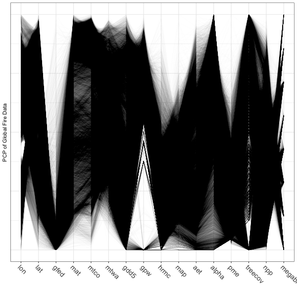
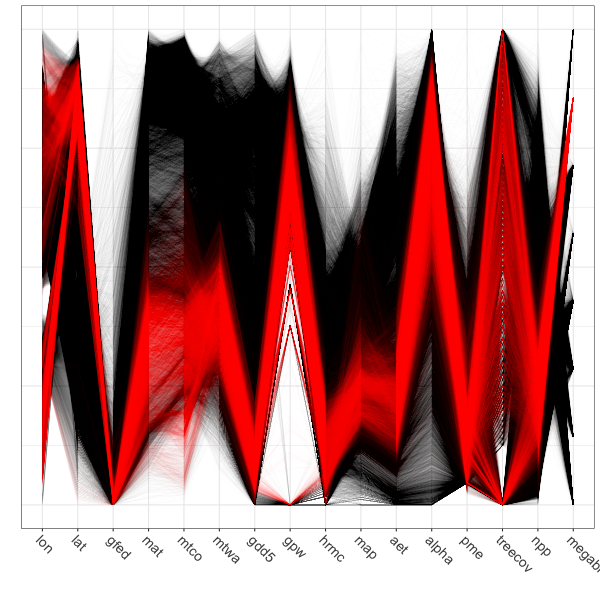

```{r highdim-1, set-options, echo=FALSE}
options(width = 105)
knitr::opts_chunk$set(dev='png', dpi=300, cache=TRUE, out.width = "75%", out.height = "75%")
knitr::opts_knit$set(progress = TRUE, verbose = TRUE)
pdf.options(useDingbats = TRUE)
klippy::klippy(position = c('top', 'right'))
```

<p><span style="color: #00cc00;">NOTE:  This page has been revised for Winter 2024, but may undergo further edits.</span></p>

# Introduction #

One of the hallmarks of Earth-system science data is that it is either high-dimensional (i.e. many variables, as in a "wide" data frame), or high-resolution (i.e. many rows, as in a "tall" data frame).  There has been a rapid increase in the availability of such data sets that may contain thousands of observations (high-resolution, i.e. high-density or high-frequency data sets) and tens or hundreds of variables or attributes (high-dimension).  Data sets like these  arise from:

- satellite remote sensing and other remote-sensing methods (e.g. hyperspectral methods)
- comprehensive censuses and other polling activities
- synthesis databases of existing data sets
- "reanalysis" sets of climatological variables that may consist of multiple observations per day over spans of multiple decades
- climate-model simulations of past, present and future climates
- grid-point and other forms of data exported from GIS-managed data sets.

Although computing resources now permit the rapid production of such data sets, there is still a need for visualizing and understanding the results, and in many contexts, the analysis of the data sets is lagging the production of the data.  Several approaches are evolving::

- methods for visualizing many hundreds or thousands (or more) data points using "conventional" approaches, with about a million points now (2010’s) considered to represent a "large" data set.
- methods for examining "linked" displays (usually interactively) that allow individual observations to be tracked across multiple views of a data
- special-purpose analysis methods for dealing with high-resolution (density or frequency) data sets
- traditional and novel methods for dealing with high-dimensional data sets (i.e. those with many variables, or more variables than observations)

# Parallel coordinate plots #

Parallel coordiate plots in a sense present an individual axis for each variable in a dataframe along which the individual values of the variable are plotted (usually rescaled to lie between 0 and 1), with the points for a particular observation joined by straight-line segments.  Usually the points themselves are *not* plotted to avoid clutter, but all data values (or "cells" in the dataframe) explictly appear on the plot, nearly a million of them in the example here.  Parallel coordinate plots can be generated using the `GGally` package.

## Global fire data ##

The global fire data set provides a good instructional example of the development and use of parallel coordinate plots.  The input data consist of the GFEDv3.1 burned fraction (of half-degree grid cells, `gfed`), several bioclimatic variables (mean annual temperature (`mat`), mean temperature of the warmest and coldest months (`mtwa` and `mtco` respectively), growing degree days (5-deg C base, `gdd5`), annual precipitation (`map`), annual equilibrium evapotranspiration (`aet`), precipitation minus evapotranspiration (`pme`), `alpha` (P-E),lightning-strike frequency (`hmrc`), population density (`gpw`), net primary productivity (`npp`), treecover (`treecov`), and two categorical variables describing "megabiomes" and potential natural vegetation types (`megabiome` and `vegtype` respectively).

Load the necessary packages:

```{r highdim-2,  message=FALSE}
# load packages
library(sf)
library(ggplot2)
library(tidyr)
library(GGally)
#library(gridExtra)
```

 Read the data from an existing `.csv` file.
 
```{r highdim-3, echo=TRUE, eval=TRUE, results='hide'}
# read the data -- output suppressed
csvpath <- "/Users/bartlein/Projects/RESS/data/csv_files/"
csvname <- "global_fire.csv"
csvfile <- paste(csvpath, csvname, sep="")
gf <- read.csv(csvfile)
str(gf)
summary(gf)
```

The two categorical (i.e. factor) variables have levels arranged in the default alphabetical order.  The following code reorders the levels into something more ecologically and climatically sensible:

```{r highdim-4, echo=TRUE, eval=TRUE, results='hide'}
# reorder megabiomes -- output suppressed
megabiome_name <- c("TropF", "WarmF", "SavDWd", "GrsShrb", "Dsrt", "TempF", "BorF", "Tund", "None", "Ice")
gf$megabiome <- factor(gf$megabiome, levels=megabiome_name)

# reorder vegtypes
vegtype_name <- c("TrEFW","TrDFW","TeBEFW","TeNEFW","TeDFW","BrEFW","BrDFW","EDMFW",
                  "Savan","GrStp","ShrbD","ShrbO","Tund","Dsrt","PDRI")
gf$vegtype <- factor(gf$vegtype, levels=vegtype_name)

# check the new ordering of factor levels
str(gf[16:17])
```

Drop the last two categories

```{r highdim-5}
# drop last two categories
mb2 <- c("TropF", "WarmF", "SavDWd", "GrsShrb", "Dsrt", "TempF", "BorF", "Tund")
gf <- gf[gf$megabiome %in% mb2, ]
table(gf$megabiome)
```

Do the usual transformations:

```{r highdim-6, eval=TRUE, echo=FALSE, results='hide'}
gf$hrmc <- sqrt(gf$hrmc)
min(log10(gf$gpw[gf$gpw > 0]))
gf$gpw <- log10(gf$gpw + 1e-10)
gf$map <- sqrt(gf$map)
gf$pme <- sqrt(gf$pme - min(gf$pme))
```
```{r highdim-7, eval=FALSE, echo=TRUE}
# transformations (output suppressed)
hist(gf$hrmc)
gf$hrmc <- sqrt(gf$hrmc)
hist(gf$hrmc)

hist(log10(gf$gpw[gf$gpw > 0]))
min(log10(gf$gpw[gf$gpw > 0]))
gf$gpw <- log10(gf$gpw + 1e-10)
hist(gf$gpw)

hist(gf$map)
gf$map <- sqrt(gf$map)
hist(gf$map)

hist(gf$pme)
gf$pme <- sqrt(gf$pme - min(gf$pme))
hist(gf$pme)
```

Get a shapefile too:

```{r highdim-8, messages = FALSE}
# world_sf
library(maps)
world_sf <- st_as_sf(maps::map("world", plot = FALSE, fill = TRUE))
world_otl_sf <- st_geometry(world_sf)
```
```{r highdim-9}
# ggplot map of world_outline
ggplot() + 
  geom_sf(data = world_otl_sf, fill = NA, col = "black") + 
  scale_x_continuous(breaks = seq(-180, 180, 30)) +
  scale_y_continuous(breaks = seq(-90, 90, 30)) +
  coord_sf(xlim = c(-180, +180), ylim = c(-90, 90), expand = FALSE) +
  theme_bw()
```


## Plots ##

Parallel coordinate plots can be made using the `ggparcoord()` function from the `GGally` package:

```{r highdim-10, pcp01}
# parallel coordinate plot
pngfile <- "pcp01.png"
png(pngfile, width=600, height=600) # open the file
ggparcoord(data = gf[1:16],
  scale = "uniminmax", alphaLines = 0.01) + 
  ylab("PCP of Global Fire Data") +
  theme_bw() +
  theme(axis.text.x  = element_text(angle=315, vjust=1.0, hjust=0.0, size=14),
        axis.title.x = element_blank(), 
        axis.text.y = element_blank(), axis.ticks.y = element_blank() )
dev.off()
```


Note the use of transparency, specified by the `alphaLines` argument.  Individual observations (gridpoints) that have similar values for each variable trace out dense bands of lines, and several distinct bands, corresponding to different "pyromes" (like biomes) can be observed.

Parallel coordinate plots are most effective when paired with another display with points highlighted in one display similarly highlighted in the other.  In the case of the global fire data set the logical other display is a map. There are (at least) two ways of doing the highlighting.  Here, a particular megabiome ("BorF" -- Boreal forest/Taiga) is used.  First create a new variable that will be set to zero, except where `gf$megabiome == "BorF"`.  Then, the data are sorted so that the non-"BorF" observations get plotted first.

```{r highdim-11}
# select those points with megabiome = "BorF"
gf$points <- rep(0, dim(gf)[1])
gf$points[gf$megabiome == "BorF"] <- 1
gf$points <- as.factor(gf$points)
table(gf$points)
```


```{r highdim-12 }
# pcp
pngfile <- "pcp02.png"
png(pngfile, width=600, height=600) # open the file
ggparcoord(data = gf[order(gf$points),],
  columns = c(1:16), groupColumn = "points",
  scale = "uniminmax", alphaLines=0.01) + ylab("")  +
  theme_bw() + 
  theme(axis.text.x  = element_text(angle=315, vjust=1.0, hjust=0.0, size=14),
        axis.title.x = element_blank(),
        axis.text.y = element_blank(), axis.ticks.y = element_blank(),
        legend.position = "none") +
  scale_color_manual(values = c(rgb(0, 0, 0, 0.2), "red"))
dev.off()
```


Plot the points.
```{r highdim-13  }
# map
pngfile <- "map02.png"
png(pngfile, width=600, height=300) # open the file

ggplot() +
  geom_point(data = gf, aes(x = lon, y = lat, color = points), size = 0.8) +
  scale_color_manual(values = c("gray80", "red")) +
  geom_sf(data = world_otl_sf, fill = NA, col = "black") + 
  coord_sf(xlim = c(-180, +180), ylim = c(-90, 90), expand = FALSE) +
  scale_x_continuous(breaks = seq(-180, 180, by = 60)) +
  scale_y_continuous(breaks = seq(-90, 90, by = 30)) +
  labs(x = "Longitude", y = "Latitude", title="Selected Points", fill=" ") +
  theme_bw()
dev.off()
```


Before moving on, delete the variable `select_points` from the `gf` dataframe:

```{r highdim-14}
gf$points <- NULL
```

<hr>
# High-density plots with the tabplot package #

The "tableplot" is an interesting visualization method that can be useful for discovering large-scale patterns in the covariations among a small (< 15) set or subset of variables, which can be either continuous or categorical.  The basic idea is to organize the rows of a data set along an axis of increasing or decreasing values of a continuous variable or the different "levels" of a categorical variable.  A reduction in the density of the data is achieved by binning multiple rows of the data and plotting bin averages (or frequencies) of the variables.  As in all compositing techniques, if there a consistent response in the other variables to the variable selected to organize the rows, then this will emerge, otherwise inconsistent reponses will wash each other out, and no apparent pattern will be evident in the plots of the other variables.

## North American modern pollen data ##

This example makes use of a data set of 4360 modern pollen samples for North America, from Whitmore et al. (2005, *Quaternary Science Reviews* [https://doi.org/10.1016/j.quascirev.2005.03.005](https://doi.org/10.1016/j.quascirev.2005.03.005).  The variables include the location and elevation of each sample, the relative abundances of the 12 most-abundant pollen types (transformed by taking square roots), and two categorical variables, Federova et al. (1994) vegetation types and USGS land-cover types from satellite remote-sensing data (see Whitmore et al. 2005 for details).  This data set provides an interesting example, inasmuch as the resulting tableplots are reminiscent of "downcore"-plotted pollen diagrams.

```{r highdim-15, napollen}
# read the North American modern pollen data
csv_path <- "/Users/bartlein/Projects/RESS/data/csv_files/"
csv_name <- "NAmodpol.csv"
csv_file <- paste(csv_path, csv_name, sep="")
napol <- read.csv(csv_file) # takes a while
str(napol)
```

Map the pollen site locations:
  
```{r highdim-16, hd31, fig.width=6, fig.height=5}
library(maps)
plot(napol$Lat ~ napol$Lon, type="n")
map("world", add=TRUE, lwd=2, col="gray")
points(napol$Lat ~ napol$Lon, pch=16)
```

## Plots ##
Load the `tabplot` package.  Note that `tabplot` loads some other packages (`ffbase`, `ff`, `bit`, etc.) that allow for efficient processing of large data sets and replace some of the functions in the `base` package.  It might be good to restart R after using the `tabplot` package.

```{r highdim-17, hd32, message=FALSE}
library(tabplot)
```

Here's a simple tableplot, with the observations arranged by latitude (`sortCol="Lat"`) and linear scales specified for all continuous variables (`scales="lin"`, the `tabplot()` function attempts to find a suitable scale for each variable, but here the pollen variables were all transformed prior to the analysis, and so we want to suppress further transformation here).

(Note that it just happens that the resulting plot looks like a standard pollen diagram--this isn't designed in any way.)

```{r highdim-18, hd33, echo=TRUE, fig.width=10, eval=FALSE}
tableplot(napol, sortCol="Lat", scales="lin", fontsize = 8)
```
```{r highdim-19, hd34, out.height="90%", out.width="90%", message=FALSE, echo=FALSE}
suppressWarnings(tableplot(napol, sortCol="Lat", scales="lin", fontsize = 8))
```

It's possible to see broad trends in all of the pollen types, as well as in the frequency of different vegetationtypes as a function of latitude.

Each bin the above plot represents a bin that, in this case, holds 46 observations, and what is plotted as bars in each column  is the bin-average or frequency for those observations. Here's a second plot like the first, using more bins:
  
```{r highdim-20, hd35, echo=TRUE, eval=FALSE}
tableplot(napol, sortCol="Lat", scales="lin", nBins=200, fontsize = 8)
```
```{r highdim-21, hd36, out.height="90%", out.width="90%", message=FALSE, echo=FALSE}
suppressWarnings(tableplot(napol, sortCol="Lat", scales="lin", nBins=200, fontsize = 8))
```

The same broad-scale patterns are evident in this plot, suggesting that the approach is robust with respect to the number of bins.  The next plot using the abundance of *Picea* (spruce to organize the data):
  
```{r highdim-22, hd37, echo=TRUE, eval=FALSE}
tableplot(napol, sortCol="Picea", scales="lin", nBins=100, , fontsize = 8)
```
```{r highdim-23, hd38, out.height="90%", out.width="90%", message=FALSE, echo=FALSE}
suppressWarnings(tableplot(napol, sortCol="Picea", scales="lin", nBins=100, fontsize = 8))
```

The plot shows that *Aremisia* (sagebrush) pollen has a similar profile to *Picea* and both tend to be high at high elevation and low (western) longitudes.  The next plot using one of the categorical variables to organize the data.

```{r highdim-24, hd39, echo=TRUE, eval=FALSE}
tableplot(napol, sortCol="Fed", scales="lin", nBins=100, fontsize = 8)
```
```{r highdim-25, hd40, out.height="90%", out.width="90%", message=FALSE, echo=FALSE}
suppressWarnings(tableplot(napol, sortCol="Fed", scales="lin", nBins=100, fontsize = 8))
```

The blockiness of the different profiles shows that the individual vegetation types have distinctive mixtures of the different pollen types.

## Global fire data

The global fire data set has roughly the same number of variables as the pollen data, but ten times the number of observations.  The number of individual observations in each bin is therefore larger, increasing the likelihood that the contents of individual bins will be more heterogeneous, with an consequent loss of overall information.

## Plots ##

To start, produce a tableplot, arranged by mean-annual temperature (`mat`), an obvious first-order preditor of biomass burning, as well as overall climate (through the dependence of the water balance on temperature via the Clausius-Clapyron relationship):

```{r highdim-26, out.height="90%", out.width="90%"}
tableplot(gf, sortCol="mat", scales="lin", fontsize = 8, pals=list(megabiome="Set8", vegtype="Set8"))
```

Overall, the trends of individual variables are relatively smooth, and it's easy to see distiguish the temperature and moisture variables (as well as the population variable `gpw`).  The vegetation-type variables `megabiome` and `vegtype` are also well sorted out along a mean annual temperature gradient.  Burned fraction (`gfed`) obviously displays a threshold-type relationshion, where values are small at low temperatures, and higher at high values of `mat`.

Next, the tableplot is sorted by precipitation minus evapotranspiration (`pme`, or P-E):  

```{r highdim-27, out.height="90%", out.width="90%"}
tableplot(gf, sortCol="pme", scales="lin", fontsize = 8, pals=list(megabiome="Set8", vegtype="Set8"))
```

The relationship between burned fraction and P-E evident in univariate plots--the arch-shaped pattern, where burned fraction is highest at intermediate values of effective moisture--is also evident here:  as P-E monotonically incrases, burned fraction (`gfed`) rises, then falls.

Finally, the tableplot can be sorted by burned fraction (`gfed`):

```{r highdim-28, out.height="90%", out.width="90%"}
tableplot(gf, sortCol="gfed", scales="lin", fontsize = 8, pals=list(megabiome="Set8", vegtype="Set8"))
```

This plot confirms the existing relationships, where burned fraction broadly tracks temperature and P-E.  However the plots also reveal a distinct threshold that is apparently related to a distinct discontinuity in vegetation:  the transition beteen desert and tundra vegetation types, and grassland, shubland and forested ones.

[[Back to top]](highdim.html)

# Plotting multivariate/multiple time series #

Although the tableplots of the North American pollen data above happened to look like conventional pollen diagrams, which were a comparatively early (over a century ago) attempt to visualize multivariate data, the data displayed by the `tableplot()` function does not necessarily need to be a series.  The next example illustrates a display method in which the data *do* form a series, in this case pollen data again, only this time for a single site, which form a multivariate time series.

## Carp L. pollen data ##

The data here come from a long pollen record from Carp L., in Washinton State.  (Whitlock, C.L. et al., 2000, *Palaeogeography Palaeoclimatology Palaeoecology* 155(1-2):7-29 [https://doi.org/10.1016/S0031-0182(99)00092-9] (https://doi.org/10.1016/S0031-0182\(99\)00092-9) and Whitlock, C. and P.J. Bartlein, 1997, *Nature* 388:57-61 [https://doi.org/10.1038/40380](https://doi.org/10.1038/40380).  Pollen data are "long-tailed" and so the data were transformed earlier by taking the square root of the pollen percentages.

```{r highdim-29}
# read Carp L. pollen data (transformed to square-roots)
csvpath <- "/Users/bartlein/Projects/RESS/data/csv_files/"
csvname <- "carp96t.csv" # square-root transformed data
carp <- read.csv(paste(csvpath, csvname, sep=""))
summary(carp)
```

Pollen data (expressed as proportions or percentages of individual pollen types) vary over an order of magnitude in value, and also have long-tailed distributions.  Consequently they should be tranformed, and a useful transformation is to simply take the square root of the proportions.

```{r highdim-30}
# transform 
tcarp <- carp
tcarp[4:25] <- sqrt(tcarp[4:25])
names(tcarp)
```

As it appears in the spreadsheet, the data are not particularly well organized, but instead the columns are arranged according to the traditional style of pollen diagrams.  An alternative approach is to arrange the indiviual variables (pollen types) according to their affinities as they vary over the core, which can be accomplished by doing a cluster analysis on a dissimilary matrix among pollen types: taxa that vary in a similar (or inverse) fashion downcore appear adjacent to one another.

```{r highdim-31}
# cluster rearrangement
carp_heat <- heatmap(as.matrix(tcarp[4:25]), Rowv = NA, scale="none")
attributes(carp_heat)
carp_heat$colInd
sort_cols <- carp_heat$colInd + 3
```

The "heatmap" (which in itself provides an interesting way to look at the data), can be used to rearrange the columns of the dataframe to put similar (or inversely similar, when one type is high the other is low) next to one another:

```{r highdim-32}
# rearrange matrix
stcarp <- tcarp
names(stcarp)
stcarp[4:25] <- tcarp[sort_cols]
names(stcarp) <- c("Depth", "Age", "IS", names(tcarp)[sort_cols])
names(stcarp)
```

## Plots ##

The idea behind the `mvtsplots()` package (and function) is to use color to reveal underlying patterns in the data.  The first plot shows the "raw" data, simply coded for each pollen taxon independently from low (magenta) to high (green).  The plots on the margins are of boxplots for the individual series (right), and a time series of the median values across all series (bottom), which attempt to summarize the overall level of the series.

```{r highdim-33, mvtsplots01}
library(mvtsplot)
mvtsplot(stcarp[, 4:25], xtime=carp$Age, levels=9, margin=TRUE)
```

PLotted this way, one begins to get an idea of some organization to the data along the time axis.  The plot is a little noisy, and can be simplified by smoothing the individual series.

```{r highdim-34, mtvsplot02}
mvtsplot(stcarp[, 4:25], xtime=carp$Age, smooth.df=25, levels=9, margin=TRUE)
```

Further simplification can be gotten by "normalizing" the data, transforming and assigning colors based on the range of values in each series individually.

```{r highdim-35, mtvsplot03}
mvtsplot(stcarp[, 4:25], xtime=carp$Age, smooth.df=2, norm="internal", levels=9, margin=TRUE)
```

The color field now shows that the data are well organized in time, which can be verified by adding a plot of the variable `IS` i.e. the MIS (Marine Isotopic Stage) to the plot (on the last row).  The progression of plots can also be seen to have proceeded from a fairly chaotic pattern to one with coherent patches:

```{r highdim-36, mvtsplot04}
mvtsplot(stcarp[, 3:25], xtime=carp$Age, smooth.df=2, norm="internal", levels=9, margin=TRUE)
```

[[Back to top]](highdim.html)

# Interactive plots

R has a long history of attempts to develop interactive plots, usually consisting of the basic plots developed from low-dimensional data. RStudio's *Shiny* package [https://shiny.rstudio.com](https://shiny.rstudio.com) and the *Plotly R Open Source Graphics Library* [https://plot.ly/r/](https://plot.ly/r/) are examples that are rapidly developing.  An interesting plot for displaying high-dimensional data is the *cubeplot*, which is easiest to explain by looking at one.  The data here come from the *TraCE-21k* transient climate simulation from 21,000 years ago to present (at monthly resolution) (Liu, Z., et al. 2009, Science 325(5938): 310-314).  A data set of of decadal-average "anomaly" values (the difference between past and present) is examined here.

## Data ##

The data are read using `{ncdf4}` subsampled and rearranged, and then coverted to a `{stars}` object for plotting using the `{cubeplot}` package.  First, load the packages:

```{r highdim-37, echo=FALSE, eval=TRUE, include=FALSE, results="hide", messages=FALSE, cache=FALSE}
# load packages
library(ncdf4)
library(sf)
library(stars)
library(RColorBrewer)
library(cubeview)
```

Read the data:

```{r highdim-38, echo=TRUE, eval=TRUE, results="hide", warning=FALSE, cache=FALSE}
# read TraCE21-ka transient climate-model simulation decadal data
tr21dec_path <- "/Users/bartlein/Projects/RESS/data/nc_files/"
tr21dec_name <- "Trace21_TREFHT_anm2.nc"
tr21dec_file <- paste(tr21dec_path, tr21dec_name, sep="")
dname <- "tas_anm_ann"
```

```{r highdim-39}
# read the data using ncdf4
nc_in <- nc_open(tr21dec_file)
print(nc_in)
lon <- ncvar_get(nc_in,"lon")
lat <- ncvar_get(nc_in,"lat")
tmp_array <- ncvar_get(nc_in, dname)
```

Generate some age values (22,000 yrs ago to 1989 CE)

```{r highdim-40}
time <- seq(22000, -30, by = -10)
head(time); tail(time)
length(time)
```

Take a look at the data.

```{r highdim-41}
dim(tmp_array)
class(tmp_array)
head(lon); tail(lon); head(lat); tail(lat)
image(tmp_array[,, 1], col = rev(brewer.pal(10,"RdBu")))
```

The data appear to run from 0 to 360, so rotate the longitudes, and also flip the latitudes.

```{r highdim-42}
# rotate longitude
temp <- array(NA, dim = dim(tmp_array))
lon_temp <- rep(NA, length(lon))
temp <- tmp_array
lon_temp <- lon
tmp_array[1:48,,] <- temp[49:96,,] 
tmp_array[49:96,,] <- temp[1:48,,]
lon[1:48] <- lon_temp[49:96] - 360.0
lon[49:96] <- lon_temp[1:48]
# flip latitude
lat <- rev(lat)
image(tmp_array[,, 1], col = rev(brewer.pal(10,"RdBu")))
```


Even though the data are of decadal resolution, that's still a lot of data, and so for this example, the data are downsampled in time to produce century time-step decadal average values. A `time2` value of 0 is equivalent to 1950 CE (or 0 yrs BP).

```{r highdim-43, echo=TRUE, cache=FALSE}
# get every 10-th slice
tmp2 <- array(NA, dim = c(96, 48, 221))
time2 <- rep(NA, 221)
class(tmp2)
dim(tmp2)
for (j in (1:96)) {
  for (k in (1:48)) {
    for (l in (1:221)) {
      tmp2[j, k, l] <- tmp_array[j, k, (1 + (l-1)*10)]
      time2[l] <- time[(1 + (l-1)*10)]
    }
  }
}
image(tmp2[,, 2], col = rev(brewer.pal(10,"RdBu")))
```

Convert to a `{stars}` object:

```{r highdim-44}
tmp2_stars <- st_as_stars(tmp2)
tmp2_stars
```


## Cube plot ## 

The "cubeplot" can be produced using the `cubeView()` function from the `{cubeview}` package.  The plot is interactively controlled as follows (from the `cubeView()` help file:

The location of the slices can be controlled by keys:

- x-axis: LEFT / RIGHT arrow key
- y-axis: DOWN / UP arrow key
- z-axis: PAGE_DOWN / PAGE_UP key

Other controls:

- Press and hold left mouse-button to rotate the cube
- Press and hold right mouse-button to move the cube
- Spin mouse-wheel or press and hold middle mouse-button and move mouse down/up to zoom the cube
- Press space bar to show/hide slice position guides

The `cubeView()` function renders the raster brick, and displays a "map view" on the front (or rear) face of the brick, and Hovmöller plots on the top (or bottom) and sides. The location of the intersection of the slices is listed as x-, y-, and z- coordinates in the legend. The following code fragment can be used to retrieve the real longitude, latitude and time values:

```{r highdim-45}
# get lon, lat, and time from the x-, y-, and z- coorinates
x <- 33; y <- 14; z <- 78
print(c(lon[x], lat[y], time2[z]))
```


```{r highdim-46, echo=TRUE, eval=FALSE, cache=FALSE}
# cubeplot
cutpts <- c(-40,-10,-5,-2,-1,0,1,2,5,10,20)
col = rev(brewer.pal(10,"RdBu"))
cubeView(tmp2_stars, at=cutpts, col.regions=col)
```


To save the interactive cubeplot, in the RStudio Plots window, click on Export > Save as Web Page...

Here is a link to the plot on the server:  [https://pjbartlein.github.io/REarthSysSci/tr21cube.html](https://pjbartlein.github.io/REarthSysSci/tr21cube.html)  

[[Back to top]](highdim.html)
