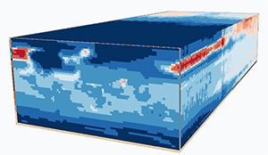

**GEOG 4/590: Spring 2019, 10:00-11:50 Tues & Thurs, 106 Condon Hall**  
**Topic:  R for Earth-System Science**

**Instructor:** Pat Bartlein, bartlein@uoregon.edu, 154 Condon Hall, 6-4967, office hours 2-3p W.

**Overview:**  Research in Earth-System Science (ESS) typically involves the analysis and display of large data sets from observations (including reanalysis data sets), satellite and other sources of remote-sensing imagery, or model output.  A large array of tools and approaches exists for analyzing those data, and each has its own set of advantages and disadvantages.  The R language and data-analysis environment is particularly well suited for analyzing Earth-system data because it includes a large number of analysis packages, many specifically adapted for coping with the characteristics of “big data” like high dimensionality and resolution.  In addition, geospatial analyses, that previously required stand-alone GIS programs, are well integrated into R, and R also has the facility for reading, writing and managing netCDF and HDF data sets—the standard way of storing ESS data.  This course will review the basic applications of R for data analysis and visualization, the management of large data sets, geospatial analyses, and some representative analyses of ESS data sets.  We will also discuss the use of R Markdown and GitHub for doing “reproducible research.”

NOTE:&nbsp; This is the curent web page for GEOG
4/590, R for Earth-System Science.  It is currently under construction, and will evolve over the next few weeks.&nbsp;  

Course Web Page URL:  `https://pjbartlein.github.io/REarthSysSci/`
