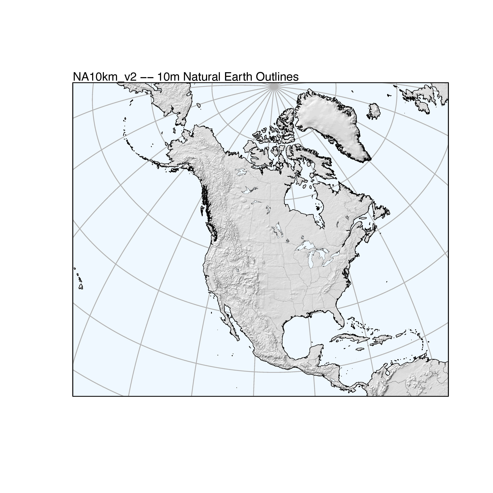

```{r maps2-1, echo=FALSE}
options(width = 105)
knitr::opts_chunk$set(dev='png', dpi=300, cache=TRUE, out.width = "80%", out.height = "80%", verbose=TRUE)
pdf.options(useDingbats = TRUE)
klippy::klippy(position = c('top', 'right'))
```
<p><span style="color: #00cc00;">NOTE:  This page has been revised for Winter 2024, but may undergo further edits.</span></p>

# A second example #

This second example illustrates the creating of a base map for North America that conforms to the projection used for the `na10km_v2` data, a data set of present-day climate that accompanies a packrat-midden database: Strickland, L.E., Thompson, R.S., Shafer, S.L., Bartlein, P.J., Pelltier, R.T., Anderson, K.H., Schumann, R.R., McFadden, A.K., 2024. Plant macrofossil data for 48-0 ka in the USGS North American Packrat Midden Database, version 5.0. Scientific Data 11, 68.
[[https://www.nature.com/articles/s41597-023-02616-y]](https://www.nature.com/articles/s41597-023-02616-y).  As before, *Natural Earth* shapefiles are read and projected, this time using a Lambert Azimuthal Equal-Area projection, and trimmed to the appropriate region.

## Read the Natural Earth shapefiles ##

Load the appropriate packages.

```{r maps2-2, messages=FALSE, results="hide"}
library(sf)
library(stars)
library(ggplot2)
library(RColorBrewer)
library(classInt)
```

Set the shapefile names, including those for global coastlines, adminstrative units (borders).  (Note that these are smaller-spatial/larger-cartrographic resolution shapefiles, more appropriate for continental-scale as opposed to global-scale mapping.)  Set the filenames:

```{r maps2-3}
# read Natural Earth shapefiles
shape_path <- "/Users/bartlein/Projects/RESS/data/RMaps/source/"
coast_shapefile <- paste(shape_path, "ne_10m_coastline/ne_10m_coastline.shp", sep="")
admin0_shapefile <- paste(shape_path, "ne_10m_admin_0_countries/ne_10m_admin_0_countries.shp", sep="")
admin1_shapefile <- paste(shape_path, 
        "ne_10m_admin_1_states_provinces_lakes/ne_10m_admin_1_states_provinces_lakes.shp", sep="")
lakes_shapefile <- paste(shape_path, "ne_10m_lakes/ne_10m_lakes.shp", sep="")
grat15_shapefile <- paste(shape_path, "ne_10m_graticules_all/ne_10m_graticules_15.shp", sep="")
```

As before, query geometry types to compose object names:

```{r maps2-4}
# query geometry type
coast_geometry <- as.character(st_geometry_type(st_read(coast_shapefile), by_geometry = FALSE))
coast_geometry
```

Read and plot the shapefiles. At a higher spatial resolution, these files will take more time to load. (Note:  summary output is suppressed)

```{r maps2-5, results="hide", warnings=FALSE, cache=TRUE}
# read shapefiles
coast_lines_sf <- st_read(coast_shapefile) # note geometry type MULTILINESTRING
plot(st_geometry(coast_lines_sf), col="gray50")
admin0_poly_sf <- st_read(admin0_shapefile) # note:  geometry type MULTIPOLYGON
plot(st_geometry(admin0_poly_sf), col="gray70", border="red", add = TRUE)
admin1_poly_sf <- st_read(admin1_shapefile) # note:  geometry type MULTIPOLYGON
plot(st_geometry(admin1_poly_sf), col="gray70", border="pink", add = TRUE)
lakes_poly_sf <- st_read(lakes_shapefile) # note:  geometry type POLYGON
plot(st_geometry(lakes_poly_sf), col="blue", add = TRUE)
grat15_lines_sf <- st_read(grat15_shapefile) # note:  geometry type LINESTRING
plot(st_geometry(grat15_lines_sf), col="gray50", add = TRUE)

# filter out the small lakes
lrglakes_poly_sf <- lakes_poly_sf[as.numeric(lakes_poly_sf$scalerank) <= 2 ,]
plot(lrglakes_poly_sf, bor="purple", add=TRUE)
```


Take a look at the `admin1_poly` dataframe, to figure out the codes for Canadian and U.S. provincial and state borders.

```{r maps2-6 }
head(admin0_poly_sf)
```

The approprate code to extract the U.S. and Canada data is `admin1_poly$sr_sov_a3 == "CAN"` and `admin1_poly$sr_sov_a3 == "US1"`.  Extract the borders, and plot the resulting shapefiles.

```{r maps2-7 }
# extract US and Canada boundaries
can_poly_sf <- admin1_poly_sf[admin1_poly_sf$sov_a3 == "CAN" ,]
us_poly_sf <- admin1_poly_sf[admin1_poly_sf$sov_a3 == "US1",]
plot(st_geometry(coast_lines_sf))
plot(st_geometry(can_poly_sf), border = "red", add=TRUE)
plot(st_geometry(us_poly_sf), border = "blue", add=TRUE)
```

Convert the U.S. and Canada polygons to `MULTILINESTRINGS`:

```{r maps2-8 }
# convert geometries from polygons to lines
admin0_lines_sf <- st_cast(admin0_poly_sf, "MULTILINESTRING")
can_lines_sf <- st_cast(can_poly_sf, "MULTILINESTRING")
us_lines_sf <- st_cast(us_poly_sf, "MULTILINESTRING")
```

## Project the shape files ##

Set the `proj4string` value and the coordinate reference system for the na10km_v2 grid:

```{r maps2-9 }
# Lambert Azimuthal Equal Area
na_proj4string <- "+proj=laea +lon_0=-100 +lat_0=50 +x_0=0 +y_0=0 +ellps=WGS84 +datum=WGS84 +units=m +no_defs"
na_crs = st_crs(na_proj4string)
```

Project the various shapefiles (and plot the coastlines as an example):

```{r maps2-10 }
coast_lines_proj <- st_transform(coast_lines_sf, crs = na_crs)
admin0_poly_proj <- st_transform(admin0_poly_sf, crs = na_crs)
admin0_lines_proj <- st_transform(admin0_lines_sf, crs = na_crs)
admin1_poly_proj <- st_transform(admin1_poly_sf, crs = na_crs)
lakes_poly_proj <- st_transform(lakes_poly_sf, crs = na_crs)
lrglakes_poly_proj <- st_transform(lrglakes_poly_sf, crs = na_crs)
can_poly_proj <- st_transform(can_poly_sf, crs = na_crs)
us_poly_proj <- st_transform(us_poly_sf, crs = na_crs)
can_lines_proj <- st_transform(can_lines_sf, crs = na_crs)
us_lines_proj <- st_transform(us_lines_sf, crs = na_crs)
grat15_lines_proj <- st_transform(grat15_lines_sf, crs = na_crs)
```

```{r maps2-11, cache=TRUE}
plot(st_geometry(admin0_lines_proj), col = "gray70")
plot(st_geometry(coast_lines_proj), col = "black", add=TRUE)
plot(st_geometry(grat15_lines_proj), col = "gray70", add=TRUE)
```

Define a bounding box for trimming the polygon and line shape files to the area covered by the na10km_v2 grid. The extent of the area is known from the definition of the grid, but could also be determined by reading an na10km_v2 netCDF file.  The projected `admin` shape files are quite complicated, and create "topology exception errors".  These can be fixed using an approach discussed on StackExchange [[link]](http://gis.stackexchange.com/questions/163445/r-solution-for-topologyexception-input-geom-1-is-invalid-self-intersection-er)

```{r maps2-12 }
# North America Bounding box (coords in metres)
na10km_bb <- st_bbox(c(xmin = -5770000, ymin = -4510000, xmax = 5000000, ymax = 4480000), crs = na_proj4string)
na10km_bb <- st_as_sfc(na10km_bb)
```

Clip or trim the coastlines to the `na10km_bb` boundary-box object, using the `st_intersection()` function:

```{r maps2-13}
# clip the projected objects to the na10km_bb
na10km_coast_lines_proj <- st_intersection(coast_lines_proj, na10km_bb)
plot(st_geometry(na10km_coast_lines_proj))
plot(st_geometry(na10km_bb), add = TRUE)
```


```{r maps2-14, warning=FALSE}
# trim the other projected objects
na10km_lakes_poly_proj <- st_intersection(lakes_poly_proj, na10km_bb)
na10km_lrglakes_poly_proj <- st_intersection(lrglakes_poly_proj, na10km_bb)
na10km_can_poly_proj <- st_intersection(can_poly_proj, na10km_bb)
na10km_us_poly_proj <- st_intersection(us_poly_proj, na10km_bb)
na10km_can_lines_proj <- st_intersection(can_lines_proj, na10km_bb)
na10km_us_lines_proj <- st_intersection(us_lines_proj, na10km_bb)
na10km_grat15_lines_proj <- st_intersection(grat15_lines_proj, na10km_bb)
na10km_admin0_poly_proj <- st_intersection(admin0_poly_proj, na10km_bb)
na10km_admin1_poly_proj <- st_intersection(admin1_poly_proj, na10km_bb)
```

Plot the projected shapefiles.

```{r maps2-15 }
# plot the projected objects
plot(st_geometry(na10km_coast_lines_proj))
plot(st_geometry(na10km_can_lines_proj), col = "pink", add = TRUE)
plot(st_geometry(na10km_us_lines_proj), col = "lightblue", add = TRUE)
plot(st_geometry(na10km_lrglakes_poly_proj), col = "lightblue", bor = "blue", add=TRUE)
plot(st_geometry(na10km_admin0_poly_proj), bor = "gray70", add = TRUE)
plot(st_geometry(na10km_grat15_lines_proj), col = "gray70", add = TRUE)
plot(st_geometry(na10km_bb), border = "purple", add = TRUE)
```

## Write out the projected and trimmed shape files ##

Next, write out the projected shapefiles, first setting the output path.

```{r maps2-16, warning=FALSE}
# write out the various shapefiles 
outpath <- "/Users/bartlein/Projects/RESS/data/RMaps/derived/na10km_10m/"
```

```{r maps2-17}
# coast lines 
outshape <- na10km_coast_lines_proj
outfile <- "na10km_10m_coast_lines/"
outshapefile <- paste(outpath,outfile,sep="")
st_write(outshape, outshapefile, driver = "ESRI Shapefile", append = FALSE)
```

It's always good practice to test whether the shapefile has ideed been written out correctly.  Read it back in and plot it.

```{r maps2-18 }
# test
test_sf <- st_read(outshapefile)
test_outline <- st_geometry(test_sf)
plot(test_outline, col="gray")
```

Write out the other shape files (output is suppressed):

```{r maps2-19, messages = FALSE, results="hide", warning=FALSE}
# write out the various shapefiles 
outshape <- na10km_bb
outfile <- "na10km_10m_bb/"
outshapefile <- paste(outpath,outfile,sep="")
st_write(outshape, outshapefile, driver = "ESRI Shapefile", append = FALSE)

# lakes poly
outshape <- na10km_lakes_poly_proj
outfile <- "na10km_10m_lakes_poly/"
outshapefile <- paste(outpath, outfile, sep="")
st_write(outshape, outshapefile, driver = "ESRI Shapefile", append = FALSE)

# lrglakes poly
outshape <- na10km_lrglakes_poly_proj
outfile <- "na10km_10m_lrglakes_poly"
outshapefile <- paste(outpath,outfile,sep="")
st_write(outshape, outshapefile, driver = "ESRI Shapefile", append = FALSE)

# can poly
outshape <- na10km_can_poly_proj
outfile <- "na10km_10m_can_poly/"
outshapefile <- paste(outpath,outfile,sep="")
st_write(outshape, outshapefile, driver = "ESRI Shapefile", append = FALSE)

# us poly
outshape <- na10km_us_poly_proj
outfile <- "na10km_10m_us_poly/"
outshapefile <- paste(outpath,outfile,sep="")
st_write(outshape, outshapefile, driver = "ESRI Shapefile", append = FALSE)

# can lines
outshape <- na10km_can_lines_proj
outfile <- "na10km_10m_can_lines/"
outshapefile <- paste(outpath,outfile,sep="")
st_write(outshape, outshapefile, driver = "ESRI Shapefile", append = FALSE)

# us lines
outshape <- na10km_us_lines_proj
outfile <- "na10km_10m_us_lines/"
outshapefile <- paste(outpath,outfile,sep="")
st_write(outshape, outshapefile, driver = "ESRI Shapefile", append = FALSE)

# admin0 poly
outshape <- na10km_admin0_poly_proj
outfile <- "na10km_10m_admin0_poly/"
outshapefile <- paste(outpath,outfile,sep="")
st_write(outshape, outshapefile, driver = "ESRI Shapefile", append = FALSE)

# admin1 poly
outshape <- na10km_admin1_poly_proj
outfile <- "na10km_10m_admin1_poly/"
outshapefile <- paste(outpath,outfile,sep="")
st_write(outshape, outshapefile, driver = "ESRI Shapefile", append = FALSE)
```
[[Back to top]](Rmaps2.html)

# Map of North American shaded relief #

## Read the projected and trimmed shapefiles ##

Plot the projected and trimmed shapefiles: 

```{r maps2-20, cache=TRUE}
# plot the basemap (note different order than before)
plot(st_geometry(na10km_bb), border = "black", col = "aliceblue")
plot(st_geometry(na10km_grat15_lines_proj), col = "gray70", add = TRUE)
plot(st_geometry(na10km_admin0_poly_proj), col = "white",  border = "gray", add = TRUE)
plot(st_geometry(na10km_can_lines_proj), col = "gray", add = TRUE)
plot(st_geometry(na10km_us_lines_proj), col = "gray", add = TRUE)
plot(st_geometry(na10km_lrglakes_poly_proj), col = "aliceblue", border = "black", lwd = 0.5, add = TRUE)
plot(st_geometry(na10km_coast_lines_proj), col = "black", lwd = 0.5, add = TRUE)
plot(st_geometry(na10km_bb), boder = "black", add = TRUE)
```

## Read a shaded relief file ##

Read a pre-computed shaded relief file.  This could also be crearted by reading the na10km_v2 grid-point elevations and using the `shade` function from the `terra` package.  Note that in this file, the coordinates are in km, and so they must be multiplied by 1000.

```{r maps2-21 }
# get 10km shade values
datapath <- "/Users/bartlein/Projects/RESS/data/csv_files/"
datafile <- "na10km_shade.csv"
shade <- read.csv(paste(datapath,datafile,sep=""))
str(shade)
shade$x <- shade$x*1000
shade$y <- shade$y*1000
head(shade)
```

Convert the dataframe to a POINTS `sf` object

```{r maps2-22 }
# convert to POINTS
shade_pixels <- st_as_sf(shade, coords = c("x", "y"), crs = na_crs)
shade_pixels
```

Read some predetermined (gray-scale) colors for the shading.

```{r maps2-23 }
# read hillshade color numbers
colorfile <- "shade40_clr.csv"
shade_rgb <- read.csv(paste(datapath, colorfile, sep=""))
shade_clr <- rgb(shade_rgb)
```

Set the (gray-scale) color numbers for each pixel:

```{r maps2-24 }
shade_int <- as.integer(((shade$shade+1)/2)*40)+1
shade_colnum <- shade_clr[shade_int]
```

## Make the map ##

Plot the shaded-relief colors and the various shape files.  The location of the text string was determined by plotting an initial version of the map, and using the `locator()` function.  The `cex=0.09` argument in plotting `shade_pixels` was determined by trial and error. Redirect the output to a .pdf file.

```{r maps2-25, cache = TRUE, echo=TRUE, eval=FALSE, messages=FALSE}
pdf(file = "na_shade01b.pdf")
plot(st_geometry(na10km_bb), border = "black", col = "aliceblue")
plot(st_geometry(na10km_grat15_lines_proj), col = "gray70", add = TRUE)
plot(st_geometry(shade_pixels), pch=15, cex=0.09, col=shade_colnum, add = TRUE)
plot(st_geometry(na10km_admin0_poly_proj), lwd=0.2, bor="gray50", add=TRUE)
plot(st_geometry(na10km_can_lines_proj), lwd=0.2, col="gray50", add=TRUE)
plot(st_geometry(na10km_us_lines_proj), lwd=0.2, col="gray50", add=TRUE)
plot(st_geometry(na10km_lrglakes_poly_proj), lwd=0.2, bor="black", col="aliceblue", add=TRUE)
plot(st_geometry(na10km_coast_lines_proj), lwd=0.5, add=TRUE)
text(-5770000, 4620000, pos=c(4), offset=0.0, cex=1.0, "NA10km_v2 -- 10m Natural Earth Outlines")
plot(st_geometry(na10km_bb), add=TRUE)
dev.off()
```


The resulting plot will look like this:  


[[Back to top]](Rmaps2.html)
