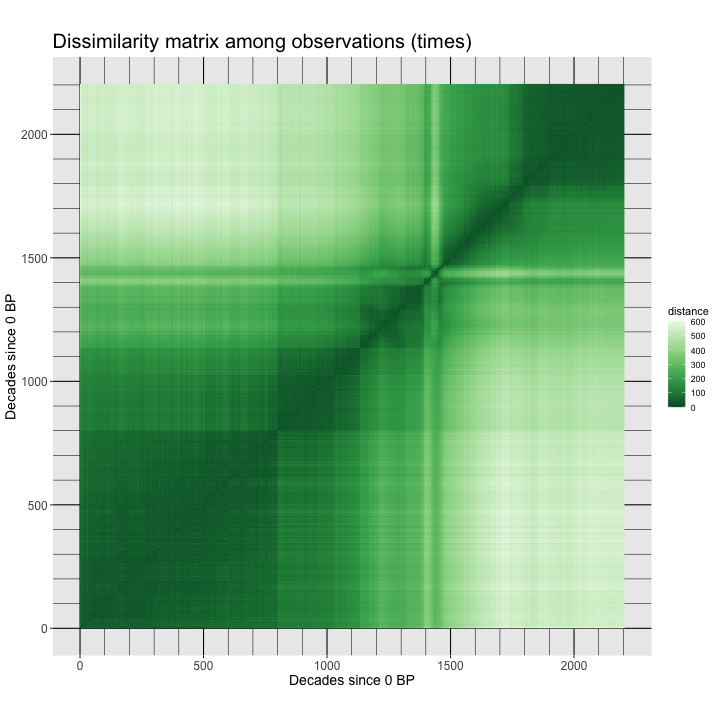
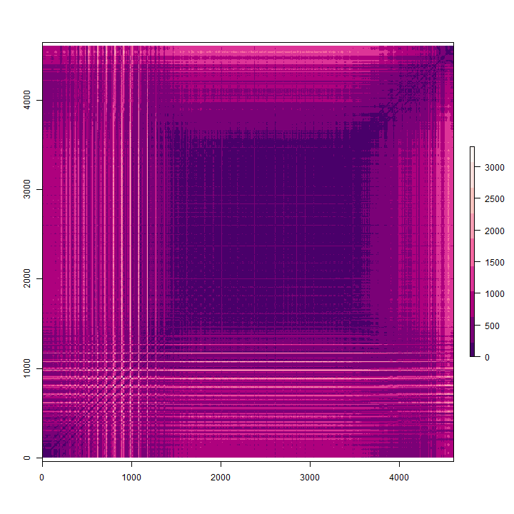
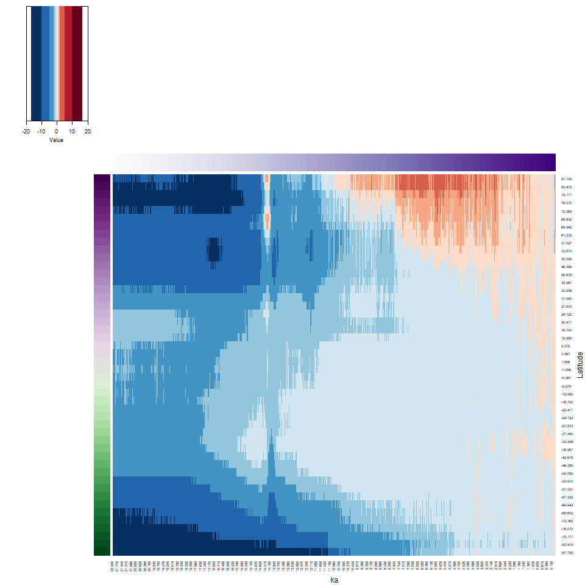
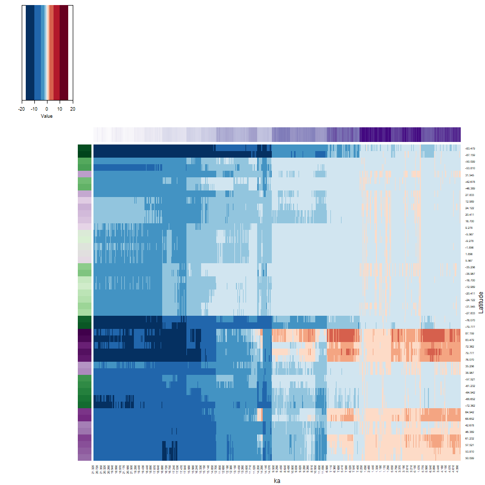
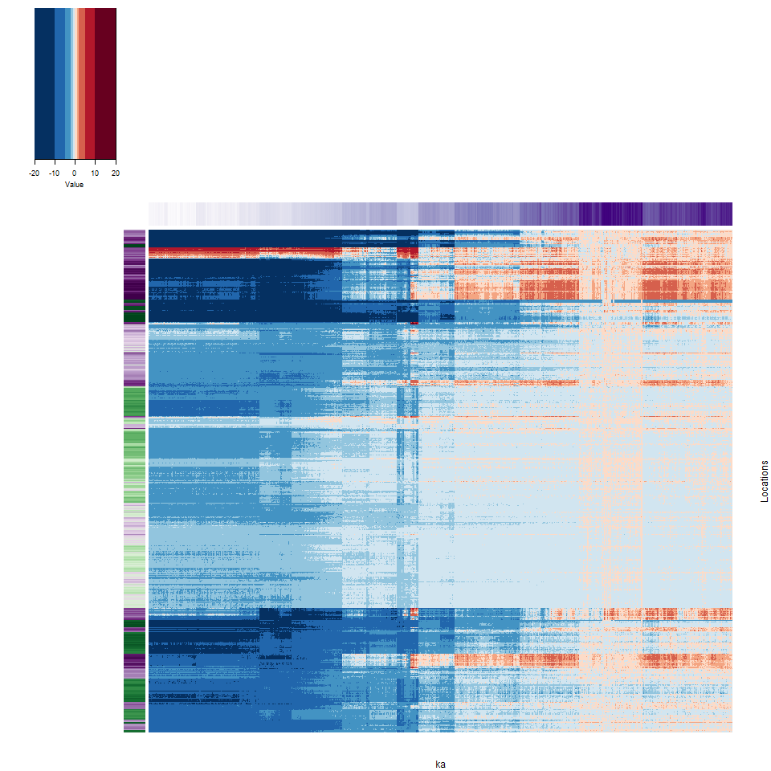

```{r, set-options, echo=FALSE}
options(width = 105)
knitr::opts_chunk$set(dev='png', dpi=300, cache=FALSE, out.width = "75%", out.height = "75%")
knitr::opts_knit$set(progress = TRUE, verbose = TRUE)
pdf.options(useDingbats = TRUE)
klippy::klippy(position = c('top', 'right'))
```

# Introduction #

There is a broad group of multivariate analyses that have as their objective the organization of individual observations (objects, sites, grid points, individuals), and these analyses are built upon the concept of multivariate distances (expressed either as similarities or dissimilarities) among the objects.

The organization generally takes two forms:

- the arrangement of the objects in a lower-dimensional space than the data were originally observed on;
- the development of "natural" clusters or the classifications of the objects.

These analyses share many concepts and techniques (both numerical and practical) with other procedures such as principal components analysis, numerical taxonomy, discriminant analysis and so on.

The analyses generally begin with the construction of an *n* x *n* matrix **D** of the distances between objects.  For example, in a two dimensional space, the elements *d<sub>ij</sub>* of **D** could be the Euclidean distances between points,

*d<sub>ij</sub>* = [(*x<sub>i1</sub>*- *x<sub>j1</sub>*)<sup>2</sup> + (*x<sub>i1</sub>*- *x<sub>j1</sub>*)<sup>2</sup>]<sup>½</sup>

The Euclidean distance, and related measures are easily generalized to more than two dimensions.

# A simple cluster analysis #

The basic idea of cluster analysis can be illustrated using the Oregon climate-station dataset, with the goal being to identify groups of stations with similar climates, which also regionalizes the climate of the state.  Begin by reading a shape file for mapping the data, and the data itself.

```{r, message=FALSE}
# read county outlines
library(sp)
library(rgdal)
otl_path <- "/Users/bartlein/Projects/ESSD/data/shp_files/OR/"
otl_name <- "orotl.shp"
otl_file <- paste(otl_path, otl_name, sep="")
orotl_shp <- readOGR(otl_file)
```
```{r}
# read stations
orstationc_path <- "/Users/bartlein/Projects/ESSD/data/csv_files/"
orstationc_name <- "orstationc.csv"
orstationc_file <- paste(orstationc_path, orstationc_name, sep="")
orstationc <- read.csv(orstationc_file)
summary(orstationc)
attach(orstationc)
```

Plot the station locations.

```{r}
# plot stations
plot(orotl_shp)
points(lon, lat, xlim=c(-125, -116), ylim=c(41,47),
   xlab="Latitude", ylab="Longitude", type="n")
text(lon, lat, labels=station, cex=0.6)
```

## The cluster analysis #

In this example, the groups of stations or the climate regions of Oregon (as expressed in the climate-station data) will be defined via an “agglomerative-hierarchical” cluster analysis. In such an analysis, individual objects (observations) are combined according to their (dis)similarity, with the two most similar objects being combined first (to create a new composite object), then the next two most similar objects (including the composites), and so on until a single object is defined. The sequence of combinations is illustrated using a “dendrogram” (cluster tree), and this can be examined to determine the number of clusters. The function cutree determines the cluster membership of each observation, which can be listed or plotted.

The first step in an agglomerative cluster analysis (although not always expicitly displayed), is the calculation of a dissimilarity matrix, which is a square symmetrical matrix that illustrates the dissimilarities (typically Euclidean distances) between individual cases or observations, using, in this case the six climate variables to define the space that distance is calculated in.

```{r, fig.asp=1}
# get dissimilarities (distances) and cluster
library(lattice)
X <- as.matrix(orstationc[,5:10])
X_dist <- dist(scale(X))
grid <- expand.grid(obs1 = seq(1:92), obs2 = seq(1:92))
levelplot(as.matrix(X_dist)/max(X_dist) ~ obs1*obs2, data=grid, 
    col.regions = gray(seq(0,1,by=0.0625)), xlab="observation", ylab="observation")
```

In the code above, for convience, a matrix **X** was created to omit the variables we don’t want to include in the clustering (i.e. the non-climatic information). The levelplot() function plots the dissimilarity matrix that the cluster analysis works with. The "plaid" as opposed to completely random appearance of the plot indicates that it is likely that natural groups will exist in the data.  Now do the cluster analysis:

```{r}
# cluster analysis
X_clusters <- hclust(X_dist, method = "ward.D2")
plot(X_clusters, labels=station, cex=0.5)
```

The function `hclust()` performs a "Wards's single-linkage" analysis, and the `plot()` function plots the dendrogram.  Notice that the individual "leaves" of the plot are labeled by the climate-station names.

The dendrogram can be inspected to get an idea of how many distinct clusters there are (and it can also identify unusual points–look for Crater Lake `CLK`). As a first guess, let’s say there were three distinct clusters evident in the dendrogram.  The `cuttree()` function can be used to "cut" the dendrogram at a particular level:

```{r}
# cut dendrogram and plot points in each cluster (chunk 1)
nclust <- 3
clusternum <- cutree(X_clusters, k=nclust)
```

And then the cluster membership (i.e. which cluster?) of each station can be mapped.

```{r}
# plot cluster membership of each station
plot(lon, lat, xlim=c(-125, -116), ylim=c(41,47), xlab="Latitude", ylab="Longitude",
     main=paste(as.character(nclust), "Clusters"), type="n")
plot(orotl_shp, add=T)
text(lon, lat, labels=clusternum)
```

(A listing of the cluster number that each station belongs to can be gotten by the following code.)


```{r, echo=TRUE, eval=FALSE}
print(cbind(station, clusternum, as.character(Name)))
```

## Examining the cluster analysis

The efficacy of the analyis in regionalizing or grouping the stations can be gauged usigns plots and a analysis that looks at the "separation" of the groups of stations.

```{r}
# examine clusters -- simple plots 
tapply(tjan, clusternum, mean)
histogram(~ tjan | clusternum, nint=20, layout=c(1,3))
```

Note how many of the histograms seem multimodal–this is a clear sign of inhomogeneity of the clusters. Let’s see how the clusters differ.  This can be done via discriminant analysis, which (like PCA) defines some new variables with desireable properties, in this case, new variables that maximally "spread out" the groups along the new variable axes:

```{r}
# discriminant analysis (chunk 3)
library(MASS)
cluster_lda1 <- lda(clusternum ~ tjan + tjul + tann + pjan + pjul + pann)
cluster_lda1
plot(cluster_lda1)

cluster_dscore <- predict(cluster_lda1, dimen=nclust)$x
for (j in 1:(nclust-1)) {
  boxplot(cluster_dscore[,j] ~ clusternum, xlab=paste("LD", as.character(j), sep=""))
  }
cor(orstationc[5:10],cluster_dscore)
```

The discriminant analysis here is used to answer the question “how do the clusters of stations differ climatically?” In this case, it looks like `pann` and `tann` are the variables most closely correlated with each discriminant function, and because each of these variables are more-or-less averages of the seasonal extreme variables, that might explain why the clusters seem inhomogeneous.

The analysis can be repeated, extracting different numbers of clusters. The easiest way to do this is to copy the three chunks of code above into a text editor, changing the assignment to nclust and including or excluding before executing each chunk, one at a time.

# Distances:  among observations and among variables

```{r, echo=TRUE, eval=FALSE}
# load packages
# distance matrices
library(parallelDist)
library(raster)
```


```{r, echo=TRUE, eval=FALSE}
# disatances among observations (time)
dist_obs <- as.matrix(parDist(X)) 
dim(dist_obs)
```


```{r, echo=TRUE, eval=FALSE}
raster_obs <- flip(raster(dist_obs, xmn=0, ymn=0, xmx=dim(dist_obs)[1], ymx=dim(dist_obs)[2]), direction=1)
raster_obs
```


```{r, echo=TRUE, eval=FALSE}
png(dist_obs_pngfile, width=720, height=720) # open the file
plot(raster_obs, maxpixels=dim(dist_obs)[1]*dim(dist_obs)[2], col=rev(brewer.pal(9,"RdPu"))) 
dev.off()
```


```{r, echo=TRUE, eval=FALSE}
# variables (grid points)
dist_var <- as.matrix(parDist(t(X))) 
dim(dist_var)

raster_var <- flip(raster(dist_var, xmn=0, ymn=0, xmx=dim(dist_var)[1], ymx=dim(dist_var)[2]), direction=1)
raster_var

png(dist_var_pngfile, width=720, height=720) # open the file
plot(raster_var, maxpixels=dim(dist_var)[1]*dim(dist_var)[2], col=rev(brewer.pal(9,"RdPu"))) 
dev.off()
```






# Heatmaps (2-way, time and space clustering)

## A simple example with Hovmöller-matrix data

### Set up

```{r, echo=TRUE, eval=FALSE}
# Hovmöller matrix 
X <- matrix(0, nrow=nlat, ncol=nt)
for (n in (1:nt)) {
  for (k in (1:nlat)) {
    for (j in (1:nlon)) {
      X[k, n] <- X[k, n] + var_array[j, k, n]
    }
    X[k, n] <- X[k,n ]/nlon
  }
}
dim(X)
ncols <- dim(X)[2]
```


```{r, echo=TRUE, eval=FALSE}
# set row and column names
rownames(X) <- str_pad(sprintf("%.3f", lat), 5, pad="0")
head(rownames(X));tail(rownames(X)); length(rownames(X))
colnames(X) <- str_pad(sprintf("%.3f", plt_xvals), 5, pad="0")
head(colnames(X));tail(colnames(X)); length(colnames(X))
```


```{r, echo=TRUE, eval=FALSE}
# flip X
X <- X[(nlat:1),]
head(rownames(X)); tail(rownames(X)); length(rownames(X))
```


```{r, echo=TRUE, eval=FALSE}
# subset
X <- X[,seq(1, 2201, by=20)]
dim(X)
ncols <- dim(X)[2]
rownames(X)
```

```{r, echo=TRUE, eval=FALSE}
# generate colors for heatmap and side bars
rcol <- colorRampPalette(brewer.pal(10,"PRGn"))(nlat)
ccol <- colorRampPalette(brewer.pal(9,"Purples"))(ncols)
ncols <- 10
zcol <- (rev(brewer.pal(10,"RdBu"))) #(ncols)
breaks = c(-20,-10,-5,-2,-1,0,1,2,5,10,20)
length(breaks)
```

### Hovmöller-matrix plot (decimated decadal data)

```{r, echo=TRUE, eval=FALSE}
png_file <- paste(file_label, "_heatmap_hov_01", ".png", sep="")
png(png_file, width=960, height=960)
system.time( X_heatmap <- heatmap.2(X, cexRow = 0.8, cexCol = 0.8, scale="none", Rowv=NA, Colv=NA, dendrogram = "none",
        RowSideColors=rcol, ColSideColors=ccol, col=zcol, breaks=breaks, trace="none", density.info = "none",
        lmat=rbind(c(6, 0, 5), c(0, 0, 2), c(4, 1, 3)), lwid=c(1.0, 0.2, 5.0), lhei = c(1.5, 0.2, 4.0), 
        xlab = "ka", ylab = "Latitude", key = TRUE, key.title = NA) 
)
dev.off()
```


### Hovmöller-matrix heatmap (decimated decadal data)

```{r, echo=TRUE, eval=FALSE}
png_file <- paste(file_label, "_heatmap_01", ".png", sep="")
png(png_file, width=960, height=960)
system.time( X_heatmap <- heatmap.2(X, cexRow = 0.8, cexCol = 0.8, scale="none", # Rowv=NA, Colv=NA, dendrogram = "none",
        RowSideColors=rcol, ColSideColors=ccol, col=zcol, breaks=breaks, trace="none", density.info = "none",
        lmat=rbind(c(6, 0, 5), c(0, 0, 2), c(4, 1, 3)), lwid=c(1.0, 0.2, 5.0), lhei = c(1.5, 0.2, 4.0), 
        xlab = "ka", ylab = "Latitude", key = TRUE, key.title = NA) 
)
dev.off()
```


## A second example with decadal data

```{r, echo=TRUE, eval=FALSE}
# generate colors for horizontal side bar
ccol <- colorRampPalette(brewer.pal(9,"Purples"))(ncols)
```

### Hovmöller-matrix plot 

```{r, echo=TRUE, eval=FALSE}
png_file <- paste(file_label, "_heatmap_hov_01", ".png", sep="")
png(png_file, width=960, height=960)
system.time( X_heatmap <- heatmap.2(X, cexRow = 0.8, cexCol = 0.8, scale="none", Rowv=NA, Colv=NA, dendrogram = "none",
        RowSideColors=rcol, ColSideColors=ccol, col=zcol, breaks=breaks, trace="none", density.info = "none",
        lmat=rbind(c(6, 0, 5), c(0, 0, 2), c(4, 1, 3)), lwid=c(1.0, 0.2, 5.0), lhei = c(1.5, 0.2, 4.0), 
        xlab = "ka", ylab = "Latitude", key = TRUE, key.title = NA) 
)
dev.off()
```



### Hovmöller-matrix heatmap 

```{r, echo=TRUE, eval=FALSE}
png_file <- paste(file_label, "_heatmap_01", ".png", sep="")
png(png_file, width=960, height=960)
system.time( X_heatmap <- heatmap.2(X, cexRow = 0.8, cexCol = 0.8, scale="none", # Rowv=NA, Colv=NA, dendrogram = "none",
        RowSideColors=rcol, ColSideColors=ccol, col=zcol, breaks=breaks, trace="none", density.info = "none",
        lmat=rbind(c(6, 0, 5), c(0, 0, 2), c(4, 1, 3)), lwid=c(1.0, 0.2, 5.0), lhei = c(1.5, 0.2, 4.0), 
        xlab = "ka", ylab = "Latitude", key = TRUE, key.title = NA) 
)
dev.off()
```



## Full-grid example

### Set up

```{r, echo=TRUE, eval=FALSE}
# reshape the 3-d array
var_vec_long <- as.vector(var_array)
length(var_vec_long)
X <- matrix(var_vec_long, nrow = nlon * nlat, ncol = nt) # Don't transform as usual..
dim(X)
ncols <- dim(x)[3]
```


```{r, echo=TRUE, eval=FALSE}
# generaate row and column names
rownames(X) <- paste("E", str_pad(sprintf("%.2f", round(grid$lon, 2)), 5, pad="0"),
  "N", str_pad(sprintf("%.2f", round(grid$lat, 2)), 5, pad="0"), sep="")
head(rownames(X), 20); tail(rownames(X), 20); length(rownames(X))

colnames(X) <- str_pad(sprintf("%.3f", t), 5, pad="0")
head(colnames(X)); tail(colnames(X)); length(colnames(X))
```


```{r, echo=TRUE, eval=FALSE}
# flip X
X <- X[((nlon*nlat):1),]
head(rownames(X)); tail(rownames(X)); length(rownames(X))
```


```{r, echo=TRUE, eval=FALSE}
# generate colors for vertical side bar
icol <- colorRampPalette(brewer.pal(10,"PRGn"))(nlat)
idx <- sort(rep((1:nlat), nlon))
rcol <- icol[idx]
ccol <- colorRampPalette(brewer.pal(9,"Purples"))(nt)
```

### Matrix plot

```{r, echo=TRUE, eval=FALSE}
png_file <- paste(file_label, "_heatmap_hov_03", ".png", sep="")
png(png_file, width=960, height=960)
system.time( X_heatmap <- heatmap.2(X, cexRow = 0.8, cexCol = 0.8, scale="none", Rowv=NA, Colv=NA, dendrogram = "none",
        RowSideColors=rcol, ColSideColors=ccol, col=zcol, breaks=breaks, trace="none", density.info = "none",
        lmat=rbind(c(6, 0, 5), c(0, 0, 2), c(4, 1, 3)), lwid=c(1.0, 0.2, 5.0), lhei = c(1.5, 0.2, 4.0), 
        xlab = "ka", ylab = "Locations", key = TRUE, key.title = NA, labRow = FALSE, labCol = FALSE) 
)
dev.off()
```
```
##    user  system elapsed 
## 1700.08   42.51 1744.53
```


### Heatmap

```{r, echo=TRUE, eval=FALSE}
png_file <- paste(file_label, "_heatmap_03", ".png", sep="")
png(png_file, width=960, height=960)

system.time( X_heatmap <- heatmap.2(X, cexRow = 0.8, cexCol = 0.8, scale="none", dendrogram = "none",
        RowSideColors=rcol, ColSideColors=ccol, col=zcol, breaks=breaks, trace="none", density.info = "none",
        lmat=rbind(c(6, 0, 5), c(0, 0, 2), c(4, 1, 3)), lwid=c(1.0, 0.2, 5.0), lhei = c(1.5, 0.2, 4.0), 
        xlab = "ka", ylab = "Locations", key = TRUE, key.title = NA, labRow = FALSE, labCol = FALSE) 
)
```
```
##    user  system elapsed 
##  643.89   42.26  688.10 
 ```


