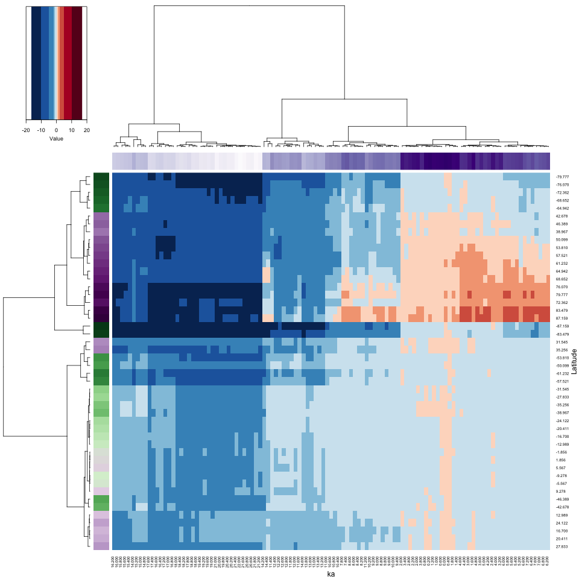
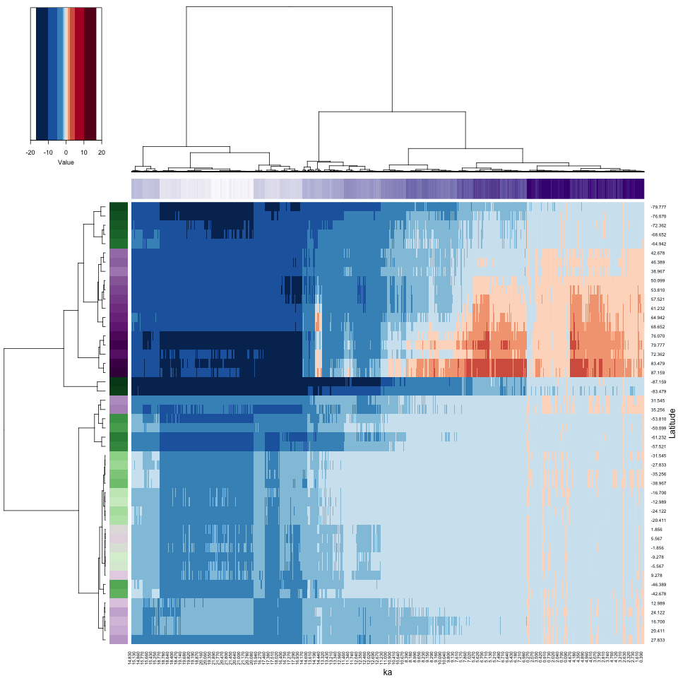

```{r multivariate-1, echo=FALSE}
options(width = 105)
knitr::opts_chunk$set(dev='png', dpi=300, cache=FALSE, out.width = "75%", out.height = "75%")
knitr::opts_knit$set(progress = TRUE, verbose = TRUE)
pdf.options(useDingbats = TRUE)
klippy::klippy(position = c('top', 'right'))
```

<p><span style="color: #00cc00;">NOTE:  This page has been revised for Winter 2024, but may undergo further edits.</span></p>

# Introduction #

"Cluster analysis" is a broad group of multivariate analyses that have as their objective the organization of individual observations (objects, sites, grid points, individuals), and these analyses are built upon the concept of multivariate distances (expressed either as similarities or dissimilarities) among the objects.

The organization generally takes two forms:

- the arrangement of the objects in a lower-dimensional space than the data were originally observed on;
- the development of "natural" clusters or the classifications of the objects.

These analyses share many concepts and techniques (both numerical and practical) with other procedures such as principal components analysis, numerical taxonomy, discriminant analysis and so on, and cluster analysis is one of the few machine learning techniques that uses its traditional name in multivariate analysis as its modern Data Science/Machine Learning name.

The analyses generally begin with the construction of an *n* x *n* matrix **D** of the distances between objects.  For example, in a two-dimensional space, the elements *d<sub>ij</sub>* of **D** could be the Euclidean distances between points,

*d<sub>ij</sub>* = [(*x<sub>i1</sub>*- *x<sub>j1</sub>*)<sup>2</sup> + (*x<sub>i1</sub>*- *x<sub>j1</sub>*)<sup>2</sup>]<sup>½</sup>

The Euclidean distance, and related measures are easily generalized to more than two dimensions.

To begin load some packages:

```{r multivariate-2, message=FALSE, warning=FALSE, }
library(sf)
library(ggplot2)
library(RColorBrewer)
library(lattice)
library(GGally)
library(MASS)
library(ncdf4)
library(terra)
library(tidyterra)
library(stringr)
library(parallelDist)
library(gplots)
```

Some of these packages are familiar, but `{GGally}` provides some enhanced `{ggplot2}` plots, `{stringr}` manages the manipulation of strings, `{parallelDist}` exploits multiple processors/cores to efficiently calculate large dissimilarlty/distance matrices, and '{gplots}` calculates heat maps.  

# A simple cluster analysis #

The basic idea of cluster analysis can be illustrated using the Oregon climate-station dataset, with the goal being to identify groups of stations with similar climates, which also regionalizes the climate of the state.  Begin by reading a shape file for mapping the data, and the data itself.

```{r multivariate-3, message=FALSE}
# read county outlines
# orotl_sf
shapefile <- "/Users/bartlein/Projects/RESS/data/shp_files/OR/orotl.shp"
orotl_sf <- st_read(shapefile)
```

Add a coordinate reference system and plot:

```{r multivariate-4 }
# add a CRS
st_crs(orotl_sf) <- st_crs("+proj=longlat")
or_otl_sf <- st_geometry(orotl_sf)
plot(or_otl_sf) 
```

Now read a *.csv file, and attach it.

```{r multivariate-5 }
# read stations
orstationc_path <- "/Users/bartlein/Projects/RESS/data/csv_files/"
orstationc_name <- "orstationc.csv"
orstationc_file <- paste(orstationc_path, orstationc_name, sep="")
orstationc <- read.csv(orstationc_file)
summary(orstationc)
attach(orstationc)
```

Plot the station locations, and then the three-letter station name abbreviations. Notice that the use of the `coord_sf()` function in the first plot to explicity specify the geographical extent of the map, while in the second case `ggplot2()` determines the extent.

```{r multivariate-6 }
# plot stations
ggplot() + 
  geom_sf(data = or_otl_sf, fill = NA) +
  geom_point(data = orstationc, aes(x=lon, y=lat), shape=21, color="black", size = 3, fill="lightblue") +
  coord_sf(xlim = c(-125, -116), ylim = c(41, 47), expand = FALSE) +
  labs(title = "Oregon Climate Stations", x = "Longitude", y = "Latitude") +
  theme_bw()
```
```{r multivariate-7 }
# plot station names
ggplot() +
  geom_sf(data = or_otl_sf, fill = NA) +
  geom_text(data = orstationc, aes(x =lon, y = lat, label = as.character(station)), 
            check_overlap = TRUE, size = 3) +
  labs(title = "Oregon Climate Stations", x = "Longitude", y = "Latitude") +
  theme_bw()
```

Take a quick look at the correlations among variables.

```{r multivariate-8, message=FALSE}
# matrix scatter plot and correlations
ggpairs(orstationc[2:10])
```

The off-diagonal cells for the climate variables indicate that there are some strong correlations among the climate variables (the asterisks indicate significance in the usual way).

## Distance/Dissimilarity matrices

In this example, the groups of stations (or the climate regions of Oregon, as expressed in the climate-station data) will be defined via an “agglomerative-hierarchical” cluster analysis. In such an analysis, individual objects (observations) are combined according to their (dis)similarity, with the two *most-similar* objects being combined first (to create a new composite object), then the next two most-similar objects (including the composites), and so on until a single object is defined. The sequence of combinations is illustrated using a “dendrogram” (cluster tree), and this can be examined to determine the number of clusters. The function `cutree()` determines the cluster membership of each observation, which can be listed or plotted.

The first step in an agglomerative cluster analysis (although not always expiclitly displayed), is the calculation of a dissimilarity matrix, which is a square symmetrical matrix that illustrates the dissimilarities (typically Euclidean distances) between individual cases or observations, using in this case the six climate variables to define the space that distance is calculated in. The `levelplot()` funcction from the `{lattice}` package is used to make the plot.

```{r multivariate-9, fig.asp=1}
# get dissimilarities (distances) and cluster
X <- as.matrix(orstationc[,5:10])
X_dist <- dist(scale(X))
grid <- expand.grid(obs1 = seq(1:92), obs2 = seq(1:92))
levelplot(as.matrix(X_dist)/max(X_dist) ~ obs1*obs2, data=grid, 
    col.regions = gray(seq(0,1,by=0.0625)), xlab="observation", ylab="observation")
```


In the code above, for convenience, a matrix **X** was created to omit the variables we don’t want to include in the clustering (i.e. the non-climatic information). The levelplot() function plots the dissimilarity matrix that the cluster analysis works with. The dark diagonal line is formed from the Eucldean distance values of 0.0 from the comparison of each observation with itself.

There is a range of different styles of patterns that may show up 

- If the climates at the individual stations were completely unrelated to on another, or if they were identical, the plot would appear light gray (with black pixels along the diagonal).The "plaid" as opposed to completely random appearance of the plot indicates that it is likely that natural groups will exist in the data.  
- If stations near to one another had similar climates then one would see a plaid pattern.

The "plaidness" of the image could be enhanced by sorting the observations in some way that makes sense. (Right now, they're in alphabetical order.) The plot can be redone, this time sorting in to longitudinal order, West to East (i.e. `orstationc[order(orstationc$lon), 5:10]`):

```{r multivariate-10, fig.asp=1}
# get dissimilarities (distances) and cluster
X <- as.matrix(orstationc[order(orstationc$lon), 5:10])
X_dist <- dist(scale(X))
grid <- expand.grid(obs1 = seq(1:92), obs2 = seq(1:92))
levelplot(as.matrix(X_dist)/max(X_dist) ~ obs1*obs2, data=grid, 
    col.regions = gray(seq(0,1,by=0.0625)), xlab="observation", ylab="observation")
```

The "plaid and blocks" pattern suggests that, as we might have expected, there is a longitudinal trend in Oregon climates.

## The cluster analysis

Get the orignal distance matrix again, and do the cluster analysis:

```{r multivariate-11 }
# distance matrix
X <- as.matrix(orstationc[,5:10])
X_dist <- dist(scale(X))

# cluster analysis
X_clusters <- hclust(X_dist, method = "ward.D2")
plot(X_clusters, labels=station, cex=0.4)
```

The function `hclust()` performs a "Wards's single-linkage" analysis, and the `plot()` function plots the dendrogram.  Notice that the individual "leaves" of the plot are labeled by the climate-station names.

The dendrogram can be inspected to get an idea of how many distinct clusters there are (and it can also identify unusual points–look for Crater Lake `CLK`). As a first guess, let’s say there were four distinct clusters evident in the dendrogram.  The `cuttree()` function can be used to "cut" the dendrogram at a particular level:

```{r multivariate-12 }
# cut dendrogram and plot points in each cluster 
nclust <- 4
clusternum <- cutree(X_clusters, k=nclust)
```

And then the cluster membership (i.e. which cluster?) of each station can be mapped.

```{r multivariate-13 }
# plot cluster memberships of each station
ggplot() +
  geom_sf(data = or_otl_sf, fill = NA) +
  geom_text(data = orstationc, aes(x =lon, y = lat, label = as.character(clusternum)), 
            check_overlap = TRUE, color = "red", size = 4) +
  labs(title = "Oregon Climate Stations -- Cluster Numbers", x = "Longitude", y = "Latitude") +
  theme_bw()
```

Cluster 1 picks out the stations in eastern Oregon's "High Desert" region, while Cluster 2 highlights lower elevation stations in eastern Oregon. Cluster 3 includes stations in the valleys of western Oregon, while Cluster 4 indentifies coastal and lower Columbia Valley stations.

(A listing of the cluster number that each station belongs to can be gotten by the following code.)


```{r multivariate-14, echo=TRUE, eval=FALSE}
print(cbind(station, clusternum, as.character(Name)))
```

## Examining the cluster analysis

The efficacy of the analyis in regionalizing or grouping the stations can be gauged usigns plots and a analysis that looks at the "separation" of the groups of stations.

```{r multivariate-15 }
# examine clusters -- simple plots 
tapply(tjan, clusternum, mean)
histogram(~ tjan | factor(clusternum), nint=20, layout=c(2,2))
```

Note how the histograms for some of the clusters seem multimodal multimodal–this is a clear sign of inhomogeneity of the clusters. Let’s see how the clusters differ.  This can be done via discriminant analysis [Discriminant Analysis](https://pjbartlein.github.io/REarthSysSci/topics/da.html), which (like PCA) defines some new variables with desirable properties, in this case, new variables that maximally "spread out" the groups along the new variable axes:

```{r multivariate-16 }
# discriminant analysis 
cluster_lda1 <- lda(clusternum ~ tjan + tjul + tann + pjan + pjul + pann)
cluster_lda1
plot(cluster_lda1, col = "red")
```

Get the discriminant scores (the values of the new discriminant function):

```{r multivariate-17 }
# discriminant scores
cluster_dscore <- predict(cluster_lda1, dimen=nclust)$x
```

Produce a grouped box plot for each of first three discriminant function:

```{r multivariate-18 }
# residual grouped box plot
opar <- par(mfrow=c(1,3))
boxplot(cluster_dscore[, 1] ~ clusternum, ylab = "LD 1", ylim=c(-8,8))
boxplot(cluster_dscore[, 2] ~ clusternum, ylab = "LD 2", ylim=c(-8,8))
boxplot(cluster_dscore[, 3] ~ clusternum, ylab = "LD 2", ylim=c(-8,8))
par(opar)
```

The first discriminant function clearly spreads out the four clusters, while the second could be used to discriminate between clusters 1 and 4 and clusters 2 and 3.

Finally, get the discriminant function loadings, which measure the relationship or correlation between each original variables and the new discriminant function:

```{r multivariate-19 }
# discriminant "loadings"
cor(orstationc[5:10],cluster_dscore)
```

The loadings can be used to interpret or describe the discriminant functions. Here January temperature and January and annual precipitation are most highly correlated with the first discriminant function. Each of these have strong latitudinal gradient across the state: high in the west, low in the east. Note that this gradient corresponds well with a similar longitudinal gradient in cluster number.

The discriminant analysis here is used to answer the question “how do the clusters of stations differ climatically?” In this case, it looks like `pann` and `tann` are the variables most closely correlated with each discriminant function, and because each of these variables are more-or-less averages of the seasonal extreme variables, that might explain why the clusters seem inhomogeneous.

The analysis can be repeated, extracting different numbers of clusters. The easiest way to do this is to copy the three chunks of code above into a text editor, changing the assignment to nclust and including or excluding before executing each chunk, one at a time.

# Distances:  among observations and among variables

As noted above, in addition to being the input to a cluster analysis, distance matrices are interesting in their own right.  In a typical rectangular data set, there are two distance matrices that could be calculated, one comparing variables (i.e. the columns in a data frame), and the other comparing observations (or rows).  In the examples below the "TraCE 21ka" decadal data are used. There are (96 x 48) 4608 grid points and 2204 observations.  Read the raster brick in the netCDF file (`Trace21_TREFHT_anm2.nc`): 

```{r multivariate-20 }
# read the TraCE21 temperature data
# read TraCE21-ka transient climate-model simulation decadal data
tr21dec_path <- "/Users/bartlein/Projects/RESS/data/nc_files/"
tr21dec_name <- "Trace21_TREFHT_anm2.nc"
tr21dec_file <- paste(tr21dec_path, tr21dec_name, sep="")
dname <- "tas_anm_ann"
```

```{r multivariate-21 }
# read the data using ncdf4
nc_in <- nc_open(tr21dec_file)
print(nc_in)
lon <- ncvar_get(nc_in,"lon")
lat <- ncvar_get(nc_in,"lat")
t <- ncvar_get(nc_in, "time")
var_array <- ncvar_get(nc_in, dname)
dim(var_array)
plt_xvals <- t
```

The object `plt_xvals` is used to easily access time labels for some of the later plots.

Reshape the 3-d array into a 2-d "tidy" matrix with individual variables (grid-point locations) in columns, and observations (time) in rows:

```{r multivariate-22, ehco=TRUE, eval=FALSE}
# reshape the 3-d array
nlon <- dim(var_array)[1]; nlat <- dim(var_array)[2]; nt <- dim(var_array)[3]
var_vec_long <- as.vector(var_array)
length(var_vec_long)
X <- t(matrix(var_vec_long, nrow = nlon * nlat, ncol = nt))
dim(X)
```

## Distances among times

Notice the use of the transposition function (`t()`) to get the data in the proper "tidy" arrangement for a data frame (variables in columns, observations in rows).  Distance matrix calculation can take a while, but the `{parallelDist}` package can be used to greatly speed things up, by handing off the creation of different blocks of the matrix to different processors in a multi-processor machine.

The `parDist()` function gets the dissimilarity matrix:

```{r multivariate-23, echo=TRUE, eval=FALSE}
# disatances among observations (time)
dist_obs <- as.matrix(parDist(X)) 
dim(dist_obs)
```

The dissimilarity matrix (`dist_obs`) can be conveniently visualized by turning it into a `{terra}` SpatRaster, and then using the `{tidyterra}` `geom_spatraster()` function to visualize it. The rendering of the image is faster if the image is written to a file:

```{r multivariate-24, echo=TRUE, eval=FALSE}
# turn matrix into a SpatRaster
dist_obs_terra <- flip(rast(dist_obs))
dist_obs_terra
```

Use `ggplot2()` to plot the matrix (writing the *.png image to a file):

```{r multivariate-25, echo=TRUE, eval=FALSE}
# plot the dissimilarity matrix
png("TraCE_decadal_dist_obs_v1.png", width=720, height=720) # open the file
  ggplot() +
    geom_spatraster(data = t(dist_obs_terra)) +
      scale_fill_distiller(type = "seq", palette = "Greens") +
      scale_x_continuous(breaks = seq(0, 2200, by=500), minor_breaks = seq(0, 2200, by=100)) +
      scale_y_continuous(breaks = seq(0, 2200, by=500), minor_breaks = seq(0, 2200, by=100)) +
      labs(title = "Dissimilarity matrix among observations (times)",
        x = "Decades since 0 BP", y = "Decades since 0 BP", fill="distance") +
      theme(panel.grid.major=element_line(colour="black"), panel.grid.minor=element_line(colour="black"),
            axis.text=element_text(size=12), axis.title=element_text(size=14), aspect.ratio = 1,
            plot.title = element_text(size=20))
dev.off()
```

Here's the image:


The observations here are ordered in time, and the blocks in the distance matrix indicate that there are two distinct climate regimes: one from the beginning of the record to around 14.7 ka (14,700 years before 1950 CE, e.g. in decade 1470 before the end of the record at 0 BP). Within each major interval, there are subintervals indicated by the dark squares. For example during the Holocene (the past 11,700 years, there are two blocks, the early Holocene, 11,700 to 8200 yr BP, and the middle and late Holocene, after 8200 yr BP). There are also patterns within the blocks. During the interval from 14,700 to 11,700 yr BP, the warm, but variable, Bølling-Allerød from 14,700 yr BP to 12,900 yr BP, can be seen followed by the colder Younger Dryas interval, 12,900 to 11,700 yr BP.

## Distance among locations

The dissimilarities among locations/variables can be gotten in a similar fashion, but note the use of the transpose function `t()` to get the variables in rows, and observations in columns:

```{r multivariate-26 }
# variables (grid points)
dist_var <- as.matrix(parDist(t(X)))
dim(dist_var)
```

```{r multivariate-27 }
# turn matrix into a SpatRaster
dist_var_terra <- flip(rast(dist_var))
dist_var_terra
```

Plot the matrix:

```{r multivariate-28 }
# plot the dissimilarity matrix
png("TraCE_decadal_dist_var_v1.png", width=720, height=720) # open the file
ggplot() +
  geom_spatraster(data = t(dist_var_terra)) +
  scale_fill_distiller(type = "seq", palette = "Greens") +
  scale_x_continuous(breaks = seq(0, 4600, by=500), minor_breaks = seq(0, 4600, by=250)) +
  scale_y_continuous(breaks = seq(0, 4600, by=500), minor_breaks = seq(0, 4600, by=250)) +
  labs(title = "Dissimilarity matrix among variables (grid points/locations)",
       x = "Location", y = "Location", fill="distance") +
  theme(panel.grid.major=element_line(colour="black"), panel.grid.minor=element_line(colour="black"),
            axis.text=element_text(size=12), axis.title=element_text(size=14), aspect.ratio = 1,
            plot.title = element_text(size=20))
dev.off()
```


The image is a sort of map:  The grid points are arranged in the data frame with longitudes varying rapidly, and the latitudes slowly (forming the small squares in the image), such that the square dark area (low dissimilarities) in the middle is the tropics, where the spatial variability of climate is low, while the more spatially variable higher-latitude regions (at all longitudes) frame the low-variability region. There is also a pronounced Northern Hemisphere/Southern Hemisphere contrast

# Heatmaps (2-way, time-and-space clustering)

"Heatmaps" are a visualization approach that is implemented in the `{base}` package of R, but is extended by the `{gplots}` package.  A heatmap basically consists of the raster-image type plot of the data frame, with the rows and columns of the matrix rearranged using cluster analyses of the varables and observations.  (Note that the cluster analyses are carried out sequentially, as opposed to simultaneously, this latter approach known as "biclustering".)  Typically, for small data sets, the matrix plot is augmented by dendrograms, and by "side bars" which plot some additional attribute of the data (location or time, for example) using a scatter plot, gradient plot, etc.

## A simple example with Hovmöller-matrix data

A simple heatmap can be generated for a "Hovmöller matrix" calculated using the gridded data.  The Hovmöller matrix contains longitudinal averages, and is laid out with one row for each latitude and one column for each time.

### Set up

Create the Hovmöller matrix:

```{r multivariate-29, echo=TRUE, eval=FALSE}
# Hovmöller matrix
Y <- matrix(0.0, nrow=nlat, ncol=nt)
dim(X)
for (n in (1:nt)) {
  for (k in (1:nlat)) {
    for (j in (1:nlon)) {
      Y[k, n] <- Y[k, n] + var_array[j, k, n]
    }
    Y[k, n] <- Y[k, n]/nlon
  }
}
dim(Y)
ncols <- dim(Y)[2]
```

Set row and column names for the matrix.

```{r multivariate-30, echo=TRUE, eval=FALSE}
# set row and column names
rownames(Y) <- str_pad(sprintf("%.3f", lat), 5, pad="0")
head(rownames(Y));tail(rownames(Y)); length(rownames(Y))
colnames(Y) <- str_pad(sprintf("%.3f", plt_xvals), 5, pad="0")
head(colnames(Y));tail(colnames(Y)); length(colnames(Y))
```

A matrix plot of the Hovmöller matrix will illustrate the data (and is an actual Hovmöller plot).  To get high (northern) latitudes at the top of the plot, and high (southern) latitudes at the bottom, flip the data:

```{r multivariate-31, echo=TRUE, eval=FALSE}
# flip Y
Y <- Y[(nlat:1),]
head(rownames(Y)); tail(rownames(Y)); length(rownames(Y))
```

For this example, the data are subsampled, by taking every 20th observation (to allow the dendrograms to be visualized):

```{r multivariate-32, echo=TRUE, eval=FALSE}
# subset
Y2 <- Y[, seq(1, 2201, by=20)]
dim(Y2)
ncols2 <- dim(Y2)[2]
rownames(Y2)
```

More set up.  Generate colors for the matrix pot and the side bars, which here will illustrate the latitude and time of each data point. The rows will be labeled by a diverging color scale, purple for the Northern Hemisphere, green for the Southern Hemisphere, while time will be labeled from past to present by increasingly saturated purples.

```{r multivariate-33, echo=TRUE, eval=FALSE}
# generate colors for side bars
rcol <- colorRampPalette(brewer.pal(10,"PRGn"))(nlat)
ccol <- colorRampPalette(brewer.pal(9,"Purples"))(ncols)
ccol2 <- colorRampPalette(brewer.pal(9,"Purples"))(ncols2)
```

Generate colors for the heatmap of temperature
```{r multivariate-34, echo = TRUE, eval = FALSE}
nclr <- 10
zcol <- (rev(brewer.pal(nclr,"RdBu")))
breaks = c(-20,-10,-5,-2,-1,0,1,2,5,10,20)
length(breaks)
```

### Hovmöller-matrix plot (subsetted decadal data)

Produce the heatmap for the Hovmöller matrix. Note that the `system.time()` function is being used here to gauge the time it takes to calculate and display the various heatmaps.

```{r multivariate-35, echo=TRUE, eval=FALSE}
file_label <-  "TraCE_decadal"
png_file <- paste(file_label, "_hov_01", ".png", sep="")
png(png_file, width=960, height=960)
system.time( X_heatmap <- heatmap.2(Y2, cexRow = 0.8, cexCol = 0.8, scale="none",
        Rowv=NA, Colv=NA, dendrogram = "none", # just plot data, don't do clustering
        RowSideColors=rcol, ColSideColors=ccol2, col=zcol, breaks=breaks, trace="none", density.info = "none",
        lmat=rbind(c(6, 0, 5), c(0, 0, 2), c(4, 1, 3)), lwid=c(1.0, 0.2, 5.0), lhei = c(1.5, 0.2, 4.0),
        xlab = "ka", ylab = "Latitude", key = TRUE, key.title = NA)
)
dev.off()
```
```
##   user  system elapsed 
##  0.029   0.001   0.038 
```


Notice the way the side bars work in illustrating the location and time of each data value. The Hovmöller plot nicely shows the latitudinal variations in climate from the Last Glacial Maximum to present, with the insolation-driven warming in the Northern Hemisphere clearly expressed.

### Hovmöller-matrix heatmap (subsetted decadal data)

The heatmap of the Hovmöller-matrix reorganizes the rows and columns in such a way as to place variables (i.e. latitudes) with similar variations over time, and observations (times) with similar latitudinal patterns, next to one another.

Now here's the heatmap: 

```{r multivariate-36, echo=TRUE, eval=FALSE}
png_file <- paste(file_label, "_heatmap_01", ".png", sep="")
png(png_file, width=960, height=960)
system.time( X_heatmap <- heatmap.2(Y2, cexRow = 0.8, cexCol = 0.8, scale="none",
        RowSideColors=rcol, ColSideColors=ccol2, col=zcol, breaks=breaks, trace="none", density.info = "none",
        lmat=rbind(c(6, 0, 5), c(0, 0, 2), c(4, 1, 3)), lwid=c(1.0, 0.2, 5.0), lhei = c(1.5, 0.2, 4.0),
        xlab = "ka", ylab = "Latitude", key = TRUE, key.title = NA)
)
dev.off()
```
```
##   user  system elapsed 
##  0.096   0.003   0.099 
```



The heatmap has rearranged the data according to the cluster analyses of the observations and variables, placing more similar data points next to one another.  Notice how the side bars allow one to figure out the location and time of individual points.  Here, and not surprisingly, there appear to be four distinct time-space clusters (or "regimes") in the data): glacial vs. interglacial (Holocene) and high latitudes (in both hemispheres) vs. low latitudes. Notice that the rearrangement in time is relatively modest (see the column color bar), while that in location is more dramatic. Spatial variations of climate are always larger in amplitude than temporal variations.

## A second example with decadal data

A second example uses the decadal data directly (as opposed to subsampling)

### Hovmöller-matrix plot 

```{r multivariate-37, echo=TRUE, eval=FALSE}
png_file <- paste(file_label, "_hov_02", ".png", sep="")
png(png_file, width=960, height=960)
system.time( X_heatmap <- heatmap.2(Y, cexRow = 0.8, cexCol = 0.8, scale="none", 
        Rowv=NA, Colv=NA, dendrogram = "none", # just plot data, don't do clustering
        RowSideColors=rcol, ColSideColors=ccol, col=zcol, breaks=breaks, trace="none", density.info = "none",
        lmat=rbind(c(6, 0, 5), c(0, 0, 2), c(4, 1, 3)), lwid=c(1.0, 0.2, 5.0), lhei = c(1.5, 0.2, 4.0),
        xlab = "ka", ylab = "Latitude", key = TRUE, key.title = NA)
)
dev.off()
```
```
##   user  system elapsed 
## 35.070   0.091  35.195 
```


### Hovmöller-matrix heatmap 

```{r multivariate-38, echo=TRUE, eval=FALSE}
png_file <- paste(file_label, "_heatmap_02", ".png", sep="")
png(png_file, width=960, height=960)
system.time( X_heatmap <- heatmap.2(Y, cexRow = 0.8, cexCol = 0.8, scale="none", 
        RowSideColors=rcol, ColSideColors=ccol, col=zcol, breaks=breaks, trace="none", density.info = "none",
        lmat=rbind(c(6, 0, 5), c(0, 0, 2), c(4, 1, 3)), lwid=c(1.0, 0.2, 5.0), lhei = c(1.5, 0.2, 4.0),
        xlab = "ka", ylab = "Latitude", key = TRUE, key.title = NA)
)
dev.off()
```
```
##   user  system elapsed 
##  1.582   0.073   1.657 
```



The results are similar to those for the subsetted data, but the execution times are longer

## Full-grid example

Finally, a heatmap of the gridded data (as opposed to the Hovmöller matrix data) can be obtained

### Set up

There are several set up steps necessary.  Reshape the input array again, and generate row and column names:

```{r multivariate-39, echo=TRUE, eval=FALSE}
# reshape the 3-d array
var_vec_long <- as.vector(var_array)
length(var_vec_long)
X <- matrix(var_vec_long, nrow = nlon * nlat, ncol = nt) # Don't transpose as usual this time
dim(X)
ncols <- dim(X)[3]
```

```{r multivariate-40, echo=TRUE, eval=FALSE}
# generate row and column names
grid <- expand.grid(lon, lat)
names(grid) <- c("lon", "lat")
rownames(X) <- paste("E", str_pad(sprintf("%.2f", round(grid$lon, 2)), 5, pad="0"),
  "N", str_pad(sprintf("%.2f", round(grid$lat, 2)), 5, pad="0"), sep="")
head(rownames(X), 20); tail(rownames(X), 20); length(rownames(X))

colnames(X) <- str_pad(sprintf("%.3f", t), 5, pad="0")
head(colnames(X)); tail(colnames(X)); length(colnames(X))
```

Flip the data...

```{r multivariate-41, echo=TRUE, eval=FALSE}
# flip X
X <- X[((nlon*nlat):1),]
head(rownames(X)); tail(rownames(X)); length(rownames(X))
```

... and generate colors:

```{r multivariate-42, echo=TRUE, eval=FALSE}
# generate colors for vertical and horizontal side bars
icol <- colorRampPalette(brewer.pal(10,"PRGn"))(nlat)
idx <- sort(rep((1:nlat), nlon))
rcol <- icol[idx]
ccol <- colorRampPalette(brewer.pal(9,"Purples"))(nt)
```

### Matrix plot

Here's a matrix plot of the data:
Here, there are too many points to make the dendrograms interpretable in any way, and so they are suppressed.

```{r multivariate-43, echo=TRUE, eval=FALSE}
png_file <- paste(file_label, "_hov_03", ".png", sep="")
png(png_file, width=960, height=960)
system.time( X_heatmap <- heatmap.2(X, cexRow = 0.8, cexCol = 0.8, scale="none",
        Rowv=NA, Colv=NA, dendrogram = "none",
        RowSideColors=rcol, ColSideColors=ccol, col=zcol, breaks=breaks, trace="none", density.info = "none",
        lmat=rbind(c(6, 0, 5), c(0, 0, 2), c(4, 1, 3)), lwid=c(1.0, 0.2, 5.0), lhei = c(1.5, 0.2, 4.0),
        xlab = "ka", ylab = "Locations", key = TRUE, key.title = NA, labRow = FALSE, labCol = FALSE)
)
dev.off()
```
```
##    user  system elapsed 
## 1700.08   42.51 1744.53
```


### Heatmap

Heatmap of the grid-point data

```{r multivariate-44, echo=TRUE, eval=FALSE}
png_file <- paste(file_label, "_heatmap_03", ".png", sep="")
png(png_file, width=960, height=960)
system.time( X_heatmap <- heatmap.2(X, cexRow = 0.8, cexCol = 0.8, scale="none", dendrogram = "none",
        RowSideColors=rcol, ColSideColors=ccol, col=zcol, breaks=breaks, trace="none", density.info = "none",
        lmat=rbind(c(6, 0, 5), c(0, 0, 2), c(4, 1, 3)), lwid=c(1.0, 0.2, 5.0), lhei = c(1.5, 0.2, 4.0),
        xlab = "ka", ylab = "Locations", key = TRUE, key.title = NA, labRow = FALSE, labCol = FALSE)
)
dev.off()
```
```
##    user  system elapsed 
##  643.89   42.26  688.10 
 ```


