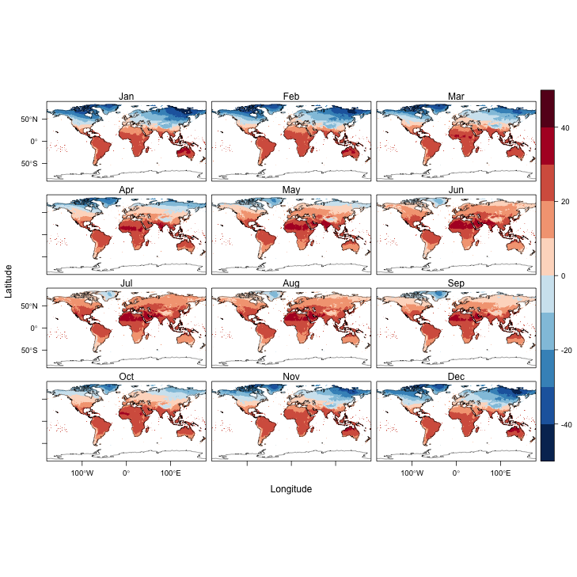
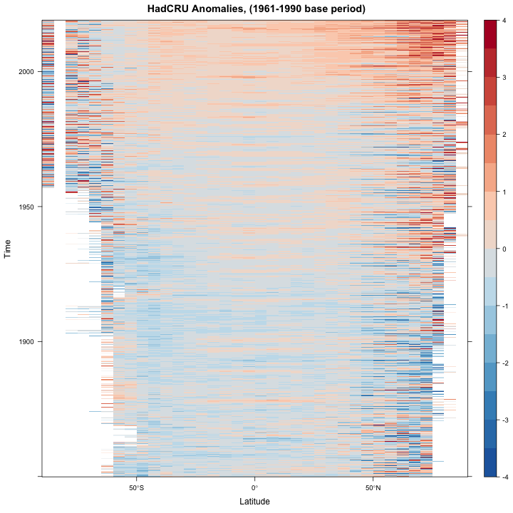

```{r set-options, echo=FALSE}
options(width = 105)
knitr::opts_chunk$set(dev='png', dpi=300, cache=FALSE, out.width = "75%", out.height = "75%")
pdf.options(useDingbats = TRUE)
klippy::klippy(position = c('top', 'right'))
```

# Examples of the use of the raster package to read and analyze raster data sets #

## Preliminaries ## 

The following files will be used here, and are available on the SFTP server, in the folders /nc_files and /Rmaps:

- `ne_110m_admin_0_countries.shp` — world coastline and country borders
- `ne_110m_coastline.shp`— world coastlines 
- `treecov.nc` — global UMD tree-cover data
- `cru_ts4.02.1961.1990.tmp.ltm.nc` — CRU monthly temperature time series, long-term means
- `cru_ts4.02.1901.2017.tmp.anm.nc`— CRU monthly temperature time series (1901-2017)
- `NOAA_ERSSTv5_sst.mnmean.nc` — NOAA SST monthly time series (1854 - 2019)
- `NOAA_ERSSTv5_sst.mon.ltm.1981-2010.nc`— NOAA SST time series, long-term means
- `HadCRUT.4.6.0.0.median.nc` — HadCRUtv4 — Hadley Centre/CRU merged temperature anomalies, 1850-2019 

Download or copy the files to a "data folder" like `"/Users/bartlein/Projects/ESSD/data/nc_files"`.  

The following examples use functions from the `raster` and `rasterVis` packages to read and display a few data sets.  The datasets used here happen to be stored as `netCDF` files, but the `raster` package can also read and write other formats that raster data are commonly stored in.  The `raster` package implements three basic objects or classes:  1) a `rasterLayer`, which is a single 2-D, x-y array of values (e.g. a DEM), 2) a `rasterStack`, a set of individual co-registered (i.e. on the same grid) rasterLayer objects (usually different variables), and 3) a `rasterBrick`, representing a set of layers that make up 3-D data set of a particular variable, such as a climate variable observed over time, or a set of bands in a multi- or hyperspectral image.  Individual layers can be assembled into a stack, and can also be formed by extracting a 2-D slice from a raster brick.

Load the appropriate packages (installing them first if they're not present, i.e. `install.packages("maptools")`:

```{r rstr02, message=FALSE, cache=FALSE}
library(ncdf4)
library(ncdf.tools)
library(raster)
library(rasterVis)
library(RColorBrewer)

library(ggplot2)
library(ggthemes)

library(zoo)
library(sf)
```

For subsequent use, read the world country-outlines shape file:

```{r readWorldFake, echo=TRUE, eval=TRUE}
shp_path <- "/Users/bartlein/Projects/ESSD/data/shp_files/ne_110m_admin_0_countries/"
shp_name <- "ne_110m_admin_0_countries.shp"
shp_file <- paste(shp_path, shp_name, sep="")

# read the shapefile
world_shp <- read_sf(shp_file)
world_outline <- as(st_geometry(world_shp), Class="Spatial")

# plot the outline
plot(world_outline, col="gray80", lwd=1)
```

## Reading a netCDF file using the raster package ##

Read a single-variable netCDF dataset describing global tree cover using the `raster()` function, which operates on a filename.  Individual characteristics of the data can be displayed using some utility functions.

```{r read treeWin, eval=FALSE, echo=FALSE}
# read a single-variable netCDF dataset using raster()
tree_path <- "e:/Dropbox/DataVis/working/geog490/data/nc_files/"
tree_name <- "treecov.nc"
tree_file <- paste(tree_path, tree_name, sep="")
tree <- raster(tree_file) # open treecov.nc
```
```{r read treeMac, eval=TRUE, echo=TRUE}
# read a single-variable netCDF dataset using raster()
tree_path <- "/Users/bartlein/Projects/ESSD/data/nc_files/"
tree_name <- "treecov.nc"
tree_file <- paste(tree_path, tree_name, sep="")
tree <- raster(tree_file) # open treecov.nc
```

```{r print tree}
print(tree) # netCDF info
tree # raster info
print(c(filename(tree), hasValues(tree), inMemory(tree)))
```

In the above example, the `raster()` function opens the netCDF file, and creates a raster object (`tree`).  Printing this object using the `print()` function displays the netCDF metadata (or "attributes"), while simply "typing" the object name displays the attributes of the `raster` object.  The functions `filename()`, `hasValues()` and `inMemory()` display the filename of the object, whether it currently contains values, and whether it is stored in memory, or still resides on disk.  In this case, the data in the file ``r filename(tree)`` still resides on disk (`inMemory(tree) = `r inMemory(tree)``).

The range of `tree` (tree cover) can be gotten with the `cellStats()` function.  Values less than 0.0 indicate barren land-surfac cover, and these values can be recoded to be equal to 0.0.

```{r rstr05}
print(c(cellStats(tree,stat='min'), cellStats(tree,stat='max')))
tree[tree < 0] <- 0
```

Next, a basic plot of the data can be generated using the `levelplot()` function.  (The `rasterVis` package implements a number of Lattice-type plots for raster data sets.)

```{r rstr06, fig.width=5, fig.height=4}
# basic plot
levelplot(tree)
```

A better map can be genrated by setting a `rasterTheme` (in this case a progressive color scale of green from the `RColorBrewer` palette), generating the `levelplot()` object, and then adding a layer to the plot consisting of the countru outlines (`world.shp`).

```{r rstr07, fig.width=5, fig.height=4}
# plot with outlines, a better color scale, no marginal plots
mapTheme <- rasterTheme(region=brewer.pal(8,"Greens"))
plt <- levelplot(tree, margin=F, par.settings=mapTheme)
plt + latticeExtra::layer(sp.lines(world_outline, col="gray30", lwd=0.5))
```

Notice in the code above the specification of the `layer()` function as `latticeExtra::layer()`.  This distinguishes betwee the layer function in the the `latticeExtra` package from that in `ggplot2`.

Here is another version, with outlines, a better color scale, and "marginal plots".

```{r rstr08}
# plot with outlines, a better color scale, marginal plots
mapTheme <- rasterTheme(region=brewer.pal(8,"Greens"))
plt <- levelplot(tree, margin=T, par.settings=mapTheme)
plt + latticeExtra::layer(sp.lines(world_outline, col="gray30", lwd=0.5))
```

[[Back to top]](rasterVis01.html)

# rasterVis-style small-multiple maps #

Small-multiple maps consist of an array of maps, each with the same cooridinate system, that can be used, for example, to plot long-term mean values for individual maps.  Here, the long-term means of CRU TS 4.02 near-surface air temperature data will be plotted.  First, read in another shapefile, with only coastlines.

```{r readCoast}
# set path and shape file name
coast_shp_path <- "/Users/bartlein/Projects/ESSD/data/RMaps/source/ne_110m_coastline/"
coast_shp_name <- "ne_110m_coastline.shp"
coast_shp_file <- paste(coast_shp_path, coast_shp_name, sep="")

# read the shapefile
coast_shp <- read_sf(coast_shp_file)
coast_outline <- as(st_geometry(coast_shp), Class="Spatial")

# plot the outline
plot(coast_outline, col="gray50", lwd=1)
```

Set the path, file, and variable names for the CRU data:

```{r setupCRU}
# path and file name, set dname
ncpath <- "/Users/bartlein/Projects/ESSD/data/nc_files/"
ncname <- "cru_ts4.02.1961.1990.tmp.ltm.nc"   
ncfname <- paste(ncpath, ncname, sep="")
dname <- "tmp_ltm"  # note: tmp means temperature (not temporary)
```

Read the CRU data as a raster stack:
```{r readCRU}
# read a raster stack
CRU_tmp_ltm <- stack(ncfname)
CRU_tmp_ltm
```

Replace the cryptic names in the raster stack with the names of months:

```{r replacenames}
# replace layer names
names(CRU_tmp_ltm) <- c("Jan","Feb","Mar","Apr","May","Jun","Jul","Aug","Sep","Oct","Nov","Dec")
```

Create a `rasterVis` lattice-style levelplot.  The plot will be rather large and time-consuming to plot, and so a more efficient way to produce it is to write it directly to a `.png` file.  This is accomplished by braketing the necessary code for the levelplot with code to open a `.png` file:

```{r pngplot, echo=TRUE, eval=TRUE, message=FALSE,}
# lattice-style levelplot
pngfile <- "CRU_tmp_ltm.png"
png(pngfile, width=729, height=729) # open the file
cutpts <- c(-50,-40,-30,-20,-10,0,10,20,30,40,50)
plt <- levelplot(CRU_tmp_ltm , at=cutpts, cuts=11, pretty=T, 
          col.regions=(rev(brewer.pal(10,"RdBu"))))
plt + latticeExtra::layer(sp.lines(coast_outline, col="black", lwd=0.5))
#dev.off() # close the file
```
Here's what the image looks like:



# Time-Series plots #

A basic way of visualizing data in, for example, a 3-D netCDF file, with time being the third dimension, is to plot time series of individual grid points or areal averages.  Here we'll plot the CRU temperature data for the grid point closest to Eugene, both as a single time series with the monthly values in consecutive order, and in a multi-panel plot, with the data for each month of the year in a differnt panel.  Begin by setting the path, file, and variable names:

```{r tsread}
# path and file name, set dname
ncpath <- "/Users/bartlein/Projects/ESSD/data/nc_files/"
ncname <- "cru_ts4.02.1901.2017.tmp.anm.nc"   
ncfname <- paste(ncpath, ncname, sep="")
dname <- "tmp_anm"  # note: tmp means temperature (not temporary)
```

Open the netCDF file
```{r tsopen}
# open a netCDF file
ncin <- nc_open(ncfname)
print(ncin)
```

Get longitude, latitude and time:

```{r tsgetdims}
# get longitude and latitude
lon <- ncvar_get(ncin,"lon")
nlon <- dim(lon)
head(lon)
lat <- ncvar_get(ncin,"lat")
nlat <- dim(lat)
head(lat)

# get time
time <- ncvar_get(ncin,"time")
# time # uncomment to see individual times
tunits <- ncatt_get(ncin,"time","units")
nt <- dim(time)
print(c(nlon, nlat, nt))
tunits
```

Get the array of time series data:

```{r tsgetdata}
# get temperature
tmp_array <- ncvar_get(ncin,dname)
dlname <- ncatt_get(ncin,dname,"long_name")
dunits <- ncatt_get(ncin,dname,"units")
fillvalue <- ncatt_get(ncin,dname,"_FillValue")
dim(tmp_array)
```

Convert the time variable from the *CF-Conventions* "time-since" format to a more conventional form:

```{r tsconverttime}
# convert time -- split the time units string into fields
# convert time -- split the time units string into fields
tustr <- strsplit(tunits$value, " ")
ptime <- convertDateNcdf2R(time, unlist(tustr)[1], 
  origin =  as.POSIXct(unlist(tustr)[3], tz = "UTC"), time.format = "%Y-%m-%d")
head(time); tail(time)
head(ptime); tail(ptime)
```

Get the beginning and ending year of the time series:

```{r tsbegyr}
# get beginning year and ending year, number of years, and set nm
beg_date <- strsplit(as.character(ptime[1]), " ")
beg_yr <- as.numeric(unlist(strsplit(as.character(beg_date), "-"))[1])
end_date <- strsplit(as.character(ptime[nt]), " ")
end_yr <- as.numeric(unlist(strsplit(as.character(end_date), "-"))[1])
nyrs <- end_yr - beg_yr + 1
nm <- 12
print(c(beg_yr, end_yr, nyrs, nm))
```

Generate a decimal year value for plotting consecutive values:

```{r tsyrmn}
# generate a decimal year ("YrMn") time coordinate
YrMn <- seq(beg_yr, end_yr+1-(1/12), by=(1/12))
head(YrMn); tail(YrMn)
```

Generate year and month values for creating the dataframe that will be used to get multi-panel plots:

```{r tsyearmonth}
# year
year <- as.integer(YrMn)
head(year); tail(year)

# month
# month <- rep(seq(1, 12, by=1), nyrs)
month_names <- c("Jan","Feb","Mar","Apr","May","Jun","Jul","Aug","Sep","Oct","Nov", "Dec")
month <- rep(month_names, nyrs)
head(month); tail(month)
month <- factor(month, levels=c( "Dec", "Jan","Feb","Mar","Apr","May","Jun","Jul","Aug","Sep","Oct","Nov"))
str(month)
```

Note that `month` is a factor, and without intervention, the monthly panels will plot in the default order for a factor:  alphabetical.  This would be a little counterintuitive to interpret, but the factor order can be reset using the code fragment:  
`month <- factor(month, levels=month_names)`, as was done above.

Now find the grid cell closest to Eugene (approximatly 123.1167 W and 44.08333 N).  This is done by using the `which.min()` function:

```{r tsclosestpoint}
# get indices of the grid cell closest to Eugene
tlon <- -123.1167; tlat <- 44.0833
j <- which.min(abs(lon-tlon))
k <- which.min(abs(lat-tlat))
print(c(j, lon[j], k, lat[k]))
```

## Time-series plot of consecutive values ##

The data in the netCDF file are arranged in consecutive order, and so this is straightforward:

```{r tsplot1}
# get time series for the closest gridpoint
tmp_ts <- tmp_array[j, k, ]

# plot time series of grid point
plot(YrMn, tmp_ts, type="l", xlab="Year", ylab=dname, main=dlname$value, col="red")
```

## Multi-panel plot of monthly time series data ##

Now make a dataframe consisting of `nt` values of the `YrMn` variable, the temperature time series `tmp_ts`, and the `year` and `month` variables generated above:

```{r tsdataframe}
# make dataframe
tmp_df <- data.frame(YrMn, year, month, tmp_ts)
str(tmp_df)
head(tmp_df); tail(tmp_df)
```

Now, construct a `ggplot2` multi-panel (e.g. "faceted") plot.  The plot will be constructed with a lowess-smoother line in the background, overplotted by the annual values of each month in a separate panel.  

```{r tsggplot1}
ggplot(data = tmp_df, aes(x=year, y=tmp_ts)) +
  # geom_smooth(method = "lm", size=2, color="pink") +
  geom_smooth(method = "loess", size=0.5, color="purple") +
  geom_line() + 
  facet_grid(month ~ .)  
```
  
The plot seems quite wide relative to the vertical space occupied by each monthly time series, which makes it difficult to notice any trends in the daa.  The aspect of the ratio can be adjusted, guided by the Bill Cleveland's notion of "banking to 45 (degrees)".  The function `bank_slopes()` in the package `ggthemes` can find the aspect ratio that optimizes that notion for a single time series (here, the values for December):

```{r tsbanking}
bank_slopes(tmp_df$year[tmp_df$month == "Dec"], tmp_df$tmp_ts[tmp_df$month == "Dec"])
```

A good first-guess aspect ratio can then be found by multiplying this value by the number of panels.  However, experience shows that multiplying by the half the number of panels provides a more pleasing result:

```{r tsggplot2, fig.width=6, fig.height=6}
ggplot(data = tmp_df, aes(x=year, y=tmp_ts)) +
  # geom_smooth(method = "lm", size=2, color="pink") +
  geom_smooth(method = "loess", size=0.5, color="purple") +
  geom_line() + 
  facet_grid(month ~ .)  + 
  theme(aspect.ratio = (0.04 * (nm/2)))
```


[[Back to top]](rasterVis01.html)

# Hovmöller and horizon plots #

The `rasterVis` package provides a couple of interesting `Lattice`-type plots that can be used to visualize 3-D data  (usually a function of  latitude, longitude and time).  The Hovmöller plot is a 2-D time/space diagram, where, for example, zonal (E-W) or meridional (N-S) averages are plotted relative to time.  The horizon plot plots multiple time series (here average values for individual latitudinal zones) in a way that allows common trends to be visualized.  

The data set used here is the NOAA Extended Sea-Surface Temperature (SST) data.  There is considerable set up to do first, which illustrates some of the necessary data wrangling the goes on before a visualization can be constructed.  First the "observed" monthly values are read, then the long-term means, and then anomalies are calculated.  The data are read using the `ncdf4` packages, which allows more flexibility in reading the data than does the `raster` package, and the resulting array is converted to a raster brick before plotting.

## Set up ##

Read the SST data:

```{r h1readsst}
# read SST data
SST_path <- "/Users/bartlein/Projects/ESSD/data/nc_files/"
SST_mon_name <- "NOAA_ERSSTv5_sst.mnmean.nc"
SST_mon_file <- paste(SST_path, SST_mon_name, sep="")
dname_mon <- "sst"
ncin <- nc_open(SST_mon_file)
# print(ncin) # uncomment to see full ncdump-style listing
```

Get longitude, latitudes and time:

```{r h1lonlat}
# get longitude and latitude
lon <- ncvar_get(ncin,"lon")
nlon <- dim(lon)
head(lon)
lat <- ncvar_get(ncin,"lat")
nlat <- dim(lat)
head(lat)

# get time
time <- ncvar_get(ncin,"time")
tunits <- ncatt_get(ncin,"time","units")
nt <- dim(time)
print (c(nlon, nlat, nt))
tunits
```
Note that longitudes run from 0 to 360 degrees E, while latitudes run from 90 N to 90 S.  The the N to S layout of latitudes (and of the data) will require various flipping of data arrays later.

Convert time:  

```{r h1converttime}
# convert time -- split the time units string into fields
tustr <- strsplit(tunits$value, " ")
ptime <- convertDateNcdf2R(time, unlist(tustr)[1], 
  origin = as.POSIXct(unlist(tustr)[3],                                                tz = "UTC"), time.format = "%Y-%m-%d")
head(time); tail(time)
head(ptime); tail(ptime)
```

Now get the SST data

```{r h1getdata}
# get monthly SSTs
SST_mon <- ncvar_get(ncin,dname_mon)
dlname_mon <- ncatt_get(ncin,dname_mon,"long_name")
dunits_mon <- ncatt_get(ncin,dname_mon,"units")
fillvalue_mon <- ncatt_get(ncin,dname_mon,"_FillValue")
dim(SST_mon)
```

Close the netCDF file:

```{r h1close1}
# close the monthly data file
nc_close(ncin)
```

Flip the latitudes and data so that the data are layed out with the origin in the "lower left" of the map:

```{r h1flipdata}
# flip N-S
temp_lat <- rep(NA, nlat)
temp_lat[1:nlat] <- lat[nlat:1]
temp_lat
lat <- temp_lat

temp_array <- array(NA, dim = c(nlon, nlat, nt))
temp_array[1:nlon, 1:nlat, 1:nt] <-  SST_mon[1:nlon, nlat:1, 1:nt] 
SST_mon <- temp_array
```

Note that in many cases, it's desireable to have longitudes run from -180 to 180.  This could be done by using the following code, but in the current example, this is NOT done to facilitate looking at plots focused on the Pacific.

```{r h1rotate, echo=TRUE, eval=FALSE}
# rotate 0 to 360 to -180 to +180
temp_lon <- rep(NA, nlon)
temp_lon[1:(nlon/2)] <-  lon[((nlon/2)+1):nlon] - 360.0
temp_lon[((nlon/2)+1):nlon] <-  lon[1:(nlon/2)]
temp_lon
lon <- temp_lon

temp_array <- array(NA, dim = c(nlon, nlat, nt))
temp_array[1:(nlon/2), 1:nlat, 1:nt] <-  SST_mon[((nlon/2)+1):nlon, nlat:1, 1:nt] 
temp_array[((nlon/2)+1):nlon, 1:nlat, 1:nt] <-  SST_mon[1:(nlon/2), nlat:1, 1:nt]
SST_mon <- temp_array
```

Get a levelplot to check that the data has been read correctly:

```{r h1levelplot`}
# levelplot 
n <- 2
grid <- expand.grid(lon=lon, lat=lat)
cutpts <- c(-5,-4,-3,-2,-1,0,5,10,15,25,35)
plt <- levelplot(SST_mon[,, n] ~ lon * lat, data=grid, at=cutpts, cuts=11, pretty=T, 
          col.regions=(rev(brewer.pal(10,"RdBu"))))
plt + latticeExtra::layer(sp.lines(coast_outline, col="black", lwd=0.5))
```

Inspection of the time range of the data reveals that there are few months from 2019 in the data array.  Get rid of these

```{r h1chop1}
# chop off last three months of the data, and also the time variables
SST_mon <- SST_mon[,, 1:(nt-3)]
dim(SST_mon)
time <- time[1:(nt-3)]
ptime <- ptime[1:(nt-3)]
head(ptime); tail(ptime)
nt <- nt - 3
```

Now get the long-term means (which have the same longitudes and latitudes as the monthly values, so no need to get those).:

```{r h1getltms}
# get SSTs ltms
SST_path <- "/Users/bartlein/Projects/ESSD/data/nc_files/"
SST_ltm_name <- "NOAA_ERSSTv5_sst.mon.ltm.1981-2010.nc"
SST_ltm_file <- paste(SST_path, SST_ltm_name, sep="")
dname_ltm <- "sst"

# open a netCDF file
ncin <- nc_open(SST_ltm_file)
#print(ncin)

# get time
time <- ncvar_get(ncin,"time")
tunits <- ncatt_get(ncin,"time","units")
nm <- dim(time)
nm; tunits

SST_ltm <- ncvar_get(ncin,dname_ltm)
dlname_ltm <- ncatt_get(ncin,dname_ltm,"long_name")
dunits_ltm <- ncatt_get(ncin,dname_ltm,"units")
fillvalue_ltm <- ncatt_get(ncin,dname_ltm,"_FillValue")
dim(SST_ltm)

# close the monthly data file
nc_close(ncin)
```

Flip the data (but not the latitudes; they are already in the right order):

```{r h1flipltms}
# flip N-S
temp_array <- array(NA, dim = c(nlon, nlat, nm))
temp_array[1:nlon, 1:nlat, 1:nm] <-  SST_ltm[1:nlon, nlat:1, 1:nm] 
SST_ltm <- temp_array
```

Again, the data could also be rotated, but that's not done here:

```{r h1rotatehtms, echo=TRUE, eval=FALSE}
# rotate 0 to 360 to -180 to +180
temp_lon <- rep(NA, nlon)
temp_lon[1:(nlon/2)] <-  lon[((nlon/2)+1):nlon] - 360.0
temp_lon[((nlon/2)+1):nlon] <-  lon[1:(nlon/2)]
temp_lon
lon <- temp_lon

temp_array <- array(NA, dim = c(nlon, nlat, nt))
temp_array[1:(nlon/2), 1:nlat, 1:nt] <-  SST_ltm[((nlon/2)+1):nlon, nlat:1, 1:nt]
temp_array[((nlon/2)+1):nlon, 1:nlat, 1:nt] <-  SST_ltm[1:(nlon/2), nlat:1, 1:nt]
SST_ltm <- temp_array
```

Map the data to check that it's been read in ok:

```{r h1levelplot2}
# levelplot 
n <- 8
grid <- expand.grid(lon=lon, lat=lat)
cutpts <- c(-5,-4,-3,-2,-1,0,5,10,15,25,35)
plt <- levelplot(SST_ltm[,, n] ~ lon * lat, data=grid, at=cutpts, cuts=11, pretty=T, 
                 col.regions=(rev(brewer.pal(10,"RdBu"))))
plt + latticeExtra::layer(sp.lines(coast_outline, col="black", lwd=0.5))
```

Get the beginning and ending years

```{r h1begyr}
# get beginning year and ending year
beg_date <- strsplit(as.character(ptime[1]), " ")
beg_yr <- as.numeric(unlist(strsplit(as.character(beg_date), "-"))[1])
end_date <- strsplit(as.character(ptime[nt]), " ")
end_yr <- as.numeric(unlist(strsplit(as.character(end_date), "-"))[1])
nyrs <- end_yr - beg_yr + 1
print(c(beg_yr, end_yr, nyrs, nm))
```

Now get the anomalies:

```{r h1getanoms}
# get anomalies
SST_anm <- SST_mon - rep(SST_ltm, nyrs)
```

Map the data to check the anomalies:

```{r h1levelplot3}
# levelplot 
n <- nt
grid <- expand.grid(lon=lon, lat=lat)
cutpts <- c(-2,-1,-.5,-.2,-.1,0,.1,.2,.5,1,2)
plt <- levelplot(SST_anm[,, n] ~ lon * lat, data=grid, at=cutpts, cuts=11, pretty=T, 
                 col.regions=(rev(brewer.pal(10,"RdBu"))))
plt + latticeExtra::layer(sp.lines(coast_outline, col="black", lwd=0.5))
```

## Hovmöller ## 

The first Hovmöller plot attempts to reproduce the NOAA ESRL PSD Hovmöller plot of tropical Pacific temperatures between 3.5 S and 3.5 N along a transect from the Indian ocean to the eastern Pacific [[View Plot]](https://www.esrl.noaa.gov/psd/map/images/sst/sst.month.anom.hov.io.gif).  Set up for selecting those data by getting the longitude `j` and latitude `k` indices of the bounding box:

```{r h1tropPac1}
# get tropical Pacific
tlon_min <- 40; tlon_max <- 280; tlat_min <- -4; tlat_max <- 4
jmin <- which.min(abs(tlon_min - lon))
jmax <- which.min(abs(tlon_max - lon))
kmin <- which.min(abs(tlat_min - lat))
kmax <- which.min(abs(tlat_max - lat))
print(c(jmin, lon[jmin], jmax, lon[jmax], kmin, lat[kmin], kmax, lat[kmax]))
```
 
Now create a raster brick from the 3-D array of anomalies, selecting data from the Pacific region just defined.  Also just get data from 1989 onwards:

```{r h1raster1}
# tropical pacific
SST_raster <- brick(SST_anm[jmin:jmax, kmax:kmin, 1621:nt], 
                    xmn=lon[jmin], xmx=lon[jmax], ymn=lat[kmin], ymx=lat[kmax],
                    transpose=TRUE,
                    crs="+proj=longlat +datum=WGS84 +ellps=WGS84 +towgs84=0,0,0")
SST_raster
```
Replace the layer names with appropriate date labels:

```{r h1datelabels}
# replace layer names
idx <- seq(as.Date(ptime[1621]), as.Date(ptime[nt]), by='month')
idx <- as.yearmon(idx)
SST_raster <- setZ(SST_raster, idx, name="time")
names(SST_raster) <- as.character(idx)
SST_raster
```

Here's the Hovmöller plot:

```{r hov1, fig.width=5, fig.height=5}
hovmoller(SST_raster,
      dirXY = x,
      at = do.breaks(c(-4,4),16),
      contour=FALSE, interpolate=FALSE,
      par.settings=RdBuTheme(region=rev(brewer.pal(8,'RdBu'))),
      main="Tropical Pacific SST Anomalies" )
```

Note that data for the globe could have been selected as follows

```{r h1selectglobe, echo=TRUE, eval=FALSE}
# globe
SST_raster <- brick(SST_anm[1:nlon, nlat:1, 1:nt],
                    xmn=lon[1], xmx=lon[nlon], ymn=lat[1], ymx=lat[nlat],
                    transpose=FALSE,
                    crs="+proj=longlat +datum=WGS84 +ellps=WGS84 +towgs84=0,0,0")
SST_raster

# replace layer names
idx <- seq(as.Date(ptime[1]), as.Date(ptime[nt]), by='month')
idx <- as.yearmon(idx)
SST_raster <- setZ(SST_raster, idx, name="time")
names(SST_raster) <- as.character(idx)
SST_raster
```

## Horizon plot ##

The horizon plot plots multiple time series (here average values for individual latitudinal zones) in a way that allows common trends to be visualized.  For this example, select a more latitudinally extensive chunk of data:

```{r h1tropPac2}
# horizon plot
# get tropical Pacific
tlon_min <- 178; tlon_max <- 290; tlat_min <- -30; tlat_max <- 30
jmin <- which.min(abs(tlon_min - lon))
jmax <- which.min(abs(tlon_max - lon))
kmin <- which.min(abs(tlat_min - lat))
kmax <- which.min(abs(tlat_max - lat))
print(c(jmin, lon[jmin], jmax, lon[jmax], kmin, lat[kmin], kmax, lat[kmax]))
```

```{r h1raster2}
# tropical pacific
SST_raster <- brick(SST_anm[jmin:jmax, kmax:kmin, 1621:nt], 
                    xmn=lon[jmin], xmx=lon[jmax], ymn=lat[kmin], ymx=lat[kmax],
                    transpose=TRUE,
                    crs="+proj=longlat +datum=WGS84 +ellps=WGS84 +towgs84=0,0,0")
SST_raster
```

```{r h1dates2}
# replace layer names
idx <- seq(as.Date(ptime[1621]), as.Date(ptime[nt]), by='month')
idx <- as.yearmon(idx)
SST_raster <- setZ(SST_raster, idx, name="time")
names(SST_raster) <- as.character(idx)
SST_raster
```

Here's the horizon plot:

```{r horizon}
# horizonplot -- rasterVis example
horizonplot(SST_raster, ylab="Latitude", xlab="Year",col.regions=rev(brewer.pal(n=8, 'RdBu')) )
```

## Hovmöller plots -- a second example ##

This second example shows how a Hovmöller plot can be written directly to a .png file, which may be useful when it takes a while to generate.  The data here are a combined set of land and ocean temperature anomalies from 1850 through the beginning of 2019.

Use the `brick()` function in `raster` to read the data.

```{r h2getdata}
# HADCRUT4 Combined Air Temperature/SST Anomalies
# read a 3-D netCDF dataset
hadcrut_path <- "/Users/bartlein/Projects/ESSD/data/nc_files/"
hadcrut_name <- "HadCRUT.4.6.0.0.median.nc"
hadcrut_file <- paste(hadcrut_path, hadcrut_name, sep="")
hadcrut <- brick(hadcrut_file) # open air.mon.anom.nc

hadcrut
print(c(filename(hadcrut), hasValues(hadcrut), inMemory(hadcrut)))
```

As before, replace the layer names (dates) with something more appropriate:

```{r h2layernames}
# replace layer names
idx <- seq(as.Date('1850-01-01'), as.Date('2019-02-01'), 'month')
idx <- as.yearmon(idx)
tmpplt <- setZ(hadcrut, idx)
names(tmpplt) <- as.character(idx)
```

Produce the plot, and send it to a `.png` file:

```{r h2plot, fig.width=4, fig.height=4}
# plot
pngfile <- "HadCRUTv4_hov.png"
png(pngfile, width=720, height=720) # open the file
hovmoller(tmpplt, dirXY=y,
      at = do.breaks(c(-4,4),16),
      contour=FALSE, interpolate=FALSE,
      par.settings=RdBuTheme(region=rev(brewer.pal(8,'RdBu'))),
      main="HadCRU Anomalies, (1961-1990 base period)" )
#dev.off()
```

Here's what it looks like:




