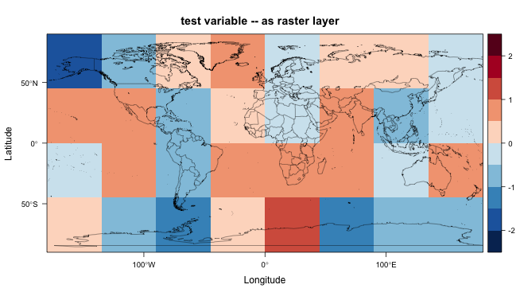

```{r set-options, echo=FALSE}
options(width = 105)
knitr::opts_chunk$set(dev='png', dpi=300, cache=FALSE, out.width = "75%", out.height = "75%")
pdf.options(useDingbats = TRUE)
klippy::klippy(position = c('top', 'right'))
```

# Raster 

The `raster` package is large library of functions and methods for dealing with, as its name implies, raster data sets, including many geospatial formats, including netCDF.  The functions support many different kinds of geospatial procedures applied to raster data, like regridding and interpolation, hillslope shading calculations, logical and mathematical manipulations and so on, but it also can efficiently read and manipulate large data sets.  In particular `raster` is designed to only read into memory those parts of a data set that are necessar for some analysis, raising the possibility of analyzing data sets that are much larger than the availble machine memory.  In addition, some of the "flatting" and "reshaping" manoevers that are required to get netCDF data sets into "tidy" formats are supported by individual functions.

To illustrate the `raster` appoach to reading and displaying the CRU temperature data, first load the required packages:

```{r start, message=FALSE}
# load packages  
library(sf) 
library(ncdf4)
library(raster)
library(rasterVis)
library(RColorBrewer)
```

Also read a world outline shape file for plotting:

```{r readWorldShape}
# set path and shape file name
shp_path <- "/Users/bartlein/Projects/ESSD/data/shp_files/ne_110m_admin_0_countries/"
shp_name <- "ne_110m_admin_0_countries.shp"
shp_file <- paste(shp_path, shp_name, sep="")

# read the shapefile
world_shp <- read_sf(shp_file)
world_outline <- as(st_geometry(world_shp), Class="Spatial")

# plot the outline
plot(world_outline, col="gray80", lwd=1)
```

## Read a netCDF file

Next, set the path, filename, and variable name for the CRU long-term mean temperature data

```{r setpath}
# set path and filename
ncpath <- "/Users/bartlein/Projects/ESSD/data/nc_files/"
ncname <- "cru10min30_tmp"  
ncfname <- paste(ncpath, ncname, ".nc", sep="")
dname <- "tmp"  # note: tmp means temperature (not temporary)
```

Read the 3-D array from the netCDF file using the `brick()` function:

```{r readCRU}
tmp_raster <- brick(ncfname, varname="tmp")
tmp_raster; class(tmp_raster)
```

Typing the name of the object `tmp_raster` produces a short summary of the contents of the file.  Note that the class of the object just created is `raster` as opposed to `array`.

Next, plot the data, using the `rasterVis` package version of the `lattice::levelplots()` function.  The `subset()` function in `raster` extracts a single layer from the raster brick, the `levelplot()` function plots the data, and the `layer()` function is used to overlay the world shapefile.

```{r plotCRU}
# rasterVis plot
mapTheme <- rasterTheme(region = rev(brewer.pal(10, "RdBu")))
cutpts <- c(-50,-40,-30,-20,-10,0,10,20,30,40,50)
plt <- levelplot(subset(tmp_raster, 1), margin = F, at=cutpts, cuts=11, pretty=TRUE, par.settings = mapTheme,
  main="January temperature")
plt + layer(sp.lines(world_outline, col="black", lwd=1.0))
```

So it looks like the `raster` package can read a netCDF file with fewer lines of code than `ncdf`.  

## "Flatting" a raster brick

The `getValues()` function in `raster` reshapes a raster object; if the argument of the function is a raster layer, the function returns a vector, while if the argument is a raster stack or raster brick (e.g. a 3-D array), the function returns a matrix, with each row representing an individual cell (or location in the grid), and the columns representing layers (which in the case of the CRU data are times (months)).  The replicates the reshaping described earlier for netCDF files.

```{r getValues}
tmp_array <- getValues(tmp_raster)
class(tmp_array); dim(tmp_array)
```

The class and diminsions of `tmp_array` describe the result of the reshaping.

# NetCDF and the raster package #

The `raster` package has the capability of reading and writing netCDF files.  There are several issues that could arise in such transformations (i.e. from the netCDF format to the `raster` format) related to such things as the indexing of grid-cell locations:  netCDF coordinates refer to the center of grid cells, while `raster` coordinates refer to cell corners.

In practice, the `raster` package seems to "do the right thing" in reading and writing netCDF, as can be demonstrated using a "toy" data set.  In the examples below, a simple netCDF data set will be generated and written out using the `ncdf4` package.  Then that netCDF data set will be read in as a raster "layer" and plotted, and finally the raster layer will be written again as a netCDF file.  As can be seen, the coordiate systems are appropriately adjusted going back and forth between netCDF and the `raster` "native" format.

## Generate and write a simple netCDF file ##

Generate a small `nlon` = 8, `nlat` = 4 2-d netCDF data set, filled with normally distributed random numbers

```{r ncrast01}
library(ncdf4)

# create a small netCDF file, save, and read back in using raster and rasterVis
# generate lons and lats
nlon <- 8; nlat <- 4
dlon <- 360.0/nlon; dlat <- 180.0/nlat
lon <- seq(-180.0+(dlon/2),+180.0-(dlon/2),by=dlon)
lon
lat <- seq(-90.0+(dlat/2),+90.0-(dlat/2),by=dlat)
lat
# generate some data
tmp <- rnorm(nlon*nlat)
tmat <- array(tmp, dim = c(nlon, nlat))
dim(tmat)
# define dimensions
londim <- ncdim_def("lon", "degrees_east", as.double(lon))
latdim <- ncdim_def("lat", "degrees_north", as.double(lat))

# define variables
varname="tmp"
units="z-scores"
dlname <- "test variable -- original"
fillvalue <- 1e20
tmp.def <- ncvar_def(varname, units, list(londim, latdim), fillvalue, 
                     dlname, prec = "single")
```

As can be seen, the longitudes run from -157.5 to +157.5, while the latitudes run from -67.5 to +67.5, and they define the centers of the netCDF grid cells.

Write the generated data to a netCDF file.

```{r ncrast02, fig.width=6, fig.height=4}
# create a netCDF file 
ncfname <- "test-netCDF-file.nc"
ncout <- nc_create(ncfname, list(tmp.def), force_v4 = TRUE)

# put the array
ncvar_put(ncout, tmp.def, tmat)

# put additional attributes into dimension and data variables
ncatt_put(ncout, "lon", "axis", "X")  
ncatt_put(ncout, "lat", "axis", "Y")

# add global attributes
title <- "small example netCDF file"
ncatt_put(ncout, 0, "title", title)

# close the file, writing data to disk
nc_close(ncout)
```

Here's what the netCDF file looks like, as plotted in Panoply:


The `ncdump` command-line utility can be used to verify the contents of the file.  At the Console in RStudio, the following code would do that:

```{r ncdump1b, echo=TRUE, eval=FALSE}
cat(system("ncdump -c test-netCDF-file.nc"))
```
```{r ncdump1, eval=TRUE, echo=FALSE}
cat(system("ncdump -c test-netCDF-file.nc", intern = TRUE), sep = '\n')
```


## Read a netCDF file as a raster layer ##

Now read the netCDF data set back in as a `raster` object.  (Load the packages if not already loaded.)

```{r ncrast03, message=FALSE, cache=FALSE}
library(raster)
library(rasterVis)
library(maptools)
library(maps)
```
```{r ncrast04}
# read the netCDF file as a raster layer
tmpin <- raster(ncfname)
tmpin
```

Listing the object as above, provides its internal `raster` attributes, while the `print()` function provides the characteristics of the source netCDF file.

```{r ncrast05}
# source file characteristics
print(tmpin)
```

## Get the actual coordinates from the raster

The actual coordinate values of the cell centers can be gotten as follows
```{r get raster coords}
# get raster coordinates
xFromCol(tmpin)
yFromRow(tmpin)
```

These can be compared with the original `lon' and 'lat' values defined above:
```{r list lonlat}
lon
-lat
```

(Note that the latitudes in the netCDF file were defined to run from negative to positive values, while the `raster yFromRow()` function reports them in descending order.  The negative sign in front of `lon` reverses the order for comparability.)

The data can be mapped using the `rasterVis` version of the `levelplot()` function, with continental outlines overlain.

```{r ncrast06, eval=FALSE}
# map the data
mapTheme <- rasterTheme(region = rev(brewer.pal(10, "RdBu")))
cutpts <- c(-2.5, -2.0, -1.5, -1, -0.5, 0, 0.5, 1.0, 1.5, 2.0, 2.5)
plt <- levelplot(tmpin, margin = F, at=cutpts, cuts=11, pretty=TRUE, par.settings = mapTheme,
  main="test variable -- as raster layer")
plt + layer(sp.lines(world_outline, col="black", lwd=1.0))
```

getValues(tmpin)



Looks ok.

## Write the raster layer as a netCDF file ##

Finally, write the raster layer (`tmpin`) out as a netCDF file:

```{r ncrast07}
# write the raster layer (tmpin)
outfile <- "test_raster.nc"
crs(tmpin) <- "+proj=longlat +datum=WGS84 +no_defs +ellps=WGS84 +towgs84=0,0,0" 
writeRaster(tmpin, outfile, overwrite=TRUE, format="CDF", varname="tmp", varunit="z-scores", 
  longname="test variable -- raster layer to netCDF", xname="lon", yname="lat")
```

Here's what the resulting netCDF file looks like in Panoply:


