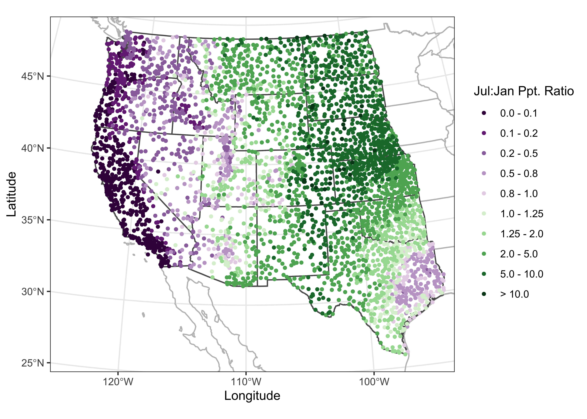

```{r set-options, echo=FALSE}
options(width = 105)
knitr::opts_chunk$set(dev='png', dpi=300, cache=TRUE, out.width = "75%", out.height = "75%", verbose=TRUE)
pdf.options(useDingbats = TRUE)
klippy::klippy(position = c('top', 'right'))
```
<span style="color: green;">**NOTE:&nbsp; This page has been revised for the 2024 version of the course, but there may be some additional edits.** &nbsp; <br>

# Introduction #

The code and results below are aimed at demonstrating some of the basic uses of R to characterize data; it is not intended as a full tutorial, as provided by some of the online readings (particularly those in the *Bookdown* series).  The examples use some relatively small data sets (by Earth-system science standards), in order to make it easy to replicate or play with the examples.  (Dealing with larger data sets will come later.)

# Reading data ##

The first step in the analysis of a data set, of course, is to read the data into R's workspace, the contents of which are displayed in RStudio's "Environment" tab.  There are two basic sources for data to be read into R:  1) data (e.g. a .csv file or netCDF) on disk (or from the web), and 2) an existing R workspace (i.e. a `*.RData`) file that might contain, in addition to the input data, function or intermediate results, for example.

## Read a .csv file ##

Although it is possible to browse to a particular file in order to open it (i.e. using the `file.choose()` function), for reproducibility, it's better to explicitly specify the source (i.e. path) of the data.  The following code reads a .csv file `IPCC-RF.csv` that contains radiative forcing values for various controls of global climate since 1750 CE, expressed in terms of Wm<sup>-2</sup> contributions to the Earth's preindustrial energy balance.  The data can be downloaded from 
[[https://pjbartlein.github.io/REarthSysSci/data/csv/IPCC-RF.csv]](https://pjbartlein.github.io/REarthSysSci/data/csv/IPCC-RF.csv) by right-clicking on the link, and saving to a suitable directory.  

Here, the file is assumed to have been dowloaded to the folder `/Users/bartlein/projects/geog490/data/csv_files/`.  (Note that this folder is not necessarly the default working directory of R, which can found using the function `getwd()`)

Read the radiative forcing .csv file:

```{r read_csv, eval=TRUE, echo=TRUE}
# read a .csv file
csv_path <- "/Users/bartlein/projects/ESSD/data/csv_files/"
csv_name <- "IPCC-RF.csv"
csv_file <- paste(csv_path, csv_name, sep="")
IPCC_RF <- read.csv(csv_file)
```

A quick look at the data can be gotten using the `str()` ("structure") function, and a five number" (plus the mean) summary of the data can be gotten using the `summary()` function;

```{r summary_csv}
str(IPCC_RF)
```
```{r str_csv}
summary(IPCC_RF)
```

There are other ways of getting a quick look at the data set:
```{r other_summary}
# other summaries
class(IPCC_RF)
names(IPCC_RF)
head(IPCC_RF)
tail(IPCC_RF)
```

The `class()` function indicates that the .csv file exists in R's workspace as a `data.frame` object, the `names()` function lists the names of the variables (columns) in the data frame, and `head()` and `tail()` list the first and last few rows in the dataframe.

## Load a saved .RData file (from the web)

An alternative way of reading data is to read in an entire workspace (`*.RData`) at once.  The following code reads those data from the web, by opening a "connection" to a URL, and then using the `load()` function (which also can be used to load a workspace file from a local folder).

```{r load_RData, eval=FALSE}
# load data from a saved .RData file
con <- url("https://pages.uoregon.edu/bartlein/RESS/RData/geog490.RData")
load(file=con) 
```

Note how the "Environment" tab in RStudio has become populated with individual objects.

# Simple visualization #

There are three properties of any variable that can be used to describe the values variable:  1) the *location* of the values along the number line, also referred to as the central tendency; 2) the *scale* of the values--how spread out they are; and 3) the *distribution* of the values (i.e. evenly spread out vs. clumped, vs. regularly spaced, for example).  These properties can be displayed by univariate plots, of which there are two kinds, enumerative and summary.

## Univariate enumerative plots

Univariate enumerative plots show individual values, and under some conditions, the data can be reconstructed from the plots in detail.

### Index plots

Index plots are simple plots that display individual observations of a particular variable, in the order the values appear in the dataframe.  In this example, the data are oxygen-isotope values for the past approximately 800 kyr (`O18`), that provide an index of the amount of ice on the land (with, as it happens, negative values indicating little ice, and positive values indicating lots of ice).  Another variable in the data set is `Insol` (insolation), or the amount of incoming solar radiation at 65<sup>o</sup>N.  The "full" names of these variables are `specmap$O18` and `specmap$Insol`, but they can be referred to by their simple column names using the `attach()` function.  Plot the `O18` values:

```{r index_plot}
# attach SPECMAP data, index plot
attach(specmap)
plot(O18)
```

### Time-series plots

The specmap data values happen to be spaced at 1 kyr intervals.  A second plot can be generated that makes the x-axis scale explicity `Age` in the data set.  The `ylim` "argument" in the function call flips the y-axis (so that "warm" is at the top), and the `pch` argument speifies thea we want small filled dots (as opposed to the default open circles):

```{r index_plot2}
# time-series plot
plot(Age, O18, ylim=c(2, -2), pch=16)
```

Although these plots could be used to get a sense of those properties listed above, they're not very efficient in doing so.

### Stripcharts

Stripcharts plot the individual values of a variable along a (number) line.

```{r stripchart1}
# stripchart of O18 data
stripchart(O18)
```

As can be easily seen, there is a lot of "overplotting", which obscures one's ability to see the distribution of values.  A second stripchar can be generated that "stacks" duplicate (or nearly so) values on top of one another:

```{r stripchart2}
# stacked stripchart
stripchart(O18, method="stack", pch=16, cex=0.5)   # stack points to reduce overlap
```

Note the use of the `method`, `pch` (plotting character), and `cex` (character-size exaggeration) arguments that modify the basic stripchart.  The stacked stripchart gives the impression that the `O18` values are not uniformly distributed along the number line.

Note that the index and time-series plots could be used to reproduce the data with a little ruler work (including the order of the values in the dataframe), while the stripchart could reprouce the values, but the order is lost.

## Univariate summary plots

Univariate summary plots, as the name suggests, summarize the variable values, and while the plots provide information on the three properties describe above, they can't be used to reconstruct the individual values.

### Histograms

The histogram is basically a graphical representation of a frequency table, that itself displays the counts of values sorted into size-category bins.  Here is the default histogram for `O18`:

```{r histogram1}
# default histogram of O18
hist(O18)
```

Note that the bin-widths are pretty big, and the default histogram gives only a large-scale overview of the distribution of the the data.  The `breaks` argument can be used to control the number of bins, and hence the "details" of the distribution (as will as the location and scale of the data):

```{r histogram2}
# histogram, more bars
hist(O18, breaks = 40)
```

In this eample, the histogram with smaller bin-widths suggests that the oxygen-isotope values might have mulltiple modes or peaks in the distribution.

### Density plots

Density plots are can be thought of a "smoothed" histograms, and while sometimes regarded as an "automatic" method for not having to make decisions about the width of the histogram bins, still requires a choice of "bandwidth".  Here's the default density plot.  Note that the `density()` function is used to creat an object called `O18_density` (which stores the values generated by `density()`, where the compound symbol `<-` is read as "gets").  The bandwidth used in creating the density plot is listed (along with some summary information) by simply "typing" the `O18_density` object at the command line.  Then, the `O18_density` object is plotted using the `plot()` function: 

```{r density1}
# density plot
O18_density <- density(specmap$O18)
O18_density
plot(O18_density)
```
 
 Here's an alternative density plot with a smaller bandwidth: 
 
```{r density2}
# density plot, different bandwidth
O18_density <- density(specmap$O18, bw = 0.10)
plot(O18_density)
```

Before going on, it's good practice to "detach" the data frame:

```{r detach1}
detach(specmap)
```

### Boxplots 

Boxplot (or box-and-whisker) plots provide a graphical representation of the "five-number" statistics for a variable (i.e. minimum, 25th percentile, median, 75th percentile, and maximum), with the interquartile range (the 75th percentile minue the 25th percentile) indicated by the height of the box (or width, depending on the orientation of the boxplot).  The data set here is a dataframe of the locations of cirque basins in Oregon, with two indictor variables or factors: the region, and a binary variable `Glacier` indicating whether or not a cirque basin is currently (early 2000's CE) occupied by a glacier.  First, attach the dataframe and get the names of the variables.

```{r cirques}
# attach cirques dataframe and getnames
attach(cirques)
names(cirques)
```

Get the boxplot of cirque elevations:

```{r boxplot1}
# boxplot of OR cirque elevations
boxplot(Elev)
```

Now get side-by-side boxplots of not-glaciated and glaciated cirques: 

```{r boxplot2}
# boxplot of elevations of not-glaciated and glaciated cirques
boxplot(Elev ~ Glacier)
```

Glaciated cirques evidently occur at higher elevations than not-glaciated ones.

Get a simple map of the cirque locations by plotting longitude and latitude, labeling the points to indicate whether a particular cirque is occupied or not:

```{r cirquemap1}
plot(Lon, Lat, type="n")
points(Lon, Lat, col=as.factor(Glacier))
```

## Bivariate plots

The "map" above is an example of the workhorse of bivariate plots--the scatterplot or scatter diagram (as were the index and time-series plots above).  In addition to showing the strength and sense (positive or negative) of bivariate relationships, the labeling of points can be used to convey additional information.

### Scatter diagrams

Plot cirque longitude along the x-axis, and latitude along the y-axis:

```{r scat1}
# cirques:  Elev vs. Lon
plot(Lon, Elev)
```

Note the convention above in the `plot()` function:  the x-variable is listed first, than the y-variable.  Replot the data, this time labeling the points.  Note the different way of specifying the variables:  The y-variable first, then a tilde (read as "varies with"), then the x-variable.  Note also the plotting character (`pch`), and the nested `as.factor()` variable-type conversion function:

```{r scat2}
# cirques:  Elev vs. Lon
plot(Elev ~ Lon, type="n")
points(Elev ~ Lon, pch=16, col=as.factor(Glacier))
```

It's easy to see that glaciated cirques are clustered in two areas:  the high Cascades and the Wallows (in eastern Oregon).

### Scatterplot matrices

Relationships between several variables can be visualized using scatterplot matrices.  The data here consist of several variables observed at Oregon climate stations.  (Note that the second panel in the first row provides a map.)

```{r matrix_scatterplot}
# matrix scatterplot of Oregon climate-station data
names(orstationc)
plot(orstationc[2:10], pch=16, cex=0.5)
```

# Enhanced graphics

The base graphics in R can be quickly produced, but are kind of crude and not "camera-ready" (an archaic term, like "dialing"" a telephone, from the days when illustrations were drawn on paper).  The R package `ggplot2` by Hadley Wickham provides an alternative approach to the "base" graphics in **R** for constructing plots and maps, and is inspired by Lee Wilkinson's *The Grammar of Graphics* book (Springer, 2nd Ed. 2005).  The basic premise of the *Grammar of Graphics* book, and of the underlying design of the package, is that data graphics, like a language, are built upon some basic components that are assembled or layered on top of one another.  In the case of English (e.g Garner, B., 2016, *The Chicago Guide to Grammar, Usage and Punctuation*, Univ. Chicago Press), there are eight "parts of speech" from which sentences are assembled:

- *Nouns* (e.g. *computer*, *classroom*, *data*, ...)
- *Pronouns* (e.g. *he*, *she*, *they*, ...)
- *Adjectives* (e.g. *good*, *green*, *my*, *year-to-year*, ..., including articles, e.g. *a*, *the*)
- *Verbs* (e.g. *analyze*, *write*, *discuss*, *computing*, ...)
- *Adverbs* (e.g. "-ly" words, *very*, *loudly*, *bigly*, *near*, *far*, ...)
- *Prepositions* (e.g. *on*, *in*, *to*, ...)
- *Conjunctives* (e.g. *and*, *but*, ...)
- *Interjections* (e.g. *damn*)

(but as Garner notes, those categories "aren't fully settled..." p. 18).

In the case of graphics (e.g. Wickham, H., 2016, *ggplot2 -- Elegant Graphics for Data Analysis, 2nd. Ed.*, Springer, available online from [[http://library.uoregon.edu]](http://library.uoregon.edu)) the components are:

- *Data* (e.g. in a dataframe)
- *Coordinate Systems* (the coordinate system of a plot)
- *Geoms* and their "aesthetic mappings" (the geometric objects like points, lines, polygons that represent the data)

These functions return *Layers* (made up of geometric elements) that build up the plot.  In addition, plots are composed of 

- *Stats* (or "statistical transformations", i.e. curves)
- *Scales* (that map data into the "aesthetic space", i.e. axes and legends)
- *Faceting* (e.g subsets of data in individual plots)
- *Legends* and
- *Themes* (that control things like background colors, fonts, etc.)
plus a few other things.

Begin by loading the `ggplot2` library.

```{r load_ggplot2}
# load the `ggplot2` package
library(ggplot2)
```

The following code chunks reproduce using `ggplot2` some of the plots described earlier.  (Note that while the package is called `ggplot2` the function is still `ggplot()`.)

```{r gg01}
# ggplot2 histogram
ggplot(specmap, aes(x=O18)) + geom_histogram(binwidth = 0.1)
```
```{r gg02}
# ggplot2 boxplots
ggplot(cirques, aes(x = Glacier, y=Elev, group = Glacier)) + geom_boxplot() +
  geom_point(colour = "blue")
```

The following plot is a plot of the relationship between elevation and annual temperature in the Oregon climate-station data set, with a "loess" curve added to summarize the relationship.

```{r gg03}
## ggplot2 scatter diagram of Oregon climate-station data
ggplot(orstationc, aes(elev, tann)) + geom_point() + geom_smooth(color = "blue") +
  xlab("Elevation (m)") + ylab("Annual Mean Temperature (C)") +
          ggtitle("Oregon Climate Station Data")
```

# Maps in R

The display of high resolution data (in addition to the standard approach of simply mapping it) can be illustrated using a set of climate station data for the western United States, consisting of 3728 observations of 15 variables.  Although these data are not of extremely high resolution (or high dimension), they illustrate the general ideas.

Begin by loading the appropriate packages.  The data and shapefiles are in the `geog490.RData` file.

```{r maps01, message=FALSE, fig.height=6, fig.width=6, eval=FALSE}
# load packages
library(sf)
library(RColorBrewer)
library(classInt)
```

## ggplot2 maps

It's possible to generate maps that are very close to "camera ready" using `ggplot2`.  The package has the capability of extracting outlines from the `maps` package in R (and also to do some simple projection using the `mapproj` package).  Here's an example of a map of the western states, the construction of which will be described later.



In what follows, we'll want to examine the large-scale patterns of the seasonality (summer-wet vs. winter-wet) of precipitation.  The data consist of monthly precipitation ratios, or the average precipitation for a particular month and station divided by the average annual total precipitation.  This has the effect of removing the very large imprint of elevation on precipitation totals.  The ratio of July to January precipitation provides a single overall description of precipitation seasonality.

# Descriptive statistics

Descriptive statistics as one might expect, are numerical (i.e. statistics) summaries of the properties of individual variables, or of the relatinships among variables.  Below are a few examples.

## Univariate statistics

The `summary()` function provides that "five-number" (plus the mean) summary:

```{r desc01}
# univariate descriptive statistics
summary(wus_pratio)
```

Recode the January to July precipitation ratio to a factor:

```{r recode}
# recode pjulpjan to a factor
ratio <- wus_pratio_sf$pjulpann/wus_pratio_sf$pjanpann
ratio[is.na(ratio)] <- 9999.0
cutpts <- c(0.0, .100, .200, .500, .800, 1.0, 1.25, 2.0, 5.0, 10.0, 9999.0)
pjulpjan_factor <- factor(findInterval(ratio, cutpts))
```

The `tapply()` function can be used to get statistics by group, in this case for the July:January precipitation-ratio categories:

```{r desc02}
# elevation summary for differnt pjulpjan classes
tapply(wus_pratio$elev, pjulpjan_factor, summary)
```

There are a number of potential descriptive statistics than can be calculated this way (as well as individually for ungrouped data).  Others statical funcions include `min()`, `max()`, `range()`, `sum()`, `mean()`, `median()`, `quantiles()`, `weighted.mean()`, `sd()`, etc.

A graphical approach to the above is boxplots:

```{r desc03}
ggplot(wus_pratio, aes(x = pjulpjan_factor, y=elev, group = pjulpjan_factor)) + geom_boxplot() +
  scale_x_discrete(labels = c("0.0 - 0.1", "0.1 - 0.2", "0.2 - 0.5", "0.5 - 0.8", "0.8 - 1.0", 
                              "1.0 - 1.25", "1.25 - 2.0", "2.0 - 5.0", "5.0 - 10.0", "> 10.0"),
                   name = "PJul:PJan Ppt. Ratio") + 
  geom_point(colour = "blue")
```

## Bivariate descriptive statistics (correlations)

The main statistic for characterizing the strength and sense of the relationship between two variables is the correlation coefficient, but beware that the statistic is a measure of the *liner* relationship between variables.  Here is a correlation matric for the western U.S. precipitation ratio data set:

```{r desc04}
# correlations among western US precip-ratio variables
round(cor(wus_pratio), 3)
```

A graphical depiction of a correlation matrix can be generated using the `corrplot()` function:

```{r desc05}
library(corrplot)
corrplot(cor(wus_pratio), method = "color")
```

# Descriptive plots for high-dimension or high-resolution data

High dimension (lots of variables) or high-resolution (lots of observations) generate a number of issues in simply visualizing the data, and relationships among variables.  Here are two approaches, the use of transparency in standard plots, and *parallel coordiate plots* (which also use transparency) to visualize all observations of all variables in a single image.

## Transparency ##

A simple scatter plot (below, left) showing the relationship between January and July precipitation ratios illustrates how the crowding of points makes interpretation difficult.  The crowding can be overcome by plotting transparent symbols specified using the "alpha channel" of the color for individual points (below, right).


```{r hd05, out.width="100%", out.height="100%", fig.width=10, fig.height=5}
# plot January vs. July precipitation ratios
opar <- par(mfcol=c(1,2)) # save graphics parameters

# opaque symbols
plot(wus_pratio$pjanpann, wus_pratio$pjulpann, pch=16, cex=1.25, col=rgb(1,0,0))

# transparent symbols
plot(wus_pratio$pjanpann, wus_pratio$pjulpann, pch=16, cex=1.25, col=rgb(1,0,0, .2))
par <- opar # restore graphics parameters
```

When there are a lot of points, sometimes the graphics capability of the GUIs are taxed, and it is more efficient to make a .pdf image directly.

```{r hd0, echo=TRUE, eval=FALSE, message=FALSE}
# transparent symbols using the pdf() device 
pdf(file="highres_enhanced_plot01.pdf")
plot(wus_pratio$pjanpann, wus_pratio$pjulpann, pch=16, cex=1.25, col=rgb(1,0,0, .2))
dev.off()
```
```{r hd07, include=FALSE, fig.width=10, echo=FALSE, eval=FALSE}
# transparent symbols using the pdf() device 
pdf(file="highres_enhanced_plot01.pdf")
plot(wus_pratio$pjanpann, wus_pratio$pjulpann, pch=16, cex=1.25, col=rgb(1,0,0, .2))
dev.off()
```

It's easy to see how the transparency of the symbols provides a visual measure of the density of points in the various regions in the space represented by the scatter plot.  

Over the region as a whole, the interesting question is the roles location and elevation may play in the seasonality of precipitation.  The following plots show that the dependence of precipitation seasonality on elevation is rather complicated.

```{r hd10, out.width="100%", out.height="100%", fig.width=10, fig.height=4}
# seasonal precipitation vs. elevation
opar <- par(mfcol=c(1,3)) # save graphics parameters
plot(wus_pratio$elev, wus_pratio$pjanpann, pch=16, col=rgb(0,0,1, 0.1))
plot(wus_pratio$elev, wus_pratio$pjulpann, pch=16, col=rgb(0,0,1, 0.1))
plot(wus_pratio$elev, wus_pratio$pjulpjan, pch=16, col=rgb(0,0,1, 0.1))
par <- opar # restore graphics parameter
```

## Parallel-coordinate plots

Parallel coordiate plots in a sense present an individual axis for each variable in a dataframe along which the individual values of the variable are plotted (usually rescaled to lie between 0 and 1), with the points for a particular observation joined by straight-line segments.  Usually the points themselves are *not* plotted to avoid clutter.  Parallel coordinate plots can be generated using the `GGally` package.  Here's a parallel coordinate plot for the western U.S. precipitation-ratio data:

```{r pcp01, out.width="100%", out.height="80%"}
# load library
library(GGally)
library(gridExtra)

# parallel coordinate plot
ggparcoord(data = wus_pratio,
  scale = "uniminmax", alphaLines = 0.05) + ylab("") +
  theme(axis.text.x  = element_text(angle=315, vjust=1.0, hjust=0.0, size=10),
        axis.title.x = element_blank(), 
        axis.text.y = element_blank(), axis.ticks.y = element_blank() )
```

Note the use of transparency, specified by the `alphaLines` argument.  Individual observations (stations) that have similar values for each variable trace out dense bands of lines, and several distinct bands, corresponding to different "precipitation regimes" (typical seasonal variations) can be observed.

Parallel coordinate plots are most effective when paired with another display with points highlighted in one display similarly highlighted in the other.  In the case of the western U.S. data the logical other display is a map. There are (at least) two ways of doing the highlighting.  Here, and "indicator variable" is defined using latitude and longitude limits, and the points within those limits appear in read on both plots.

```{r pcp03, out.height="100%", out.width="100%"}
# lon/lat window
lonmin <- -125.0; lonmax <- -120.0; latmin <- 42.0; latmax <- 49.0 
lon <- wus_pratio$lon; lat <- wus_pratio$lat
wus_pratio$select_pts <- factor(ifelse(lat >= latmin & lat <= latmax & lon >= lonmin & lon <= lonmax, 1, 0))

# pcp
a <- ggparcoord(data = wus_pratio[order(wus_pratio$select_pts),],
                columns = c(1:14), groupColumn = "select_pts",
                scale = "uniminmax", alphaLines=0.1) + ylab("") +
  theme(axis.text.x  = element_text(angle=315, vjust=1.0, hjust=0.0, size=8),
        axis.title.x = element_blank(), 
        axis.text.y = element_blank(), axis.ticks.y = element_blank(),
        legend.position = "none") +
  scale_color_manual(values = c(rgb(0, 0, 0, 0.2), "red"))

# map
b <- ggplot()  +
  geom_sf(data = wus_sf, fill=NA) +
  geom_point(aes(wus_pratio$lon, wus_pratio$lat, color = wus_pratio$select_pts), size = 1.0, pch=16) +
  theme_bw() +
  theme(legend.position = "none") +
  scale_color_manual(values = c("gray", "red"))

grid.arrange(a, b, nrow = 1)
```

The points in western Oregon and wesetern Washington clearly have a winter-wet precipitation regime.  A second highlighting approach is to select observations according to a particular range of values for a variable.  Here points with wet Augusts (e.g. points with an August:Annual precipition ratio greater than 0.5) are selected, and highlighted in the parallel coordinates plot and location map:

```{r pcp04, out.height="100%", out.width="100%"}
# variable-value selection
cutpoint <- 0.5
v <- wus_pratio$paugpann
v <- (v-min(v))/(max(v)-min(v))
wus_pratio$select_pts <- factor(ifelse(v >= cutpoint, 1, 0))

# pcp
a <- ggparcoord(data = wus_pratio[order(wus_pratio$select_pts),],
                columns = c(1:14), groupColumn = "select_pts",
                scale = "uniminmax", alphaLines=0.1) + ylab("") +
  theme(axis.text.x  = element_text(angle=315, vjust=1.0, hjust=0.0, size=8),
        axis.title.x = element_blank(), 
        axis.text.y = element_blank(), axis.ticks.y = element_blank(),
        legend.position = "none") +
  scale_color_manual(values = c(rgb(0, 0, 0, 0.2), "red"))

# map
b <- ggplot()  +
  geom_sf(data = wus_sf, fill=NA) +
  geom_point(aes(wus_pratio$lon, wus_pratio$lat, color = wus_pratio$select_pts), size = 1.0, pch=16) +
  theme_bw() +
  theme(legend.position = "none") +
  scale_color_manual(values = c("gray", "red"))

grid.arrange(a, b, nrow = 1, ncol = 2)
```

The North American Monsoon region is clearly depicted.


